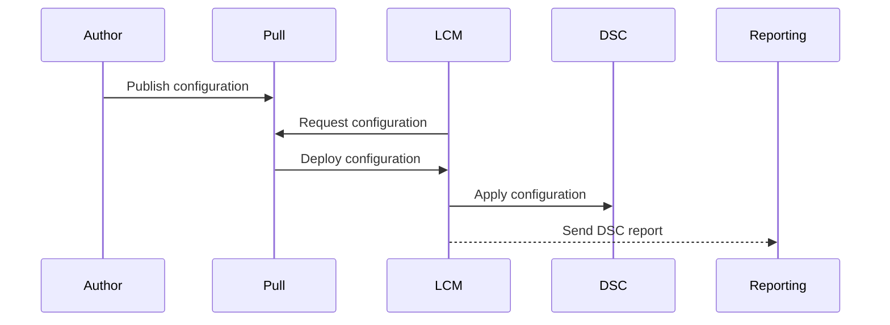
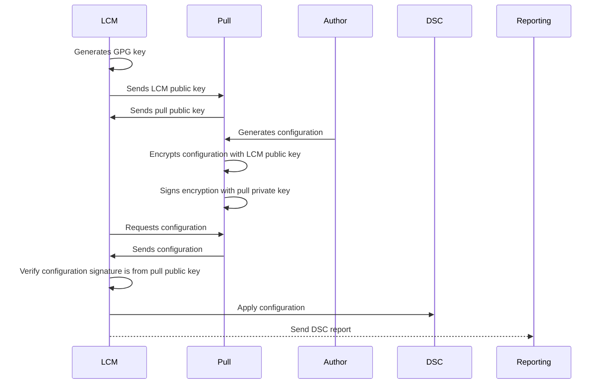

# OpenDSC

This project is to recreate the Local Configuration Manager (LCM), pull server, and reporting capabilities for [DSCv3](https://github.com/PowerShell/DSC).

DSCv3 is intended to be the tool layer rather than a platform i.e. Chef, Ansible and cloud based solutions like Azure Machine Configuration.
OpenDsc an alternative to those other platforms.

While task-scheduler with PowerShell script can accomplish the needs for a basic and rudimentary LCM replacement, a full-featured LCM replacement can reduce the administrators technical debt maintaining and deploying configuration with reporting capabilities.

## LCM - Local Configuration Manager

The LCM is the agent on the device to start dsc configuration and report back on the success or failure.

The LCM can be configured in a push or pull scenario.
A push would be landing the configuration on the device.
A pull would have the LCM call the pull server to retrieve new configuration.

Partial configurations are not in scope.
The intent is to have a single configuration that is compiled elsewhere and letting the `dsc` executable perform the key validation.

### Push Model

In this diagram the author creates the configuration on their device.
Pushes the configuration to the remote device using whatever method they like SSH/RDP/PSRemoting.
Then lands the configuration in the directory the LCM is looking for the configuration.

### Pull Model

In this diagram the author creates the configuration.
Publishes it to the pull server.
Then the LCM is configured to in pull mode.
On a reoccurring basis the LCM requests if there is a new configuration.
If there is a new configuration is pulled to the device to consume.

### Securing the configuration

The following diagram is how the LCM would securely store the configuration file at rest.
There is also the possibility of replacing GPG with CA certificates.

In a pull server situation the following diagram illustrates bootstrapping and delivery process.

## Pull Server

In DSCv1 pull server was used for the LCM to retrieve configuration and resources.

With DSCv3 having supporting multiple languages and different delivery mechanisms to deploy resources, is not in scope to carry over that feature at this time.

## Reporting Server

The reporting server is used for the LCM to send status updates.

## Configuration Server

This does not have an equivalent in DSCv1, this would be an API and front-end website/application wih the capability to create, update, and deploy configuration to the pull server or pushing to the device.

The configuration server should have the ability to create configuration based on role, location, environment, etc.
Then the configuration would be merged at deployment time to the pull server or pushed to the device.
