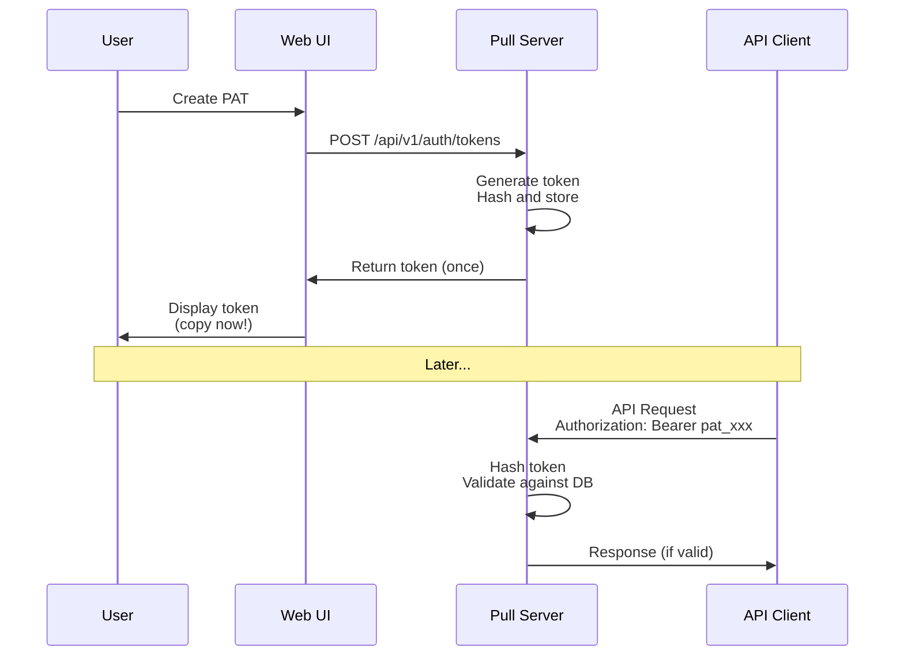
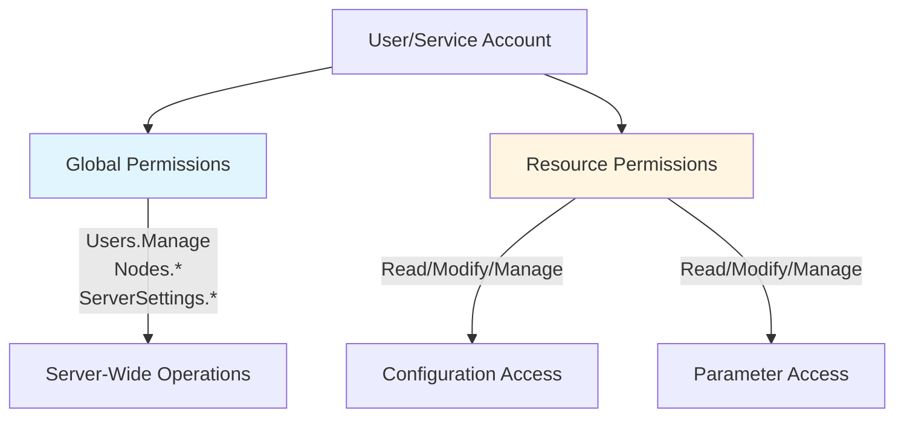
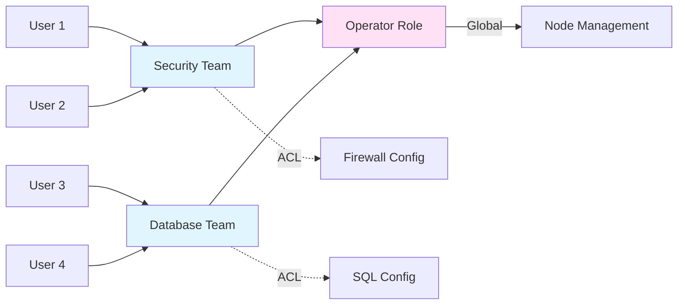
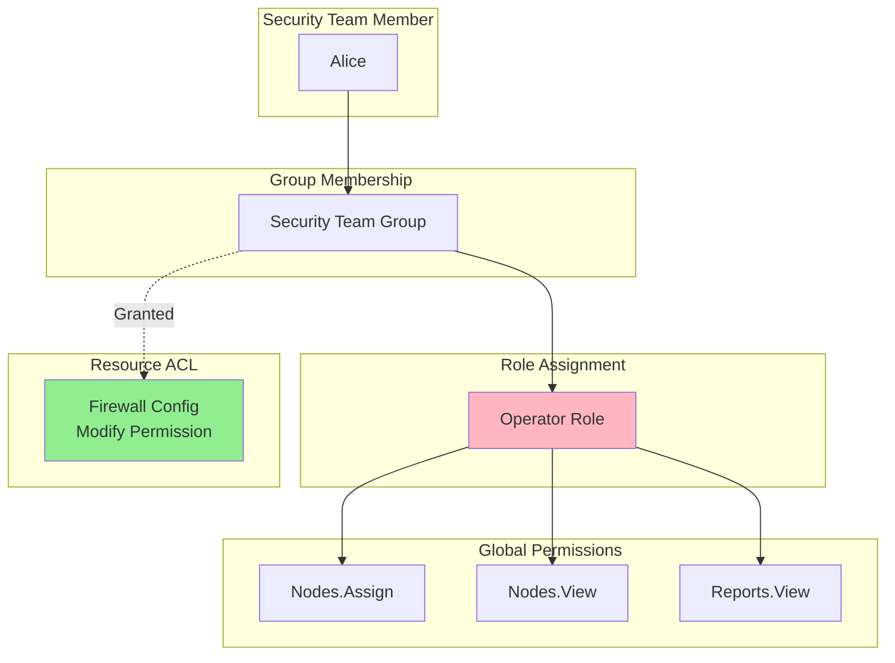

# OpenDSC Pull Server - Authentication & Authorization Guide

## Overview

The OpenDSC Pull Server provides a multi-user authentication system with
enterprise-grade access control for managing DSC configurations at scale.
This guide explains the key concepts and how to use them effectively.

## Getting Started

### Initial Setup

When you first install the Pull Server, it creates a default administrator
account:

- **Username:** `admin`
- **Password:** `admin`

**Important:** You will be required to change this password on first login for
security.

**Alternative Setup:** Set a custom initial password using the environment
variable:

```sh
OPENDSC_ADMIN_PASSWORD=YourSecurePassword
```

## Understanding Authentication Methods

The Pull Server supports different authentication methods for different use
cases:

### For Interactive Users

**Web-Based Login** - For administrators using the web interface:

- Traditional username/password authentication
- Sessions expire after 30 minutes of inactivity (8 hours maximum)
- Supports external identity providers (Microsoft Entra ID, Google, GitHub)

**Windows Authentication** - For domain-joined environments:

- Automatically maps Active Directory groups to Pull Server permissions
- No separate password management needed
- Best for corporate networks

### For Automation & Scripts

**Personal Access Tokens (PATs)** - For API access and automation:

- Secure, scoped tokens that don't expose passwords
- Can be limited to specific permissions (principle of least privilege)
- Each token is shown only once at creation - store it securely
- Expire after 90 days by default (configurable up to 365 days)



**Service Accounts** - For long-running automation:

- Independent identities not tied to any person
- Don't break when employees leave the company
- Support non-expiring tokens (if configured by administrator)
- Ideal for CI/CD pipelines, monitoring systems, etc.

## Authorization Model

The Pull Server uses a **two-tier authorization system**: global permissions
and resource-level permissions.



### Global Permissions

Global permissions control server-wide operations like:

- Managing users, groups, and roles
- Configuring server settings
- Creating/editing registration keys
- Managing nodes (all node operations are global)
- Viewing all compliance reports

### Resource Permissions

Resource permissions control access to specific configurations and parameters:

- **Read** - View the resource content
- **Modify** - Edit the resource content
- **Manage** - Full control including deletion and permission management

Resources include:

- **Configurations** - Individual DSC configurations
- **Composite Configurations** - Configurations composed of other configurations
- **Parameters** - Reusable values referenced by configurations

## Built-in Roles

The Pull Server comes with three predefined roles:

### Administrator

- **Purpose:** Full server control for IT administrators
- **Permissions:** All global permissions + admin overrides to access all
  resources
- **Use When:** Managing the server itself, creating users, or handling security

### Operator

- **Purpose:** Day-to-day configuration management and node operations
- **Permissions:** Node management + access to configurations they're granted
- **Use When:** Deploying configurations, managing nodes, viewing reports

### Viewer

- **Purpose:** Read-only access for auditing and monitoring
- **Permissions:** Read-only access + access to resources they're granted
- **Use When:** Compliance teams, auditors, or monitoring systems

## Working with Groups

Groups simplify permission management by letting you assign permissions to
teams rather than individuals.



### Internal Groups

Created and managed within the Pull Server:

- Organize users by team, function, or project
- Assign roles to the entire group at once
- Users inherit all permissions from their groups

**Example:** Create a "Security Team" group, grant them Modify permission on
firewall configurations, and add team members to the group.

### External Groups

Automatically synchronized from your identity provider (Active Directory,
Microsoft Entra ID):

- Map external groups to internal groups
- Permissions update automatically when group membership changes in your
  directory
- Reduces duplicate administration

**Example:** Map Active Directory's "IT-Operations" group to the Pull Server's
"Operator" role.

## Common Scenarios

### Scenario 1: Security Team Access

**Goal:** Security team should manage firewall configurations but nothing else.

**Solution:**

1. Create an internal group called "Security Team"
2. Assign the "Operator" role to the group (for node management)
3. Grant the group Modify permission on the Firewall configuration
4. Add team members to the group



**Result:**

- ✅ Can view and edit Firewall configuration
- ✅ Can assign Firewall configuration to nodes
- ✅ Can view compliance reports for their nodes
- ❌ Cannot view IIS, SQL, or other configurations
- ❌ Cannot modify server settings or create users

### Scenario 2: CI/CD Pipeline

**Goal:** Automated deployment pipeline needs to update configurations and
assign them to nodes.

**Solution:**

1. Create a service account called "CI-Pipeline"
2. Assign the "Operator" role
3. Grant Modify permission on specific configurations
4. Create a non-expiring PAT for the service account
5. Store the token in your CI/CD secrets

**Result:**

- Automation works reliably without expiring credentials
- Pipeline doesn't break when team members leave
- Token scope limited to necessary permissions only

### Scenario 3: Multi-Team Configuration Management

**Goal:** Different teams manage different parts of the infrastructure.

**Solution:**

1. Create groups: "Database Team", "Web Team", "Network Team"
2. Assign Operator role to each group
3. Grant each group Modify permission on their relevant configurations
4. Use composite configurations to combine team-owned configs

**Result:**

- Database team manages SQL configurations independently
- Web team manages IIS/application configurations
- Network team manages firewall/network configurations
- No team can accidentally modify another team's work

## Service Accounts vs User Accounts

### When to Use Service Accounts

Use service accounts for:

- CI/CD pipelines and automation scripts
- Monitoring systems pulling compliance data
- Third-party integrations
- Any automation that should persist beyond a person's employment

### When to Use User Accounts

Use user accounts for:

- Individual administrators and operators
- Interactive web UI access
- Situations requiring password changes and account lockout protection

## Understanding Resource Permissions

### Composite Configurations

When you have permission to modify a composite configuration, you automatically
get read access to all its component configurations. This lets you see what's
included without requiring explicit permissions on every sub-configuration.

**Example:** You have Modify on "WebServer-Full" composite configuration → you
can view (but not edit) the "IIS-Base" and "SSL-Certificates" configurations it
references.

### Parameters

Parameters have separate permissions from configurations:

- **Configuration Read** → Automatic parameter Read access
  - If you can read a configuration, you can see the parameter names and values
    it uses
  - Useful for understanding what a configuration does

- **Parameter Modify** → Requires explicit permission
  - Separates config authors from parameter value managers
  - Operations team can update database connection strings without editing
    configs

**Security Note:** Secrets should use DSC's `secret()` function. The Pull
Server stores these as-is and lets the DSC engine handle decryption at runtime
on the node.

## Security Best Practices

### Password Security

- **Minimum length:** 12 characters (configurable)
- **Complexity:** Require uppercase, lowercase, numbers, and symbols
- **Account lockout:** After 5 failed attempts (15-minute lockout)
- **Change default password immediately** after installation

### Token Security

- **Store PATs securely** - They're shown only once at creation
- **Use scoped tokens** - Grant minimum required permissions
- **Rotate regularly** - Even if tokens don't expire
- **Revoke unused tokens** - Automatically revoked after 365 days of inactivity
- **Monitor token usage** - Check audit logs for suspicious activity

### Role Assignment

- **Principle of least privilege** - Grant minimum necessary permissions
- **Use groups** - Easier to audit and manage than individual permissions
- **Regular reviews** - Periodically review who has Administrator role
- **Separate duties** - Not everyone needs full Administrator access

## Audit Trail

The Pull Server tracks all security-relevant actions:

- User logins and logouts
- Permission grants and revocations
- Resource creation and modifications
- Configuration changes
- Failed authentication attempts

Each audit entry includes:

- Who performed the action (user or service account)
- What was done (action type)
- When it happened (timestamp)
- Where it came from (IP address)

Use the audit trail for:

- Security investigations
- Compliance reporting
- Understanding configuration history
- Detecting unusual patterns

## Configuration Example

```json
{
  "Authentication": {
    "Cookie": {
      "SlidingExpiration": "00:30:00",
      "ExpireTimeSpan": "08:00:00"
    },
    "PersonalAccessToken": {
      "DefaultExpiration": "90.00:00:00",
      "MaxExpiration": "365.00:00:00",
      "AutoRevokeUnusedAfter": "365.00:00:00"
    },
    "ServiceAccounts": {
      "AllowNonExpiringTokens": true
    },
    "Password": {
      "MinimumLength": 12,
      "RequireComplexity": true,
      "MaxFailedAttempts": 5,
      "LockoutDuration": "00:15:00"
    },
    "ExternalProviders": {
      "Microsoft": {
        "Enabled": false,
        "ClientId": "",
        "ClientSecret": "",
        "TenantId": "common"
      }
    },
    "Groups": {
      "EnableExternalGroupMapping": true,
      "SyncExternalGroupsOnLogin": true
    }
  }
}
```

## Frequently Asked Questions

### Can I customize roles?

Yes, administrators can create custom roles with specific permission
combinations. However, the three built-in roles (Administrator, Operator,
Viewer) cover most common scenarios.

### What happens when a user leaves the company?

Simply delete or disable their user account. Service accounts and
configurations they created remain intact. This is why service accounts are
recommended for automation - they're independent of any person.

### How do I reset a locked account?

Administrators can reset the lockout status and optionally reset the password
through the user management interface.

### Can I use multiple identity providers?

Yes, you can enable multiple external providers (Microsoft, Google, GitHub)
simultaneously. Users can choose which one to use at login.

### How are secrets stored?

The Pull Server doesn't encrypt secrets - it stores configuration values as-is.
Use DSC's `secret()` function in your configurations to reference external
secret stores. The DSC engine on the node handles decryption at runtime.

### What if I forget the admin password?

You can reset it by setting the `OPENDSC_ADMIN_PASSWORD` environment variable
and restarting the Pull Server. This will reset the admin account password.

### How do I monitor security events?

Check the audit log for authentication events, permission changes, and resource
modifications. Export the audit log regularly for compliance and security
analysis.

## Related Documentation

- **Pull Server Setup Guide** - Initial installation and configuration
- **Node Management** - Registering and managing nodes
- **Configuration Management** - Creating and deploying configurations
- **API Reference** - REST API endpoints and usage

## Server Configuration Reference

### Configuration Approach

Authentication settings are configured at two levels:

1. **Server Configuration** (`appsettings.json`) - Infrastructure/deployment
   settings
   - Managed by system administrators during deployment
   - Requires server restart to apply changes
   - Sets global policies (password complexity, token expiration, session
     timeouts)
   - Configured via configuration files or environment variables

2. **Operational Management** (Web UI / API) - Day-to-day administration
   - Managed by Pull Server administrators through the web interface or API
   - Changes apply immediately
   - Manages users, groups, roles, permissions, and resource assignments
   - No server restart required

### Server-Level Settings

Configure authentication policies in `appsettings.json` or via environment
variables:

```json
{
  "Authentication": {
    "Cookie": {
      "SlidingExpiration": "00:30:00",      // Session timeout after inactivity
      "ExpireTimeSpan": "08:00:00"          // Maximum session duration
    },
    "PersonalAccessToken": {
      "DefaultExpiration": "90.00:00:00",   // Default PAT expiration (90 days)
      "MaxExpiration": "365.00:00:00",      // Maximum allowed PAT expiration (1 year)
      "AutoRevokeUnusedAfter": "365.00:00:00"  // Revoke tokens unused for 1 year
    },
    "ServiceAccounts": {
      "AllowNonExpiringTokens": true        // Allow service accounts to create non-expiring PATs
    },
    "Password": {
      "MinimumLength": 12,                  // Minimum password length
      "RequireComplexity": true,            // Require uppercase, lowercase, numbers, symbols
      "MaxFailedAttempts": 5,               // Lock account after failed attempts
      "LockoutDuration": "00:15:00"         // Lock duration (15 minutes)
    },
    "ExternalProviders": {
      "Microsoft": {
        "Enabled": false,                   // Enable Microsoft Entra ID authentication
        "ClientId": "",                     // Application (client) ID from Azure
        "ClientSecret": "",                 // Client secret from Azure
        "TenantId": "common"                // Tenant ID or "common" for multi-tenant
      }
    },
    "Groups": {
      "EnableExternalGroupMapping": true,   // Map external groups to internal groups
      "SyncExternalGroupsOnLogin": true     // Update group membership on each login
    }
  }
}
```

### Common Server Configuration Adjustments

**Via appsettings.json:**

**Increase session timeout for long operations:**

```json
"Cookie": {
  "SlidingExpiration": "01:00:00",  // 1 hour
  "ExpireTimeSpan": "12:00:00"      // 12 hours max
}
```

**Stricter password requirements:**

```json
"Password": {
  "MinimumLength": 16,
  "RequireComplexity": true,
  "MaxFailedAttempts": 3,
  "LockoutDuration": "00:30:00"
}
```

**Enable Microsoft Entra ID authentication:**

```json
"ExternalProviders": {
  "Microsoft": {
    "Enabled": true,
    "ClientId": "your-app-client-id",
    "ClientSecret": "your-app-client-secret",
    "TenantId": "your-tenant-id"
  }
}
```

**Via Environment Variables:**

Alternatively, set configuration using environment variables:

```sh
# Session timeout
AUTHENTICATION__COOKIE__SLIDINGEXPIRATION=01:00:00
AUTHENTICATION__COOKIE__EXPIRETIMESPAN=12:00:00

# Password policy
AUTHENTICATION__PASSWORD__MINIMUMLENGTH=16
AUTHENTICATION__PASSWORD__MAXFAILEDATTEMPTS=3

# External providers
AUTHENTICATION__EXTERNALPROVIDERS__MICROSOFT__ENABLED=true
AUTHENTICATION__EXTERNALPROVIDERS__MICROSOFT__CLIENTID=your-client-id
AUTHENTICATION__EXTERNALPROVIDERS__MICROSOFT__CLIENTSECRET=your-secret
```

### Operational Management via API/UI

The following are managed through the web interface or API (no server restart
required):

**User & Group Management:**

- Create/delete users and service accounts
- Assign users to groups
- Reset passwords and unlock accounts
- Manage Personal Access Tokens

**Role & Permission Management:**

- Assign roles to users and groups
- Create custom roles (if enabled)
- Grant/revoke resource permissions (configurations, parameters)

**Resource Access Control:**

- Set Read/Modify/Manage permissions on configurations
- Set permissions on parameters
- Map external groups to internal groups (if external auth enabled)

**Settings Management:**

- Some server settings may be configurable via API (check API documentation)
- Registration key management
- Node assignments

**Use the API for runtime operations, use `appsettings.json` for deployment
policies.**
