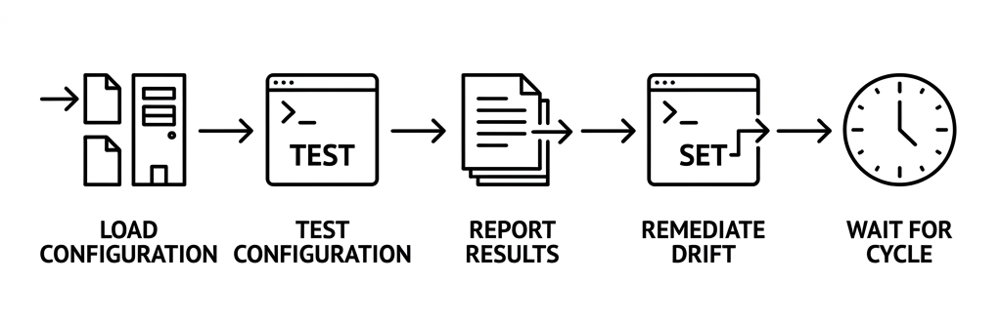

# Local Configuration Manager (LCM)

The Local Configuration Manager (LCM) is a background service that continuously
evaluates a DSC
configuration document against the current state of the system. It can detect
drift and optionally
remediate it automatically.

## Architecture

The LCM runs as a platform-native service:

- **Windows** — registered as a Windows Service (`OpenDscLcm`)
- **Linux** — runs as a systemd service or console application
- **macOS** — runs as a launchd service or console application

Internally, the LCM has two main components:

1. **LcmWorker** — the main background loop that manages scheduling and mode
   switching.
2. **DscExecutor** — invokes the `dsc` CLI (`dsc config test` and `dsc config
   set`) and parses
   the structured output.

## Operational modes

### Monitor mode

In Monitor mode, the LCM periodically runs `dsc config test` against the
configuration document.
It logs whether the system is in the desired state but doesn't make changes.

Use Monitor mode to:

- Detect configuration drift without risk of unintended changes.
- Build confidence in a configuration before enabling remediation.
- Generate compliance reports for auditing.

### Remediate mode

In Remediate mode, the LCM first runs `dsc config test`. If drift is detected,
it runs
`dsc config set` to bring the system back into compliance.

Use Remediate mode to:

- Automatically correct configuration drift.
- Enforce desired state continuously.
- Maintain compliance without manual intervention.

## Configuration sources

The LCM supports two sources for its configuration document:

### Local source

The LCM reads the configuration document from a file path on the local system.
This is useful for
standalone machines or when configurations are deployed through other means
(file shares, CI/CD
artifacts, etc.).

```json
{
  "LCM": {
    "ConfigurationSource": "Local",
    "ConfigurationPath": "C:\\DSC\\main.dsc.yaml"
  }
}
```

### Pull source

The LCM downloads its configuration from an OpenDsc Pull Server. The Pull Server
manages
versioned configurations, parameter merging, and compliance reporting.

```json
{
  "LCM": {
    "ConfigurationSource": "Pull",
    "PullServer": {
      "ServerUrl": "https://pull-server.example.com",
      "RegistrationKey": "shared-secret",
      "CertificateSource": "Managed",
      "ReportCompliance": true
    }
  }
}
```

For Pull mode setup, see the [Pull Server tutorial][01].

## Configuration precedence

The LCM reads configuration from multiple sources in the following priority
order (highest first):

1. Command-line arguments
2. Environment variables (prefixed with `LCM_`)
3. System-wide configuration file:
   - Windows: `%ProgramData%\OpenDSC\LCM\appsettings.json`
   - Linux: `/etc/opendsc/lcm/appsettings.json`
   - macOS: `/Library/Preferences/OpenDSC/LCM/appsettings.json`
4. Bundled `appsettings.json` in the service directory

## Dynamic mode switching

The LCM monitors its configuration file for changes. When the file is updated,
the LCM gracefully
stops the current evaluation cycle and reconfigures itself. You can switch
between Monitor and
Remediate mode without restarting the service.

## Certificate management

When operating in Pull mode, the LCM manages client certificates for mTLS
authentication with the
Pull Server.

### Managed certificates

By default, the LCM generates and manages a self-signed client certificate. The
certificate is
stored in the LCM's configuration directory and automatically rotated based on
the
`CertificateRotationInterval` setting.

### Platform certificates

For enterprise environments, the LCM can load a certificate from the system
certificate store by
thumbprint. This is useful when your organization has a PKI infrastructure.

## Evaluation cycle

Each evaluation cycle follows this sequence:

1. **Load configuration** — read from local file or download from Pull Server.
2. **Test** — run `dsc config test` against the configuration document.
3. **Report** — log the test results. If Pull mode is active and
   `ReportCompliance` is `true`,
   submit a compliance report to the Pull Server.
4. **Remediate** (Remediate mode only) — if drift was detected, run `dsc config
   set`.
5. **Wait** — sleep for the `ConfigurationModeInterval` before the next cycle.



## See also

- [Tutorial: Set up the LCM][02]
- [Pull Server concepts][03]

<!-- Link references -->
[01]: ../../get-started/pull-server-setup.md
[02]: ../../get-started/lcm-setup.md
[03]: ../pull-server/overview.md
