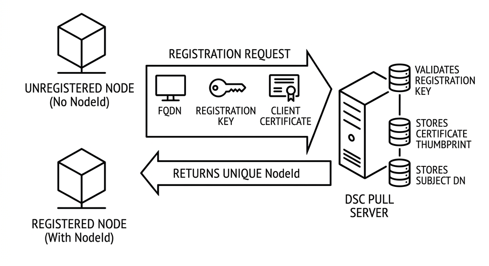

# Pull Server authentication

The OpenDsc Pull Server uses a multi-tier authentication model to secure
communication between
managed nodes, automation scripts, and the web UI.

## Authentication tiers

| Tier                  | Used by          | Mechanism                              |
| :-------------------- | :--------------- | :------------------------------------- |
| Registration key      | New nodes        | Shared secret for initial registration |
| mTLS (mutual TLS)     | Registered nodes | Client certificate                     |
| Personal Access Token | Scripts, CI/CD   | Bearer token in `Authorization` header |
| Cookie/Session        | Web UI users     | Password login with session cookie     |

## Node authentication flow

Node authentication is a two-phase process:

### Phase 1: Registration

When a node first contacts the Pull Server, it doesn't have a `NodeId`. The LCM
sends a
registration request with:

- The node's FQDN.
- A registration key (shared secret).
- A client certificate (self-signed or from the platform store).

The server validates the registration key, stores the certificate thumbprint and
subject DN, and
returns a unique `NodeId`.



### Phase 2: mTLS

After registration, the LCM uses its client certificate for all subsequent
requests. The server's
`CertificateAuthHandler` validates the certificate thumbprint against the stored
record in the
database.

The Kestrel web server is configured with
`ClientCertificateMode.AllowCertificate` so that browser
traffic isn't blocked — certificate validation is enforced selectively for node
API endpoints.

## Certificate rotation

Nodes can rotate their client certificates through the
`PUT /api/v1/nodes/{nodeId}/rotate-certificate` endpoint. The rotation is
atomic: the server
updates the certificate information and immediately invalidates the old
certificate.

### Managed certificates

When the LCM's `CertificateSource` is set to `Managed`, it generates and manages
a self-signed
certificate. The LCM handles rotation automatically based on the
`CertificateRotationInterval`.

### Platform certificates

When `CertificateSource` is `Platform`, the LCM loads a certificate from the
system certificate
store by thumbprint. This is intended for enterprise environments with existing
PKI infrastructure.

## Personal Access Tokens

Personal Access Tokens (PATs) provide Bearer token authentication for API
access. PATs are
associated with a user account and inherit that user's roles and permissions.

```text
Authorization: Bearer <token>
```

PATs have an expiration date and can be revoked from the web UI or API.

## Web UI authentication

The web UI uses password-based authentication with session cookies. After
initial setup, the
default `admin` account must have its password changed before the server can be
used.
