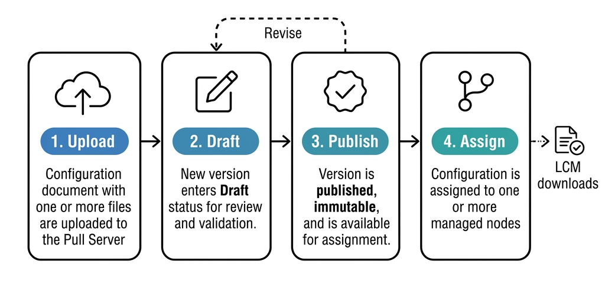

# Configuration management

The Pull Server manages DSC configuration documents through a versioned
lifecycle. Configurations
progress from upload through draft review to publishing, and are then assigned
to managed nodes.

## Configuration lifecycle

### 1. Upload

A configuration is uploaded as one or more files with a designated entry point.
The entry point
is the primary configuration document that DSC processes. Configurations can
include multiple
files for complex setups (such as included documents or shared definitions).

### 2. Draft

New versions are created in **Draft** status. Draft configurations can be
reviewed and validated
before being made available to nodes. You can upload multiple drafts and discard
them without
affecting running nodes.

### 3. Publish

When a version is ready, publish it to make it available for assignment.
Published versions are
immutable — to make changes, upload a new version.

### 4. Assign

Assign a published configuration (or composite configuration) to one or more
nodes. When the LCM
next checks in, it downloads the assigned configuration.

## Semantic versioning

Configurations use semantic versioning (`MAJOR.MINOR.PATCH`). The first uploaded
version defaults
to `1.0.0`. Subsequent versions can be specified explicitly during upload.

## Composite configurations

A composite configuration combines multiple individual configurations into a
single ordered
deployment unit. Each member has an explicit order position that determines the
sequence in which
configurations are applied.

Use composite configurations when:

- Different teams own different configuration documents.
- You want to update one part of a system's configuration without republishing
  others.
- You need a consistent bundle of configurations across a fleet.

When a composite configuration is assigned to a node, the LCM receives all
member configurations
bundled together. The DSC engine processes them in the declared order.

## Configuration change detection

The Pull Server computes a checksum for each published configuration version.
The LCM stores the
checksum locally and uses it to detect changes:

1. The LCM calls `GET /api/v1/nodes/{nodeId}/configuration/checksum`.
2. If the checksum matches the local copy, no download is needed.
3. If the checksum differs, the LCM downloads the full configuration bundle.

This minimizes network traffic — configuration documents are only transferred
when they change.

## See also

- [How to: Use composite configurations][01]
- [Versioning concepts][02]
- [Pull Server overview][03]

<!-- Link references -->
[01]: ../../guides/composite-configurations.md
[02]: versioning.md
[03]: overview.md
