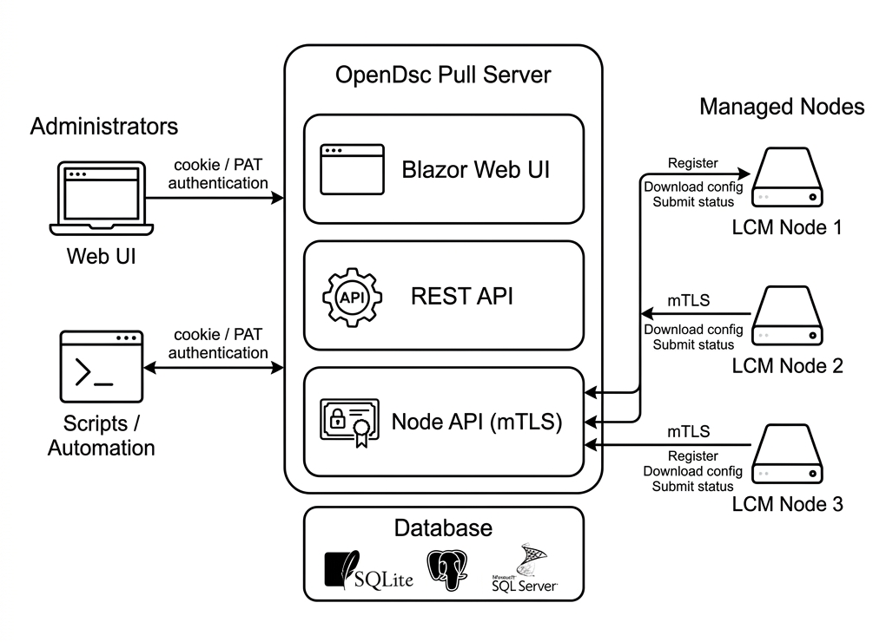

# Pull Server overview

The OpenDSC Pull Server is an ASP.NET Core application that provides centralized
configuration
management for DSC v3 nodes. It combines a REST API for automation with a Blazor
web UI for
interactive management.

## Architecture

The Pull Server has three planes of interaction:

- **Web UI** — a Blazor Server application for administrators to manage
  configurations, nodes,
  parameters, and reports through a browser.
- **REST API** — a minimal API surface for automation, scripting, and LCM
  communication.
- **Node API** — the subset of REST endpoints used by managed nodes (the LCM)
  for registration,
  configuration download, and report submission, authenticated via mTLS.



## Key subsystems

### Node registration

Managed nodes register with the Pull Server using a shared registration key.
During registration,
the node presents its FQDN and a client certificate. The server records the node
and returns a
unique `NodeId`. After registration, the node authenticates using mutual TLS
(mTLS).

For more details, see [Authentication][01].

### Configuration management

Configurations are versioned YAML or JSON documents that define the desired
state of managed
nodes. The Pull Server provides a full lifecycle:

1. **Upload** — submit configuration files.
2. **Draft** — new versions start in Draft status for review.
3. **Publish** — promote a version to make it available to nodes.
4. **Assign** — associate a configuration (or composite configuration) with one
   or more nodes.

For more details, see [Configuration management][02].

### Composite configurations

Composite configurations combine multiple individual configurations into a
single ordered
deployment unit. This allows different teams to manage different aspects of a
system independently.

### Parameter merging

Parameters are key-value data files that configuration documents can reference.
The Pull Server
merges parameters across a configurable scope hierarchy:

```text
Default → Custom scopes (by precedence) → Node
```

Narrower scopes override broader ones. The server tracks provenance so you can
see where each
merged value originated.

For more details, see [Parameter merging][03].

### Compliance reporting

The LCM submits compliance reports after each evaluation cycle. The Pull Server
stores these
reports and presents them in the web UI alongside node status.

### Role-based access control

The Pull Server implements fine-grained RBAC with:

- **Users** — individual accounts (password or PAT authentication).
- **Groups** — collections of users for easier permission management.
- **Roles** — sets of authorization policies assigned to users or groups.

Policies control access at the resource level (e.g., `nodes.read`,
`configurations.write`).

## Supported databases

The Pull Server supports three database backends:

| Database   | Use case                                 |
| :--------- | :--------------------------------------- |
| SQLite     | Development, small deployments (default) |
| PostgreSQL | Production, multi-server deployments     |
| SQL Server | Enterprise environments                  |

Configure the database in `appsettings.json` using the
`ConnectionStrings:DefaultConnection` and
`DatabaseProvider` settings.

## API documentation

When running in development mode, the Pull Server serves interactive API
documentation at
`/scalar/v1`. The OpenAPI schema is available at `/openapi/v1.json`.

[01]: authentication.md
[02]: configuration-management.md
[03]: parameter-merging.md
