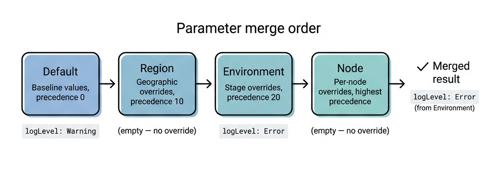

# Parameter merging

The Pull Server's parameter merging system enables hierarchical configuration
management. You
define parameter values at different scope levels, and the server merges them
into a single
resolved set for each node based on precedence rules.

## Merge order

Parameters flow from the broadest scope to the narrowest. Narrower scopes
override broader ones:

```plaintext
Default → Custom scope types (ordered by precedence) → Node
```

The Default scope provides baseline values. Custom scope types (such as Region,
Environment, or
Team) apply organization-specific overrides. The Node scope provides per-node
customization.

## Scope types and precedence

Scope types define the categories in your hierarchy. Each scope type has a
**precedence** value
that determines its position in the merge order. Higher precedence values are
applied later and
override lower ones.

| Scope type  | Precedence | Description                   |
| :---------- | :--------- | :---------------------------- |
| Default     | 0          | Global baseline (built-in)    |
| Region      | 10         | Geographic grouping           |
| Environment | 20         | Deployment stage              |
| Node        | ∞          | Per-node overrides (built-in) |

Default and Node scopes are built-in. You create custom scope types for your
organizational
structure.

## Scope values

Each scope type has one or more **scope values** representing specific
instances. For example,
the Region scope type might have `US-West` and `EU-Central` as scope values.

## Node tags

Nodes are associated with scope values through **tags**. A node can have one tag
per scope type.
Tags determine which parameter files apply to a given node.

For example, a node tagged with `Region: US-West` and `Environment: Production`
receives
parameters merged in this order:

```plaintext
Default → Region/US-West → Environment/Production → Node/<fqdn>
```

## Deep merge behavior

Parameter merging performs a deep merge of YAML/JSON objects:

- **Scalar values** at a narrower scope replace the broader value.
- **Nested objects** are merged recursively — properties from narrower scopes
  override matching
  properties, while non-conflicting properties are preserved.
- **Arrays** at a narrower scope replace the entire array from the broader
  scope.

### Example

**Default parameters:**

```yaml
appSettings:
  logLevel: Warning
  maxConnections: 100
  features:
    darkMode: false
    analytics: true
```

**Environment/Production parameters:**

```yaml
appSettings:
  logLevel: Error
  features:
    analytics: false
```

**Merged result:**

```yaml
appSettings:
  logLevel: Error          # Overridden by Environment
  maxConnections: 100      # Inherited from Default
  features:
    darkMode: false        # Inherited from Default
    analytics: false       # Overridden by Environment
```

## Provenance tracking

The Pull Server tracks the origin of each merged value. When viewing merged
parameters in the web
UI, the **Provenance Visualization** panel shows which scope contributed each
value. This makes it
easy to understand why a parameter has a particular value and which scope to
edit if you need to
change it.



## Parameter versioning

Parameter files are versioned independently from the configurations they belong
to. You can update
parameters without creating a new configuration version. Each parameter scope
has its own version
history.

## Parameter validation

When a configuration defines a parameter schema, the Pull Server validates
parameter files against
that schema. The `ParameterCompatibilityService` checks for breaking changes
between schema
versions before activation.

## See also

- [Scope system][01]
- [Parameter validation][02]

<!-- Link references -->
[01]: scope-system.md
[02]: parameter-validation.md
