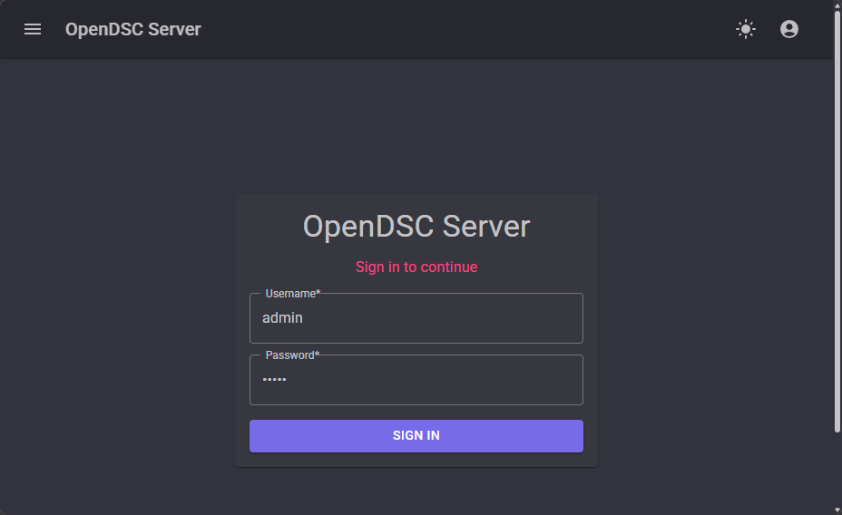
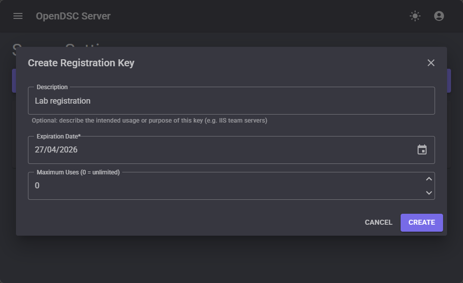
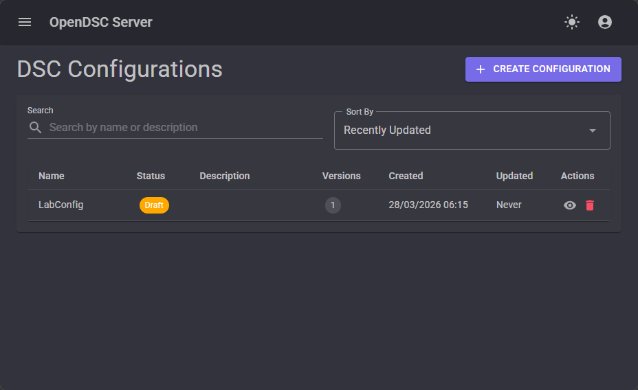
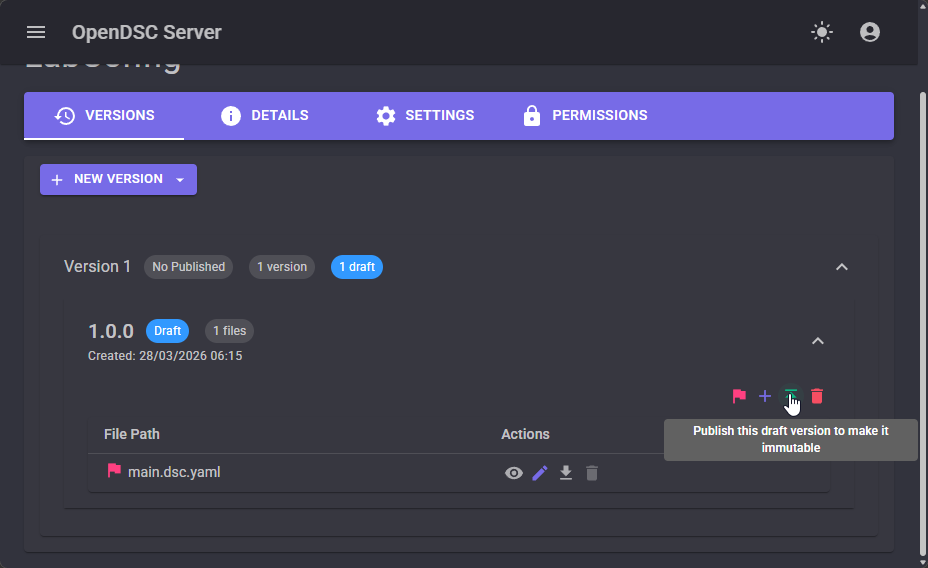
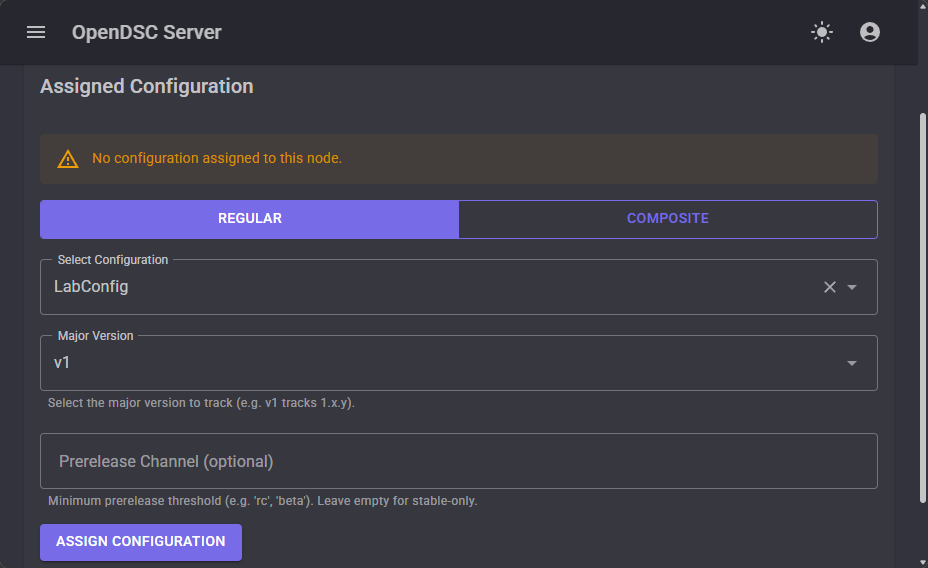

# Tutorial: Set up the Pull Server

This tutorial walks you through installing and configuring the OpenDsc Pull
Server, registering a
node, and deploying your first configuration. By the end, you'll have a working
Pull Server that
delivers configurations to managed nodes.

## Prerequisites

- A Windows machine with [OpenDsc installed][01].
- [DSC v3][02] version `3.1.0` or later.
- PowerShell 7 or later.
- Administrator privileges.
- OpenDSC.Resources installed and available in `PATH`.

## Step 1: Install the Pull Server

Download and install the Pull Server MSI from the [releases page][03]:

```powershell
$version = '0.5.1'
Invoke-WebRequest "https://github.com/opendsc/opendsc/releases/download/v$version/OpenDSC.Server-$version.msi" `
    -OutFile "$env:TEMP\OpenDSC.Server-$version.msi"
Start-Process msiexec.exe -Wait -ArgumentList "/i $env:TEMP\OpenDSC.Server-$version.msi"
```

The installer places files in `C:\Program Files\OpenDSC` and registers a Windows
service named
**OpenDSC.Server**. The service starts automatically.

## Step 2: Sign in for the first time

Open your browser and navigate to `http://localhost:5000`. The web UI prompts
you to sign in.



Sign in with the default administrator credentials:

| Field    | Value   |
| :------- | :------ |
| Username | `admin` |
| Password | `admin` |

After signing in, you're prompted to change the default password. Choose a
strong password and
save it.

## Step 3: Configure for lab use (optional)

> [!WARNING]
> The following step disables mTLS certificate validation. Never use the `Testing` environment
> in production deployments. For production HTTPS configuration, see
> [Configure HTTPS with self-signed certificates][04].

For local development and lab environments where both the server and node run on
the same
machine over HTTP, disable mTLS validation by setting the environment to
`Testing`:

```powershell
$serverRegPath = 'HKLM:\SYSTEM\CurrentControlSet\Services\OpenDscServer'
Set-ItemProperty -Path $serverRegPath `
    -Name Environment `
    -Value @('ASPNETCORE_ENVIRONMENT=Testing') `
    -Type MultiString
Restart-Service OpenDscServer
```

## Step 4: Create a registration key

Nodes need a registration key to authenticate during their initial registration
with the Pull
Server. After registration, nodes use client certificates for authentication.

### Using the web UI

1. Navigate to **Settings → Registration Keys**.
2. Click **Create**.
3. Enter a description, such as `Lab registration`.
4. Click **Save**.
5. Copy the key value that appears and save it securely.



### Using PowerShell

```powershell
# Create a web session by signing in
$session = New-Object Microsoft.PowerShell.Commands.WebRequestSession
Invoke-RestMethod -Uri 'http://localhost:5000/api/v1/auth/login' `
    -Method Post -ContentType 'application/json' `
    -Body '{"username":"admin","password":"<your-password>"}' `
    -WebSession $session

# Create a registration key
$key = Invoke-RestMethod -Uri 'http://localhost:5000/api/v1/admin/registration-keys' `
    -Method Post -ContentType 'application/json' `
    -Body '{"description":"Lab registration"}' `
    -WebSession $session

# Save the key for later use
$key.key
```

## Step 5: Install and configure the LCM

Install the LCM on the managed node (in this tutorial, the same machine as the
Pull Server):

```powershell
$version = '0.5.1'
Invoke-WebRequest "https://github.com/opendsc/opendsc/releases/download/v$version/OpenDSC.Lcm-$version.msi" `
    -OutFile "$env:TEMP\OpenDSC.Lcm-$version.msi"
Start-Process msiexec.exe -Wait -ArgumentList "/i $env:TEMP\OpenDSC.Lcm-$version.msi"
```

The installer registers a Windows service named **OpenDscLcm**. Configure it to
pull from the
server by creating the appsettings file:

```powershell
$configurationFilePath = "$env:ProgramData\OpenDSC\LCM\appsettings.json"

$configuration = @{
    LCM = @{
        ConfigurationMode         = 'Monitor'
        ConfigurationSource       = 'Pull'
        ConfigurationModeInterval = '00:15:00'
        PullServer = @{
            ServerUrl         = 'http://localhost:5000'
            RegistrationKey   = $key.key  # Use the key from Step 4
            CertificateSource = 'Managed'
            ReportCompliance  = $true
        }
    }
}

$configuration | ConvertTo-Json -Depth 5 |
    Set-Content -Path $configurationFilePath -Encoding UTF8
```

Restart the LCM service:

```powershell
Restart-Service OpenDscLcm
```

On startup, the LCM resolves the machine's FQDN, generates a managed client
certificate, and
registers with the Pull Server. The server returns a unique `NodeId` that the
LCM persists in
the configuration file.

## Step 6: Verify node registration

### Using the web UI

Navigate to the **Nodes** page. Your machine should appear with its FQDN and
registration
timestamp.

### Using PowerShell

```powershell
$nodes = Invoke-RestMethod -Uri 'http://localhost:5000/api/v1/nodes' `
    -WebSession $session

$nodes | Format-Table nodeId, fqdn, registeredAt
```

## Step 7: Upload and deploy a configuration

### Create a configuration document

Create a DSC configuration document that sets an environment variable:

```powershell
$configContent = @'
$schema: https://aka.ms/dsc/schemas/v3/bundled/config/document.json
resources:
  - name: Set greeting variable
    type: OpenDsc.Windows/Environment
    properties:
      name: DSC_GREETING
      value: Hello from OpenDsc
      scope: User
'@

$configContent | Set-Content -Path "$env:TEMP\main.dsc.yaml" -Encoding UTF8
```

### Upload the configuration

#### Using the web UI

1. Navigate to **Configurations**.
2. Click **Create**.
3. Enter the name `LabConfig`.
4. Set the entry point to `main.dsc.yaml`.
5. Upload the `main.dsc.yaml` file.
6. Click **Save**.



#### Using PowerShell

```powershell
$form = @{
    name       = 'LabConfig'
    entryPoint = 'main.dsc.yaml'
    files      = Get-Item "$env:TEMP\main.dsc.yaml"
}

Invoke-RestMethod -Uri 'http://localhost:5000/api/v1/configurations' `
    -Method Post -Form $form -WebSession $session
```

### Publish the configuration

The configuration is created in `Draft` status. Publish it to make it available
to nodes:

#### Using the web UI

1. On the **Configurations** page, click on **View Details** on `LabConfig`.
2. Expand the `1.0.0` version
3. Click **Publish** next to version `1.0.0`.



#### Using PowerShell

```powershell
Invoke-RestMethod -Uri 'http://localhost:5000/api/v1/configurations/LabConfig/versions/1.0.0/publish' `
    -Method Put -WebSession $session
```

### Assign the configuration to the node

#### Using the web UI

1. Navigate to **Nodes**.
2. Click **View** on your registered node.
3. Under **Configuration**, select `LabConfig`.
4. Click **Assign Configuration**.



#### Using PowerShell

```powershell
$lcmConfig = Get-Content "$env:ProgramData\OpenDSC\LCM\appsettings.json" | ConvertFrom-Json
$nodeId = $lcmConfig.LCM.PullServer.NodeId

Invoke-RestMethod -Uri "http://localhost:5000/api/v1/nodes/$nodeId/configuration" `
    -Method Put -ContentType 'application/json' `
    -Body (@{ configurationName = 'LabConfig' } | ConvertTo-Json) `
    -WebSession $session
```

## Step 8: Verify the configuration

The LCM checks for configuration changes every 15 minutes. To trigger an
immediate check:

```powershell
Restart-Service OpenDscLcm
```

After the LCM runs, check the **Nodes** page in the web UI to see the compliance
status, or check
the **Reports** page for detailed results.

## Summary

In this tutorial, you:

1. Installed and configured the Pull Server.
2. Created a registration key.
3. Installed and configured the LCM in Pull mode.
4. Registered a node with the Pull Server.
5. Uploaded, published, and assigned a configuration.
6. Verified configuration delivery and compliance.

## Next steps

- Configure [HTTPS with certificates][04] for production deployments.

<!-- Link references -->
[01]: ../installing.md
[02]: https://learn.microsoft.com/en-us/powershell/dsc/overview?view=dsc-3.0#installation
[03]: https://github.com/opendsc/opendsc/releases
[04]: ../guides/configure-https.md
