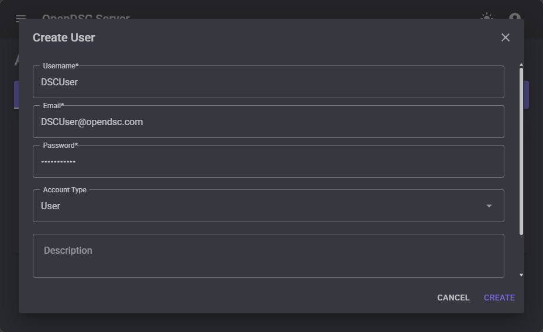
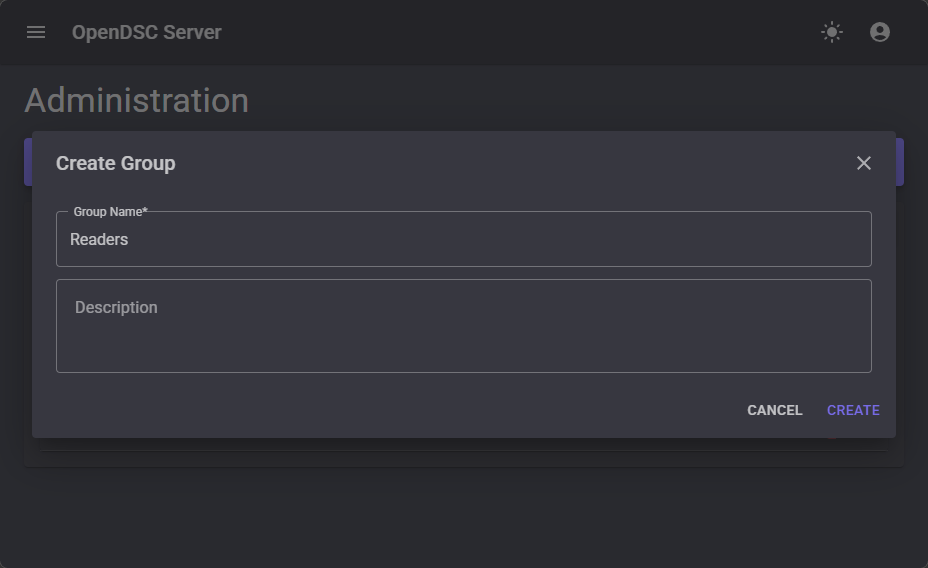
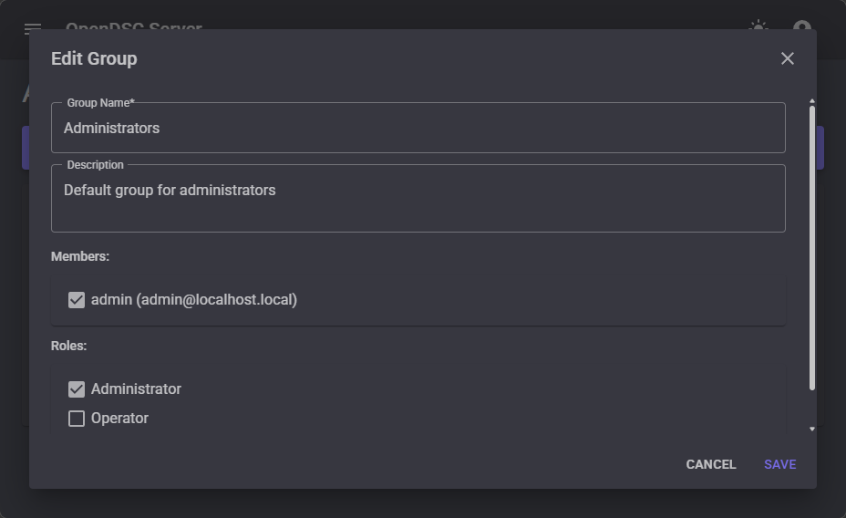
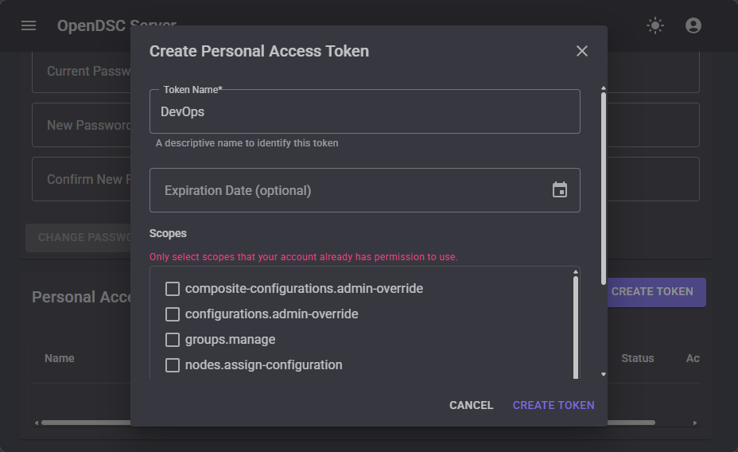

# Manage users and roles

The Pull Server includes role-based access control (RBAC) with users, groups,
and authorization
policies. This guide covers creating users, organizing them into groups, and
assigning roles.

## When to use this guide

Use this guide when you need to:

- Create accounts for team members or automation services.
- Organize users into groups for easier permission management.
- Assign fine-grained roles to control who can read, write, or administer
  different resources.

## Create a user

### Using the web UI

1. Navigate to **Admin → Users**.
2. Click **Create**.
3. Enter the username and password.
4. Click **Save**.

<!-- TODO: Replace with actual screenshot -->


### Using PowerShell

```powershell
Invoke-RestMethod -Uri 'http://localhost:5000/api/v1/users' `
    -Method Post -ContentType 'application/json' `
    -Body (@{
        username = 'jane.doe'
        password = 'SecurePassword123!'
    } | ConvertTo-Json) `
    -WebSession $session
```

## Create a group

### Using the web UI

1. Navigate to **Admin → Groups**.
2. Click **Create**.
3. Enter the group name and optionally add members.
4. Click **Save**.

<!-- TODO: Replace with actual screenshot -->


### Using PowerShell

```powershell
Invoke-RestMethod -Uri 'http://localhost:5000/api/v1/groups' `
    -Method Post -ContentType 'application/json' `
    -Body (@{
        name    = 'Platform Engineers'
        members = @('jane.doe')
    } | ConvertTo-Json) `
    -WebSession $session
```

## Assign roles

Roles define what actions users and groups can perform. The Pull Server uses
policy-based
authorization with granular policies such as `nodes.read`,
`configurations.write`, and
`admin`.

### Using the web UI

1. Navigate to **Admin → Roles**.
2. Click **Create** or edit an existing role.
3. Select the policies to include in the role.
4. Assign users or groups to the role.
5. Click **Save**.

<!-- TODO: Replace with actual screenshot -->


### Using PowerShell

```powershell
Invoke-RestMethod -Uri 'http://localhost:5000/api/v1/roles' `
    -Method Post -ContentType 'application/json' `
    -Body (@{
        name     = 'ConfigOperator'
        policies = @('configurations.read', 'configurations.write', 'nodes.read')
        groups   = @('Platform Engineers')
    } | ConvertTo-Json) `
    -WebSession $session
```

## Create a Personal Access Token (PAT)

Personal Access Tokens provide API access for automation scripts and CI/CD
pipelines.

### Using the web UI

1. Navigate to your user profile (click the user icon in the top right).
2. Under **Personal Access Tokens**, click **Create**.
3. Enter a description and expiration date.
4. Click **Create** and copy the token value.

<!-- TODO: Replace with actual screenshot -->


### Using PowerShell

```powershell
$token = Invoke-RestMethod -Uri 'http://localhost:5000/api/v1/auth/tokens' `
    -Method Post -ContentType 'application/json' `
    -Body (@{
        name      = 'CI/CD automation'
        scopes    = @('configurations.read', 'nodes.read')
        expiresAt = (Get-Date).AddDays(90).ToString('o')
    } | ConvertTo-Json) `
    -WebSession $session

# Use the token in subsequent requests
$headers = @{ Authorization = "Bearer $($token.token)" }
Invoke-RestMethod -Uri 'http://localhost:5000/api/v1/nodes' -Headers $headers
```
