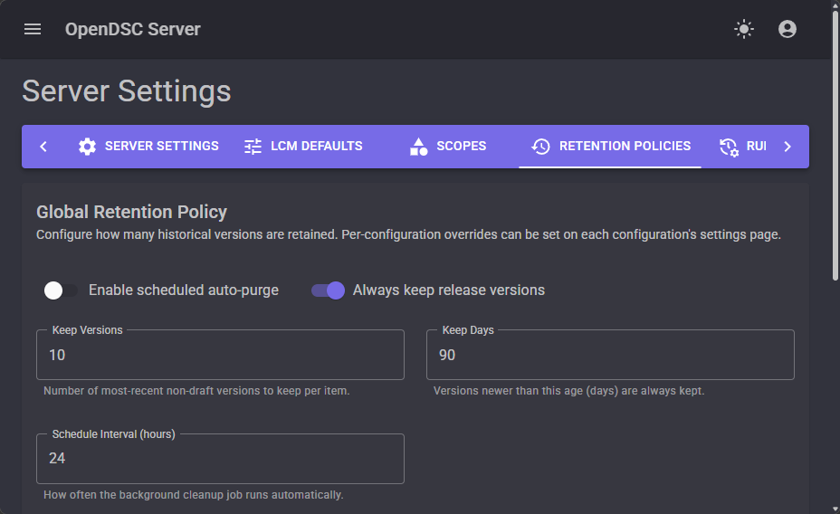
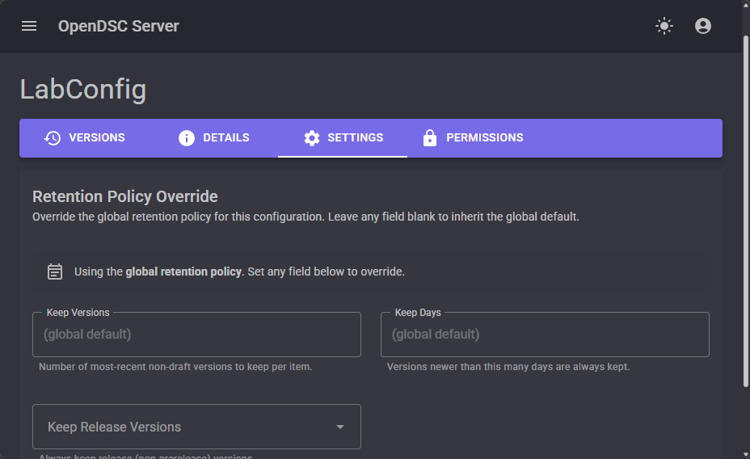

# Configure retention policies

The Pull Server stores every version of configurations and parameters. Over
time, this can
consume significant storage. Retention policies automatically clean up old
versions while
preserving the ones you need.

## When to use this guide

Use retention policies when you need to:

- Limit disk usage on the Pull Server.
- Automatically remove old configuration versions after deploying newer ones.
- Keep a specific number of recent versions for rollback purposes.

## Configure global retention

### Using the web UI

1. Navigate to **Settings → Retention**.
2. Set the **Maximum versions to keep** value.
3. Choose whether to retain published versions, all versions, or only the
   latest.
4. Click **Save**.

<!-- TODO: Replace with actual screenshot -->


### Using PowerShell

```powershell
Invoke-RestMethod -Uri 'http://localhost:5000/api/v1/settings/retention' `
    -Method Put -ContentType 'application/json' `
    -Body (@{
        enabled              = $true
        keepVersions         = 5
        keepDays             = 90
        keepReleaseVersions  = $true
    } | ConvertTo-Json) `
    -WebSession $session
```

## Per-configuration retention

You can override the global retention policy for individual configurations:

### Using the web UI

1. Navigate to **Configurations** and click on the configuration.
2. Under **Settings**, configure the retention policy.
3. Click **Save**.

<!-- TODO: Replace with actual screenshot -->


### Using PowerShell

```powershell
Invoke-RestMethod -Uri 'http://localhost:5000/api/v1/configurations/LabConfig/settings/retention' `
    -Method Put -ContentType 'application/json' `
    -Body (@{ keepVersions = 10 } | ConvertTo-Json) `
    -WebSession $session
```

## See also

- [Versioning concepts][01]
- [Configuration management][02]

<!-- Link references -->
[01]: ../concepts/pull-server/versioning.md
[02]: ../concepts/pull-server/configuration-management.md
