# System Architecture & Data Flow

This document describes the architecture and data flows of the OpenDSC Pull
Server and Local Configuration Manager (LCM) integration, covering all major
subsystems: node registration, configuration delivery, parameter merging,
compliance reporting, and certificate lifecycle management.

## Table of Contents

- [System Overview](#system-overview)
- [Component Architecture](#component-architecture)
- [Node Registration & Authentication](#node-registration--authentication)
- [LCM Operational Loop](#lcm-operational-loop)
- [Configuration Bundle Delivery](#configuration-bundle-delivery)
- [Parameter Merging](#parameter-merging)
- [Composite Configurations](#composite-configurations)
- [Compliance Reporting](#compliance-reporting)
- [Certificate Lifecycle](#certificate-lifecycle)
- [Database Entity Model](#database-entity-model)

## System Overview

At the highest level, OpenDSC consists of three independent processes wired
together over HTTPS:

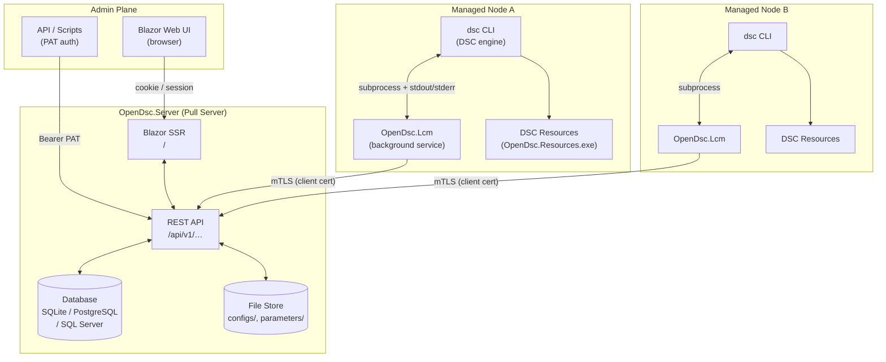

## Component Architecture

### Pull Server Internal Layers

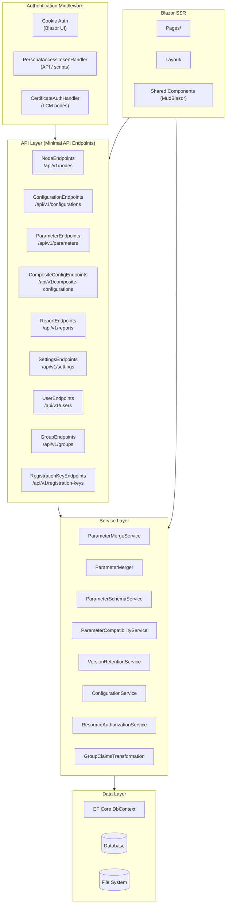

### LCM Internal Structure

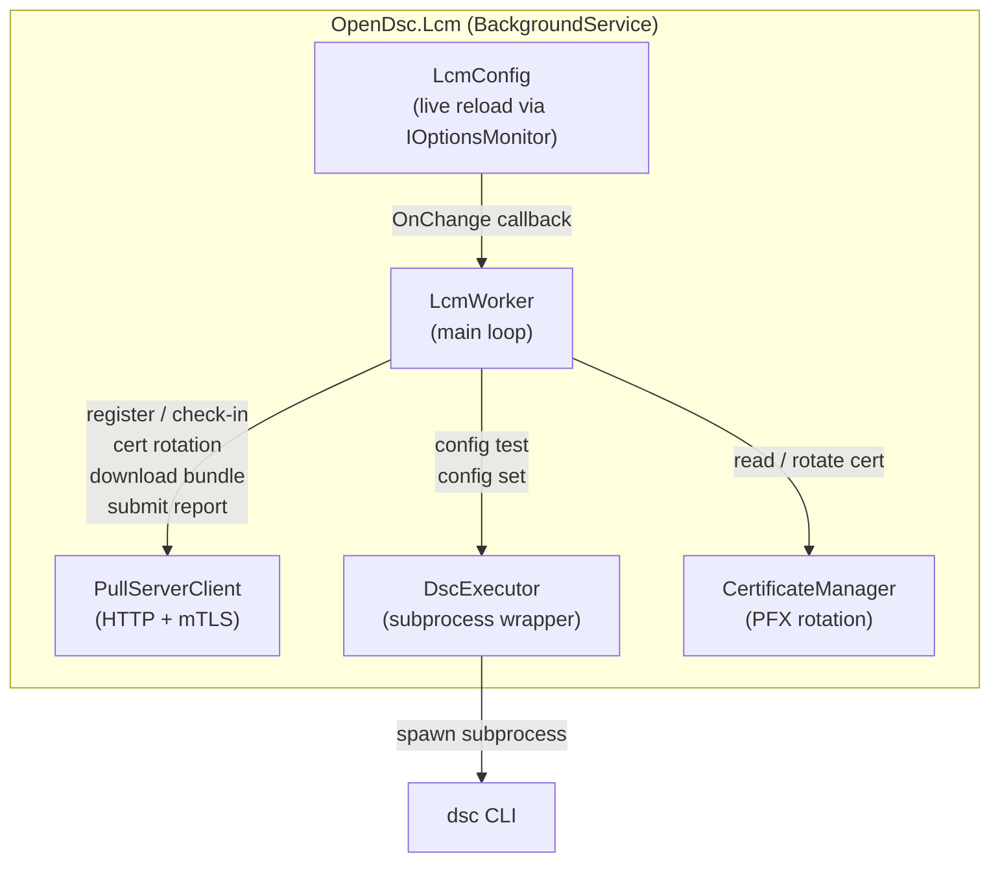

## Node Registration & Authentication

### Initial Registration Sequence

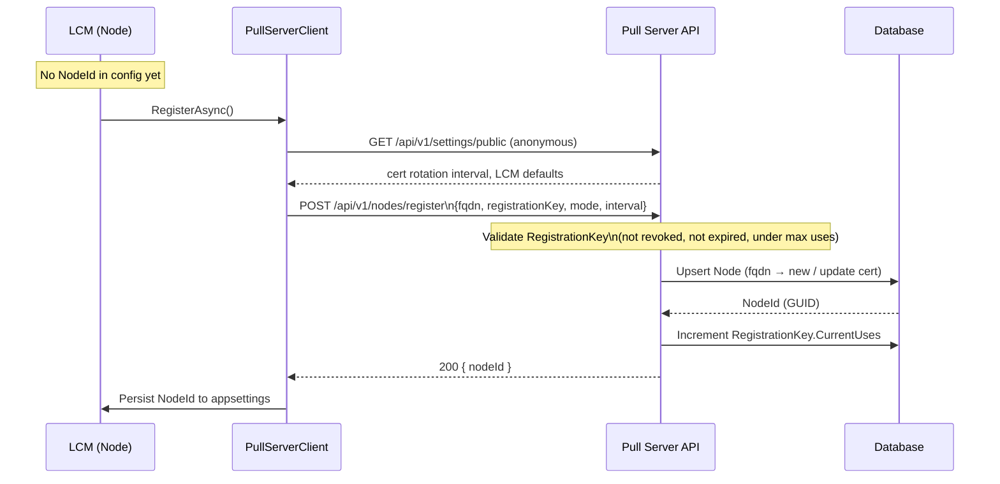

### mTLS Authentication (Subsequent Requests)

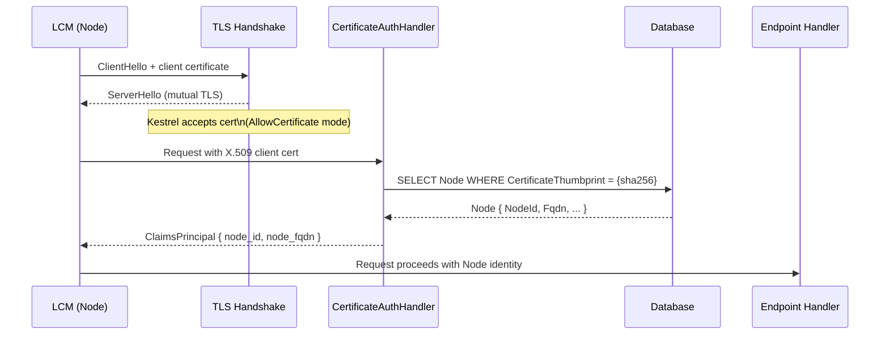

## LCM Operational Loop

### Monitor Mode

```mermaid
flowchart TD
    START([Service start]) --> REGCHECK{NodeId\nconfigured?}
    REGCHECK -- No --> REGISTER[RegisterAsync\nget NodeId]
    REGISTER --> APPLYCONF[ApplyServerLcmConfigAsync\nserver-managed config overrides]
    REGCHECK -- Yes --> APPLYCONF
    APPLYCONF --> CERTCHECK{Cert\nexpiring soon?}
    CERTCHECK -- Yes --> ROTATE[RotateCertificateAsync\nnew PFX → server]
    CERTCHECK -- No --> CHECKSUMCHECK
    ROTATE --> CHECKSUMCHECK{Config\nchecksum\nchanged?}
    CHECKSUMCHECK -- No + local hash matches --> USECACHE[Use cached\nconfiguration path]
    CHECKSUMCHECK -- Yes --> DLSTATUS[UpdateLcmStatus\n→ Downloading]
    DLSTATUS --> DOWNLOAD[GetConfigurationBundleAsync\ndownload ZIP]
    DOWNLOAD --> EXTRACT[Extract ZIP\n(path-traversal safe)\nto pull cache dir]
    EXTRACT --> CHECKSUMSTORE[Persist checksum\nentryPoint\nparametersFile]
    CHECKSUMSTORE --> USECACHE
    USECACHE --> DSCTEST[DscExecutor.ExecuteTestAsync\ndsc config test --file entryPoint]
    DSCTEST --> REPORT[SubmitReportAsync\nPOST /api/v1/nodes/id/reports]
    REPORT --> STATUSUPDATE[UpdateLcmStatusAsync\n→ Compliant / NonCompliant]
    STATUSUPDATE --> WAIT[InterruptibleDelayAsync\n(ConfigurationModeInterval)]
    WAIT --> APPLYCONF
```

### Remediate Mode

```mermaid
flowchart TD
    GET[GetConfigurationPathAsync\n(same as Monitor up to download)] --> TEST[ExecuteTestAsync\ndsc config test]
    TEST --> DESIRED{All resources\nin desired state?}
    DESIRED -- Yes --> REPORT_PASS[SubmitReportAsync\noperation=Test, compliant=true]
    DESIRED -- No --> DSCSET[ExecuteSetAsync\ndsc config set]
    DSCSET --> REPORT_FAIL[SubmitReportAsync\noperation=Set, compliant=varies]
    REPORT_PASS --> STATUS[UpdateLcmStatusAsync]
    REPORT_FAIL --> STATUS
    STATUS --> WAIT[InterruptibleDelayAsync]
    WAIT --> GET
```

### Mode Switching (Live Reload)

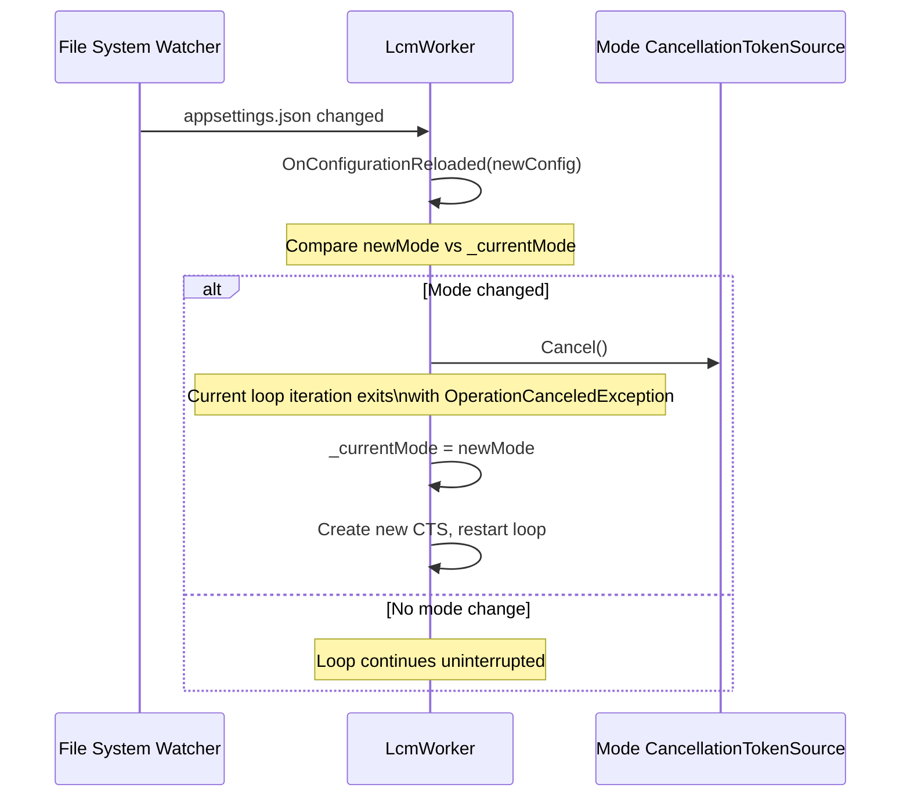

## Configuration Bundle Delivery

This diagram shows the full path from an admin uploading a configuration to a
node receiving and applying it.

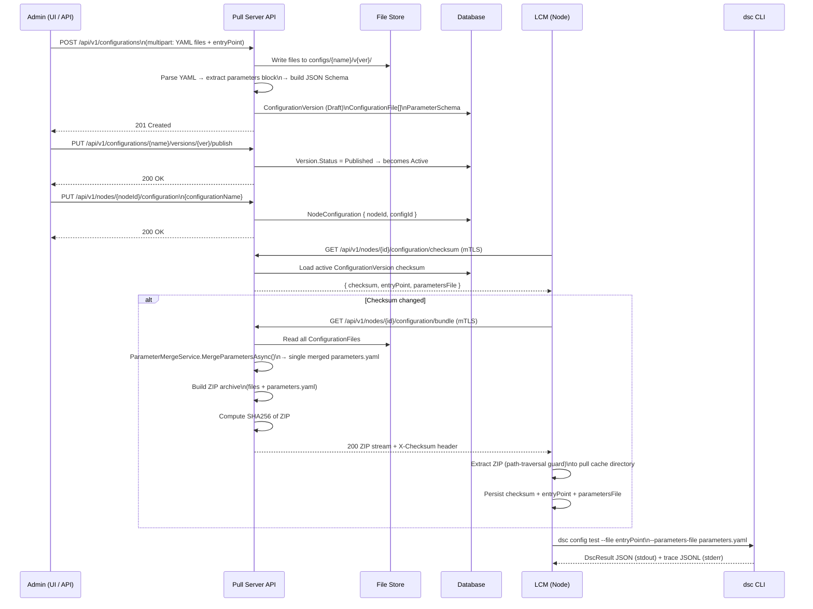

## Parameter Merging

### Scope Hierarchy

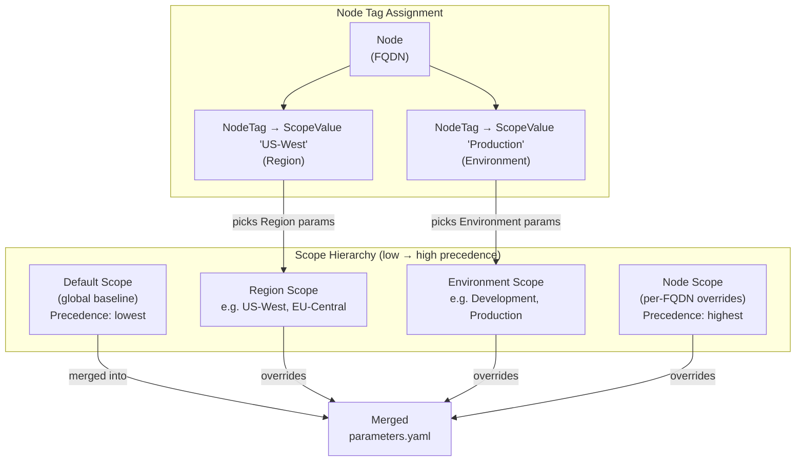

### Merge Flow (Server Side)

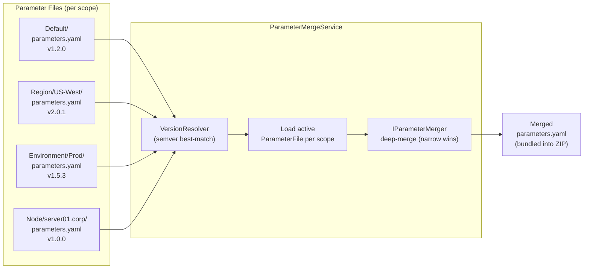

## Composite Configurations

Composite configurations combine multiple versioned configurations into a single
deployment unit that is sent to a node as an ordered set of YAML files.

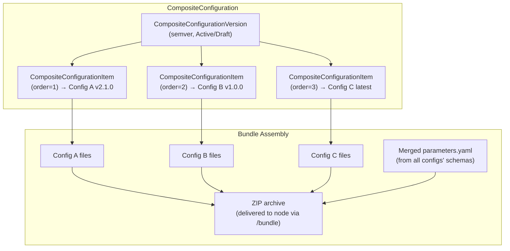

## Compliance Reporting

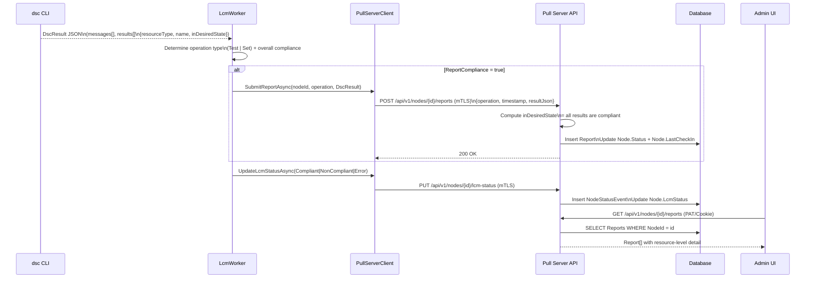

### Node Status Flow

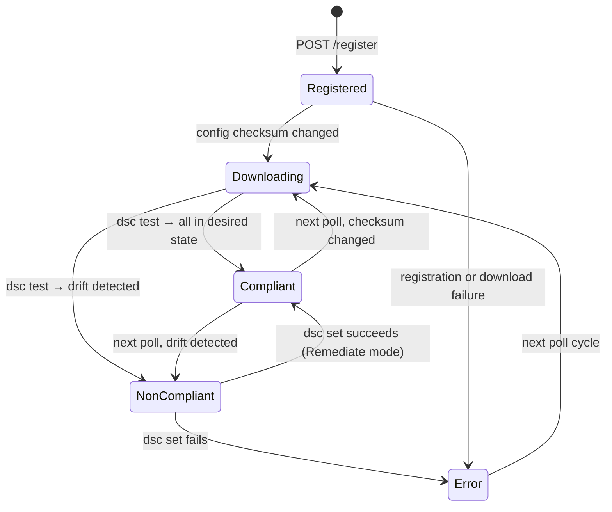

## Certificate Lifecycle

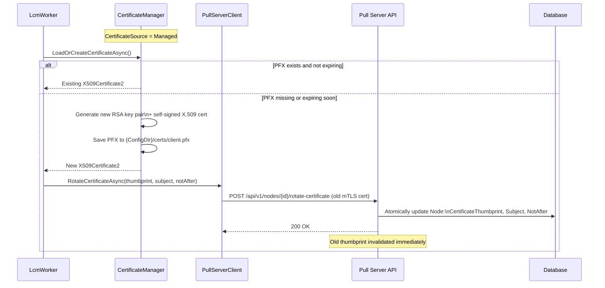

## Database Entity Model

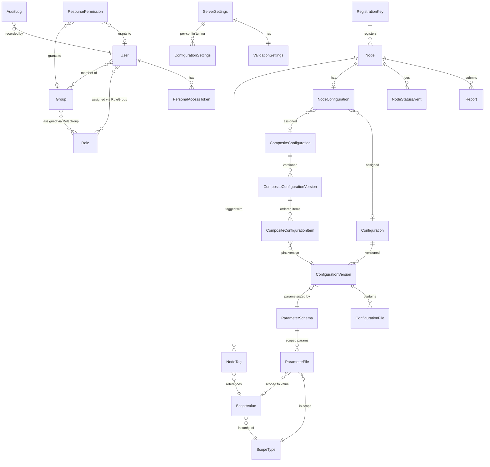

## End-to-End: New Node Onboarding

The following sequence shows the complete lifecycle from an unmanaged machine to
a fully compliant managed node.

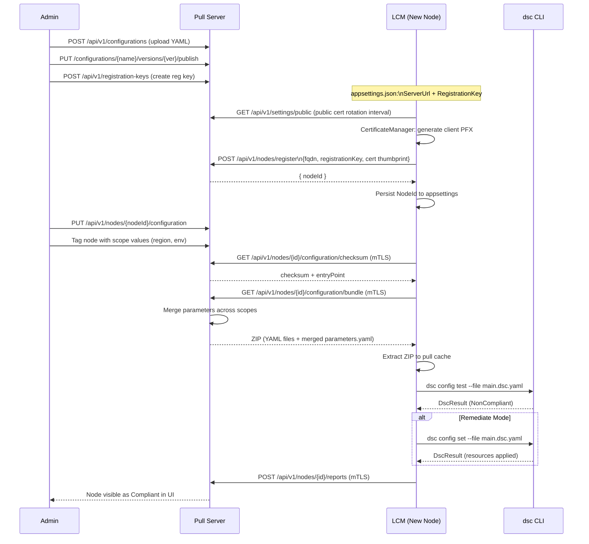
