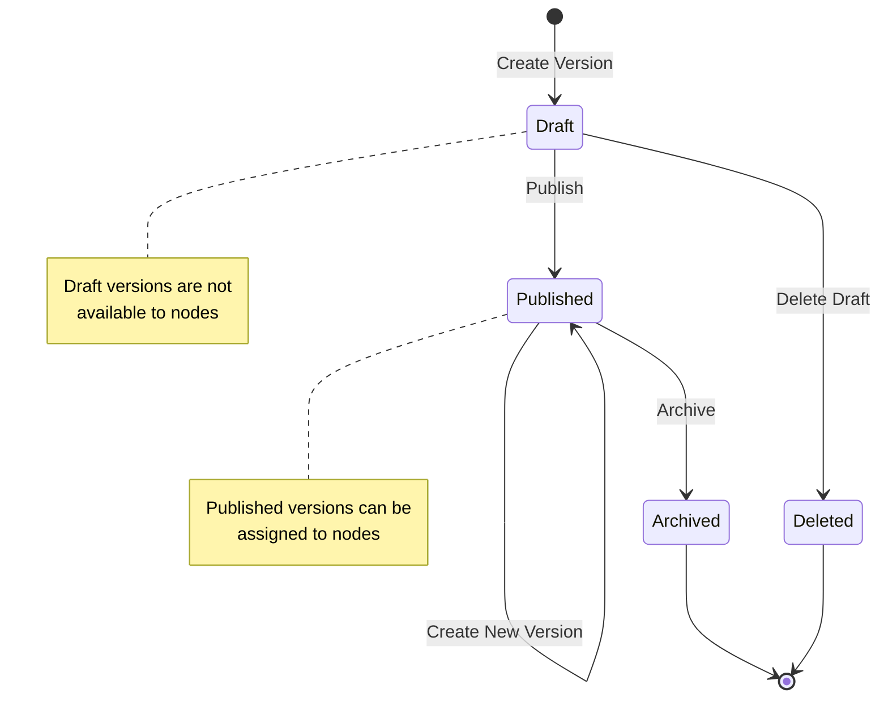
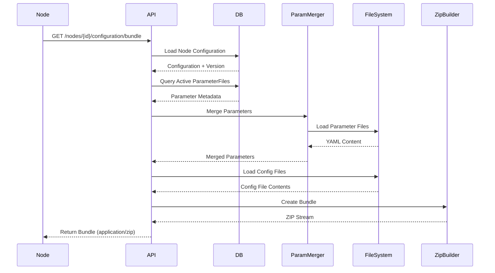
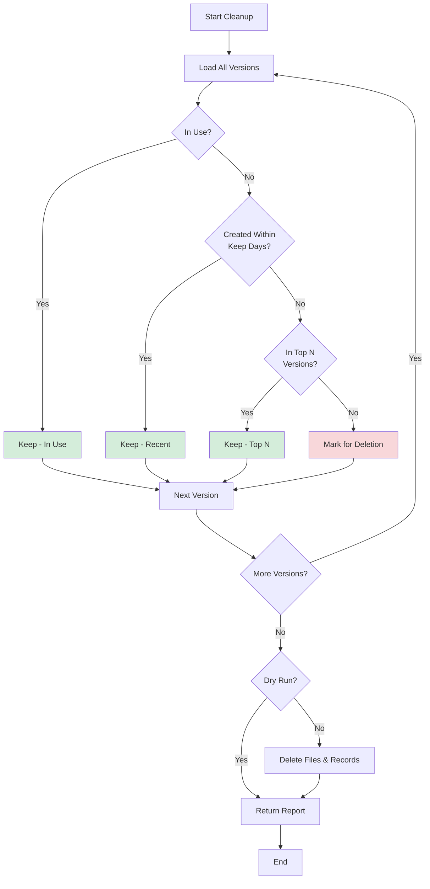

# Configuration Management Guide

The OpenDSC Pull Server provides comprehensive configuration management
with versioning, draft/publish workflows, multi-file support, and
automatic bundle generation with merged parameters. This guide explains
how configurations are managed, versioned, and distributed to nodes.

## Overview

A **configuration** is a collection of DSC YAML files that define the
desired state for one or more nodes. Configurations support:

- **Multi-file structures** - Upload multiple files (main config +
  modules)
- **Versioning** - Create multiple versions of a configuration
- **Draft/Publish workflow** - Test changes before making them live
- **Automatic bundling** - Server packages files with merged parameters
- **Checksum-based updates** - Nodes only download when changes are
  detected

## Configuration Entity

Each configuration has:

- **Name** (string) - Unique identifier (e.g., "WebServer", "Database")
- **Description** (string, optional) - Human-readable description
- **EntryPoint** (string) - Main configuration file (default:
  `main.dsc.yaml`)
- **IsServerManaged** (boolean) - Whether server manages parameter
  merging
- **Versions** (collection) - All versions of this configuration

## Version Lifecycle



### Version States

1. **Draft** - Work in progress, not visible to nodes
2. **Published** - Available for node assignment
3. **Archived** - No longer active but retained for history

### Creating a Configuration

**Initial creation** (creates version 1.0.0 automatically):

```text
POST /api/v1/configurations
Content-Type: multipart/form-data

Form Data:
- name: WebServer
- description: IIS web server configuration
- entryPoint: main.dsc.yaml (optional, defaults to main.dsc.yaml)
- version: 1.0.0 (optional, defaults to 1.0.0)
- isDraft: false (optional, defaults to true)
- files: [main.dsc.yaml, modules/iis.dsc.yaml, modules/firewall.dsc.yaml]
```

**Creates:**

- Configuration entity with name "WebServer"
- ConfigurationVersion "1.0.0" (draft or published based on `isDraft`)
- ConfigurationFile entries for each uploaded file
- Files stored at `data/configurations/WebServer/v1.0.0/`

### Creating New Versions

```text
POST /api/v1/configurations/WebServer/versions
Content-Type: multipart/form-data

Form Data:
- version: 2.0.0
- isDraft: true
- files: [main.dsc.yaml, modules/iis.dsc.yaml, modules/firewall.dsc.yaml, modules/logging.dsc.yaml]
```

**Creates:**

- New ConfigurationVersion "2.0.0" (draft)
- New set of ConfigurationFile entries
- Files stored at `data/configurations/WebServer/v2.0.0/`

### Publishing Draft Versions

```text
PUT /api/v1/configurations/WebServer/versions/2.0.0/publish
```

**Changes:**

- Sets `IsDraft = false` on version 2.0.0
- Version is now available for node assignment

## Multi-File Configurations

### File Structure

Configurations can contain multiple files organized in subdirectories:

```text
data/configurations/WebServer/v1.0.0/
├── main.dsc.yaml              # Entry point
├── modules/
│   ├── iis.dsc.yaml           # IIS-specific resources
│   ├── firewall.dsc.yaml      # Firewall rules
│   └── logging.dsc.yaml       # Logging configuration
└── parameters/
    └── defaults.yaml          # Optional local parameters
```

### Entry Point

The **entry point** file (default: `main.dsc.yaml`) is the main
configuration document that DSC CLI will execute. It can reference other
files using DSC v3 syntax.

**Example main.dsc.yaml:**

```yaml
# DSC v3 configuration
$schema: https://aka.ms/dsc/schemas/v3/config/document.json
resources:
  - name: Configure IIS
    type: Microsoft.DSC/Group
    properties:
      $schema: https://aka.ms/dsc/schemas/v3/config/document.json
      resources: !include modules/iis.dsc.yaml

  - name: Configure Firewall
    type: Microsoft.DSC/Group
    properties:
      $schema: https://aka.ms/dsc/schemas/v3/config/document.json
      resources: !include modules/firewall.dsc.yaml
```

### Relative Paths

Files within a configuration can use relative paths. The Pull Server
preserves the directory structure when creating bundles.

**Security Note:** Paths containing `../` or `..\` are rejected to
prevent path traversal attacks.

## Node Assignment

### Simple Assignment (by name)

Assign the latest published version to a node:

```text
PUT /api/v1/nodes/{nodeId}/configuration

{
  "configurationName": "WebServer"
}
```

**Behavior:**

- Finds the latest published (non-draft) version
- Stores the configuration name on the Node entity
- Node receives the latest published version when requesting bundles

### Advanced Assignment (specific version)

The Pull Server also supports advanced assignment via the
`NodeConfiguration` entity, which allows:

- Assigning a specific version by string (e.g., "1.2.0")
- Enabling/disabling server-managed parameters
- Filtering by prerelease channels

This is not yet exposed via simple REST endpoints but is available
through the database model.

## Bundle Generation

When a node requests a configuration bundle, the Pull Server:



### Bundle Contents

**Without Server-Managed Parameters:**

```text
configuration-bundle.zip
├── main.dsc.yaml
└── modules/
    ├── iis.dsc.yaml
    ├── firewall.dsc.yaml
    └── logging.dsc.yaml
```

**With Server-Managed Parameters:**

```text
configuration-bundle.zip
├── main.dsc.yaml
├── modules/
│   ├── iis.dsc.yaml
│   ├── firewall.dsc.yaml
│   └── logging.dsc.yaml
└── parameters.yaml            # Merged parameters
```

### Parameter Integration

If `IsServerManaged = true` on the configuration:

1. Pull Server queries the node's tags
2. Loads and merges parameters from all applicable scopes
3. Includes the merged `parameters.yaml` in the ZIP bundle
4. DSC configuration can reference parameters using DSC v3 parameter
   syntax

## Checksum-Based Updates

Nodes can check if a configuration has changed without downloading the
full bundle.

```text
GET /api/v1/nodes/{nodeId}/configuration/checksum
```

**Response:**

```json
{
  "checksum": "sha256:abc123def456..."
}
```

### Checksum Calculation

The checksum is computed from:

```text
version:{version}|{file1Path}:{file1Checksum}|{file2Path}:{file2Checksum}|...
```

**Sorted alphabetically by file path**, then SHA-256 hashed.

**Example:**

```text
Input: "version:1.0.0|main.dsc.yaml:abc123|modules/iis.dsc.yaml:def456"
Checksum: SHA256(input) = "1a2b3c4d5e6f..."
```

**Behavior:**

- Node stores the last checksum it received
- Before downloading bundle, node requests new checksum
- If checksums match, skip download
- If checksums differ, download new bundle

## Version Retention

### Retention Policies

The Pull Server supports automatic cleanup of old configuration versions
to save disk space.

```text
POST /api/v1/retention/configurations/cleanup

{
  "keepVersions": 5,
  "keepDays": 30,
  "dryRun": false
}
```

**Policy Rules:**

1. **Never delete versions in use** - Versions currently assigned to
   nodes are protected
2. **Keep N most recent** - Always keep the N most recent versions per
   configuration
3. **Keep recent versions** - Keep all versions created within X days
4. **Dry run support** - Test the policy without actually deleting

**Cleanup Process:**



**Response:**

```json
{
  "deletedVersions": 8,
  "freedBytes": 1024000,
  "versions": [
    {
      "configurationName": "WebServer",
      "version": "1.0.0",
      "createdAt": "2025-12-01T10:00:00Z",
      "sizeBytes": 128000
    }
  ]
}
```

## Configuration Versioning Best Practices

### Semantic Versioning

Use **semantic versioning** (MAJOR.MINOR.PATCH) for configuration
versions:

- **MAJOR** - Breaking changes (removed resources, renamed properties)
- **MINOR** - New features (added resources, new optional properties)
- **PATCH** - Bug fixes, value changes, no structural changes

**Examples:**

```text
1.0.0 → 1.0.1  # Fixed typo in firewall rule
1.0.1 → 1.1.0  # Added logging module
1.1.0 → 2.0.0  # Removed deprecated IIS settings (breaking change)
```

### Draft Workflow

1. **Create draft** - Upload new version with `isDraft: true`
2. **Test offline** - Manually test the draft configuration
3. **Publish** - Make the version available to nodes
4. **Gradual rollout** - Assign to test nodes first, then production

### Version Naming Strategies

#### Option 1: Date-based

```text
2026-02-03, 2026-02-04, ...
```

- Pro: Clear chronological ordering
- Con: Doesn't convey change impact

#### Option 2: Semantic Versioning

```text
1.0.0, 1.1.0, 2.0.0, ...
```

- Pro: Conveys change impact (major/minor/patch)
- Con: Requires discipline to follow rules

#### Option 3: Descriptive

```text
baseline, add-monitoring, security-hardening, ...
```

- Pro: Self-documenting
- Con: Hard to order chronologically

**Recommendation:** Use semantic versioning for consistency with
industry standards and tooling.

### Multi-File Organization

**Good Practices:**

1. **Modular structure** - Separate concerns into different files
2. **Consistent naming** - `modules/{feature}.dsc.yaml`
3. **Clear entry point** - Always use `main.dsc.yaml` as entry point
4. **Document dependencies** - Add comments explaining what includes
   what

**Example Structure:**

```text
main.dsc.yaml              # Entry point
modules/
  core/
    base.dsc.yaml          # Base system settings
    security.dsc.yaml      # Security hardening
  apps/
    iis.dsc.yaml           # IIS configuration
    database.dsc.yaml      # Database client setup
  network/
    firewall.dsc.yaml      # Firewall rules
    dns.dsc.yaml           # DNS settings
```

## Troubleshooting

### "Version already exists"

**Cause**: Trying to create a version with a version string that already
exists for this configuration.

**Solution**: Use a different version string or delete the existing
version first (if it's not in use).

### "Entry point file not found"

**Cause**: The specified entry point file was not included in the
uploaded files.

**Solution**: Ensure the entry point file (default: `main.dsc.yaml`) is
included in the upload.

### "Cannot delete version: in use by nodes"

**Cause**: Trying to delete a configuration version that's currently
assigned to one or more nodes.

**Solution**: Reassign those nodes to a different version first, then
delete.

### "Bundle download fails with 404"

**Cause**: Node configuration is not set or the assigned configuration
version doesn't exist.

**Solution**: Verify the node has a configuration assigned and the
version still exists.

### Missing files in bundle

**Cause**: Files weren't uploaded correctly or were corrupted.

**Solution**: Create a new version and re-upload all files, ensuring
they're all present.

## Advanced Topics

### Prerelease Channels

Configuration versions support **prerelease channels** for staged
rollouts:

```text
version: 2.0.0-beta
prereleaseChannel: beta
```

Nodes can be configured to use specific channels via the
`NodeConfiguration` entity.

**Use Case:**

- `alpha` - Internal testing only
- `beta` - External beta testers
- `stable` - Production nodes (no prerelease channel)

### Configuration Deduplication

The Pull Server uses checksums to avoid storing duplicate file content.
If you upload the same file in multiple versions, only one copy is
stored on disk.

**Implementation Note:** This is a future enhancement not yet
implemented. Currently, each version stores its own copy of files.

## API Reference

For interactive API testing and detailed request/response schemas, visit
the **Scalar API Reference** at `/scalar/v1` when running the server.

## Next Steps

- [Scope System Guide](scope-system.md) - Understand parameter
  organization
- [Parameter Merging](parameter-merging.md) - Learn how parameters are
  merged into bundles
- [Quick Start Tutorial](quickstart.md) - Follow a complete workflow
  example
- [Real-World Examples](examples/) - See configuration management in
  action
