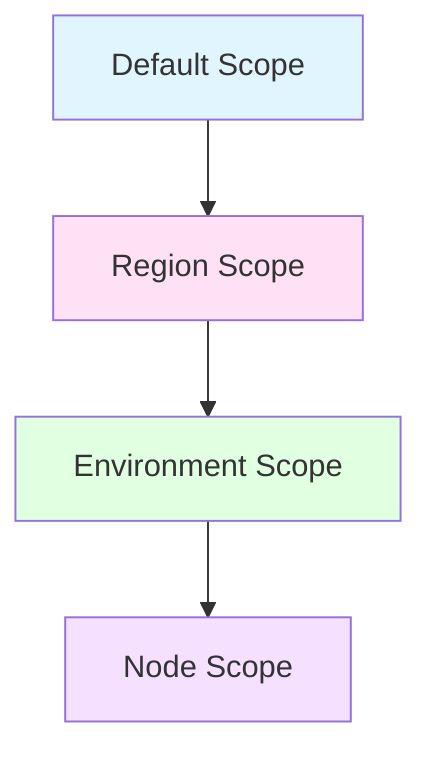

# Example: Multi-Team Web Server Configuration

This example demonstrates how different teams can manage their own
configurations using composite configurations while sharing common operational
settings. This scenario showcases:

- Multiple teams managing separate configurations for the same server (IIS team,
  Security team)
- Composite configurations combining team-managed components
- Parameter merging across scope layers within each configuration
- Real-world separation of concerns

## Scenario Overview

**Infrastructure Setup:**

- Web servers running IIS in multiple regions and environments
- IIS configuration team owns application settings and server tuning
- Security team owns firewall rules and SSL certificates
- Operations team manages region and environment-specific networking

**Teams and Responsibilities:**

- **IIS Team**: Manages application pool settings, site bindings, default
  documents
- **Security Team**: Manages firewall rules, SSL/TLS settings, security headers
- **Operations Team**: Manages region-specific compliance and
  environment-specific resource limits

## Scope Type Design

Create scope types that reflect deployment context:



**Scope Type Configuration:**

| Scope Type | Precedence | Purpose | Owner |
| ---------- | ---------- | ------- | ----- |
| Default | 0 | Global defaults for all servers | Platform Team |
| Region | 1 | Regional compliance requirements | Operations Team |
| Environment | 2 | Environment-specific limits | Operations Team |
| Node | 3 | Server-specific overrides | Individual server owner |

## Configuration Structure

**Main Configuration** (`webserver-baseline`):

```yaml
# webserver-baseline.dsc.yaml
$schema: https://raw.githubusercontent.com/PowerShell/DSC/main/schemas/2024/04/config/document.json
metadata:
  name: webserver-baseline
  version: 1.0.0
  description: IIS web server baseline configuration

# Include child configurations
include:
  - iis-config
  - security-config

parameters:
  # Operations Settings
  resourceLimits:
    type: object
    defaultValue:
      maxConnections: 1000
      requestTimeout: 30

resources:
  # Base resources can be defined here if needed
  # Child configurations provide their own resources
```

**IIS Configuration** (`iis-config` - managed by IIS Team):

```yaml
# iis-config.dsc.yaml
$schema: https://raw.githubusercontent.com/PowerShell/DSC/main/schemas/2024/04/config/document.json
metadata:
  name: iis-config
  version: 1.0.0
  description: IIS application configuration

parameters:
  # IIS Settings (managed by IIS Team)
  applicationPoolSettings:
    type: object
    defaultValue:
      enable32BitAppOnWin64: false
      managedRuntimeVersion: v4.0
      idleTimeout: '00:20:00'

  siteBindings:
    type: array
    defaultValue:
      - protocol: http
        port: 80
      - protocol: https
        port: 443

  defaultDocuments:
    type: array
    defaultValue:
      - Default.aspx
      - index.html

resources:
  # IIS Application Pool
  - name: MainAppPool
    type: Microsoft.Windows/WindowsFeatures
    properties:
      name: '[parameters(''applicationPoolSettings'').name]'
      ensure: Present
      enable32BitAppOnWin64: '[parameters(''applicationPoolSettings'').enable32BitAppOnWin64]'
      managedRuntimeVersion: '[parameters(''applicationPoolSettings'').managedRuntimeVersion]'
      idleTimeout: '[parameters(''applicationPoolSettings'').idleTimeout]'
```

**Security Configuration** (`security-config` - managed by Security Team):

```yaml
# security-config.dsc.yaml
$schema: https://raw.githubusercontent.com/PowerShell/DSC/main/schemas/2024/04/config/document.json
metadata:
  name: security-config
  version: 1.0.0
  description: Security hardening configuration

parameters:
  # Security Settings (managed by Security Team)
  firewallRules:
    type: array
    defaultValue: []

  tlsSettings:
    type: object
    defaultValue:
      minimumTlsVersion: '1.2'
      cipherSuites:
        - TLS_ECDHE_RSA_WITH_AES_256_GCM_SHA384
        - TLS_ECDHE_RSA_WITH_AES_128_GCM_SHA256

  securityHeaders:
    type: object
    defaultValue: {}

resources:
  # Firewall rules from Security team
  - name: WebServerFirewall
    type: Microsoft.Windows/Firewall
    properties:
      rules: '[parameters(''firewallRules'')]'

  # TLS configuration
  - name: TlsSettings
    type: Microsoft.Windows/Registry
    properties:
      key: HKLM:\System\CurrentControlSet\Control\SecurityProviders\SCHANNEL\Protocols\TLS 1.2\Server
      values:
        - name: Enabled
          value: 1
          type: DWord
```

## Parameter Files by Configuration and Scope

### Webserver Baseline - Default Scope Parameters

**File:** `data/parameters/webserver-baseline/Default/parameters.yaml`

Platform team sets conservative global defaults for operations settings:

```yaml
# Global defaults for operations settings - applies to ALL web servers
resourceLimits:
  maxConnections: 1000
  requestTimeout: 30
  maxBandwidth: 10485760  # 10 MB/s
```

### IIS Config - Default Scope Parameters

**File:** `data/parameters/iis-config/Default/parameters.yaml`

IIS team sets global IIS defaults and customizations:

```yaml
# Global IIS defaults and customizations - applies to ALL web servers
applicationPoolSettings:
  name: WebAppPool
  idleTimeout: '00:30:00'  # Override: 30 minutes
  maxProcesses: 4           # Override: enable web garden
  recycling:
    periodicRestart: '2.00:00:00'  # Override: 48 hours
    requestLimit: 50000
    privateMemoryLimit: 2097152     # 2 GB

siteBindings:
  - protocol: http
    port: 80
    hostName: www.example.com
  - protocol: https
    port: 443
    hostName: www.example.com
    certificateHash: 'ABC123...'

defaultDocuments:
  - Default.aspx
  - app.html
  - index.html
  - default.html

# IIS-specific logging
loggingSettings:
  logFormat: W3C
  logDirectory: D:\Logs\IIS
  logFields:
    - Date
    - Time
    - ClientIP
    - Method
    - UriStem
    - HttpStatus
```

### Security Config - Default Scope Parameters

**File:** `data/parameters/security-config/Default/parameters.yaml`

Security team sets global security defaults and customizations:

```yaml
# Global security defaults and customizations - applies to ALL web servers
tlsSettings:
  minimumTlsVersion: '1.2'
  cipherSuites:
    - TLS_ECDHE_ECDSA_WITH_AES_256_GCM_SHA384
    - TLS_ECDHE_ECDSA_WITH_AES_128_GCM_SHA256
    - TLS_ECDHE_RSA_WITH_AES_256_GCM_SHA384
    - TLS_ECDHE_RSA_WITH_AES_128_GCM_SHA256
  disableWeakProtocols: true

firewallRules:
  - name: Allow HTTP
    direction: Inbound
    action: Allow
    protocol: TCP
    localPort: 80
    enabled: true

  - name: Allow HTTPS
    direction: Inbound
    action: Allow
    protocol: TCP
    localPort: 443
    enabled: true

  - name: Block Insecure Protocols
    direction: Inbound
    action: Block
    protocol: TCP
    localPort: 21,23,25
    enabled: true

securityHeaders:
  X-Frame-Options: DENY
  X-Content-Type-Options: nosniff
  Strict-Transport-Security: max-age=31536000; includeSubDomains
  Content-Security-Policy: "default-src 'self'"
  X-XSS-Protection: '1; mode=block'
```

### Webserver Baseline - Region Scope - US-West

**File:** `data/parameters/webserver-baseline/Region/US-West/parameters.yaml`

US-West region has specific compliance requirements for operations:

```yaml
# US-West region parameters - regional compliance for operations
resourceLimits:
  maxConnections: 2000      # Higher limits for US-West capacity
  requestTimeout: 45
  maxBandwidth: 20971520    # 20 MB/s
```

### IIS Config - Region Scope - US-West

**File:** `data/parameters/iis-config/Region/US-West/parameters.yaml`

US-West region CCPA compliance logging for IIS:

```yaml
# US-West region parameters - CCPA compliance logging
loggingSettings:
  logDirectory: D:\Logs\IIS-CCPA
  retentionDays: 365
  logPersonalData: false    # CCPA requirement
```

### Security Config - Region Scope - US-West

**File:** `data/parameters/security-config/Region/US-West/parameters.yaml`

US-West region security requirements:

```yaml
# US-West region parameters - regional security
firewallRules:
  - name: Allow Azure Monitor
    direction: Outbound
    action: Allow
    protocol: TCP
    remoteAddress: 13.88.0.0/16
    remotePort: 443
    enabled: true

# US-specific cipher suites (FIPS compliance)
tlsSettings:
  fipsMode: true
  minimumTlsVersion: '1.2'
```

### Webserver Baseline - Region Scope - EU-Central

**File:** `data/parameters/webserver-baseline/Region/EU-Central/parameters.yaml`

EU-Central region GDPR compliance for operations:

```yaml
# EU-Central region parameters - GDPR compliance for operations
resourceLimits:
  maxConnections: 1500
  requestTimeout: 30
  maxBandwidth: 15728640    # 15 MB/s
```

### IIS Config - Region Scope - EU-Central

**File:** `data/parameters/iis-config/Region/EU-Central/parameters.yaml`

EU-Central region GDPR compliance logging:

```yaml
# EU-Central region parameters - GDPR compliance logging
loggingSettings:
  logDirectory: D:\Logs\IIS-GDPR
  retentionDays: 90         # GDPR data retention
  anonymizeIpAddresses: true
  logPersonalData: false
```

### Security Config - Region Scope - EU-Central

**File:** `data/parameters/security-config/Region/EU-Central/parameters.yaml`

EU-Central region security requirements:

```yaml
# EU-Central region parameters - EU data residency
dataResidency:
  region: EU
  allowDataTransfer: false
  encryptionRequired: true

# Regional firewall for EU monitoring
firewallRules:
  - name: Allow Azure Monitor EU
    direction: Outbound
    action: Allow
    protocol: TCP
    remoteAddress: 52.174.0.0/16
    remotePort: 443
    enabled: true
```

### IIS Config - Environment Scope - Production

**File:** `data/parameters/iis-config/Environment/Production/parameters.yaml`

Production environment IIS settings:

```yaml
# Production environment IIS parameters
applicationPoolSettings:
  maxProcesses: 8           # Override: higher concurrency for production
  recycling:
    periodicRestart: '7.00:00:00'  # 7 days for stability
    requestLimit: 100000
    privateMemoryLimit: 4194304    # 4 GB
```

### Webserver Baseline - Environment Scope - Production

**File:**
`data/parameters/webserver-baseline/Environment/Production/parameters.yaml`

Production environment operations settings:

```yaml
# Production environment operations parameters
resourceLimits:
  maxConnections: 5000      # Production capacity
  requestTimeout: 60
  connectionTimeout: 120

# Production monitoring
monitoring:
  enabled: true
  healthCheckInterval: 30
  alertThresholds:
    cpuPercent: 80
    memoryPercent: 85
    requestQueueLength: 1000
```

### IIS Config - Environment Scope - Staging

**File:** `data/parameters/iis-config/Environment/Staging/parameters.yaml`

Staging environment IIS settings:

```yaml
# Staging environment IIS parameters
applicationPoolSettings:
  maxProcesses: 4
  recycling:
    periodicRestart: '1.00:00:00'  # Daily recycle for testing
    requestLimit: 10000
```

### Webserver Baseline - Environment Scope - Staging

**File:**
`data/parameters/webserver-baseline/Environment/Staging/parameters.yaml`

Staging environment operations settings:

```yaml
# Staging environment operations parameters
resourceLimits:
  maxConnections: 1000      # Lower capacity for staging
  requestTimeout: 60
  connectionTimeout: 120
```

### IIS Config - Node Scope - Specific Server Override

**File:** `data/parameters/iis-config/Node/{node-guid}/parameters.yaml`

Individual server IIS override for troubleshooting:

```yaml
# Node-specific IIS override for webserver01.example.com
loggingSettings:
  logLevel: Debug           # Temporary debug logging
  includeRequestBody: true
```

### Webserver Baseline - Node Scope - Specific Server Override

**File:** `data/parameters/webserver-baseline/Node/{node-guid}/parameters.yaml`

Individual server operations override for load testing:

```yaml
# Node-specific operations override for webserver01.example.com
resourceLimits:
  maxConnections: 10000
  requestTimeout: 120
```

## Parameter Merge Result

For a node `webserver01.example.com` in **US-West** region and **Production**
environment:

The node is assigned to three configurations:

- `webserver-baseline` (operations settings)
- `iis-config` (IIS application settings)
- `security-config` (security hardening)

Each configuration merges parameters independently using scope precedence.

**Webserver Baseline Configuration - Merge Order:**

1. Default scope (precedence 0)
2. Region scope - US-West (precedence 1)
3. Environment scope - Production (precedence 2)
4. Node scope - webserver01.example.com (precedence 3)

**IIS Config Configuration - Merge Order:**

1. Default scope (precedence 0)
2. Region scope - US-West (precedence 1)
3. Environment scope - Production (precedence 2)
4. Node scope - webserver01.example.com (precedence 3)

**Security Config Configuration - Merge Order:**

1. Default scope (precedence 0)
2. Region scope - US-West (precedence 1)
3. Environment scope - Production (precedence 2)

**Final Merged Parameters (Combined from all configurations):**

```yaml
# From webserver-baseline configuration
resourceLimits:
  maxConnections: 10000               # From Node override
  requestTimeout: 120                 # From Node override
  maxBandwidth: 20971520              # From US-West
  connectionTimeout: 120              # From Production

monitoring:                           # From Production
  enabled: true
  healthCheckInterval: 30
  alertThresholds:
    cpuPercent: 80
    memoryPercent: 85
    requestQueueLength: 1000

# From iis-config configuration
applicationPoolSettings:
  name: WebAppPool                    # From Default
  enable32BitAppOnWin64: false        # From Default
  managedRuntimeVersion: v4.0         # From Default
  idleTimeout: '00:30:00'             # From Default
  maxProcesses: 8                     # From Production
  recycling:
    periodicRestart: '7.00:00:00'     # From Production
    requestLimit: 100000              # From Production
    privateMemoryLimit: 4194304       # From Production

siteBindings:                         # From Default
  - protocol: http
    port: 80
    hostName: www.example.com
  - protocol: https
    port: 443
    hostName: www.example.com
    certificateHash: 'ABC123...'

defaultDocuments:                     # From Default
  - Default.aspx
  - app.html
  - index.html
  - default.html

loggingSettings:                      # Merged Default -> US-West -> Node
  logFormat: W3C                      # From Default
  logDirectory: D:\Logs\IIS-CCPA      # From US-West
  logFields:                          # From Default
    - Date
    - Time
    - ClientIP
    - Method
    - UriStem
    - HttpStatus
  retentionDays: 365                  # From US-West
  logPersonalData: false              # From US-West
  logLevel: Debug                     # From Node override
  includeRequestBody: true            # From Node override

# From security-config configuration
firewallRules:                        # Merged Default + US-West
  - name: Allow HTTP
    direction: Inbound
    action: Allow
    protocol: TCP
    localPort: 80
    enabled: true

  - name: Allow HTTPS
    direction: Inbound
    action: Allow
    protocol: TCP
    localPort: 443
    enabled: true

  - name: Block Insecure Protocols
    direction: Inbound
    action: Block
    protocol: TCP
    localPort: 21,23,25
    enabled: true

  - name: Allow Azure Monitor
    direction: Outbound
    action: Allow
    protocol: TCP
    remoteAddress: 13.88.0.0/16
    remotePort: 443
    enabled: true

tlsSettings:                          # Merged Default -> US-West
  minimumTlsVersion: '1.2'            # From Default
  cipherSuites:                       # From Default
    - TLS_ECDHE_ECDSA_WITH_AES_256_GCM_SHA384
    - TLS_ECDHE_ECDSA_WITH_AES_128_GCM_SHA256
    - TLS_ECDHE_RSA_WITH_AES_256_GCM_SHA384
    - TLS_ECDHE_RSA_WITH_AES_128_GCM_SHA256
  disableWeakProtocols: true          # From Default
  fipsMode: true                      # From US-West

securityHeaders:                      # From Default
  X-Frame-Options: DENY
  X-Content-Type-Options: nosniff
  Strict-Transport-Security: max-age=31536000; includeSubDomains
  Content-Security-Policy: "default-src 'self'"
  X-XSS-Protection: '1; mode=block'
```

## Node Configuration Assignment

Each web server is assigned to multiple configurations based on its role:

**webserver01.example.com** (Production, US-West):

- **Configuration**: `webserver-baseline`
- **Configuration**: `iis-config`
- **Configuration**: `security-config`
- **Region** scope: `US-West`
- **Environment** scope: `Production`

**webserver02.example.com** (Staging, EU-Central):

- **Configuration**: `webserver-baseline`
- **Configuration**: `iis-config`
- **Configuration**: `security-config`
- **Region** scope: `EU-Central`
- **Environment** scope: `Staging`

## Team Workflow

### IIS Team Workflow

1. **Update IIS Configuration** (no coordination with Security team needed):

   ```text
   Update: iis-config.dsc.yaml
   Changes: applicationPoolSettings, siteBindings, defaultDocuments

   Update: data/parameters/iis-config/Default/parameters.yaml
   Changes: IIS-specific parameter overrides
   ```

2. **Publish New Version**:
   - Changes apply to ALL servers assigned to `iis-config`
   - Security team's configuration remains unchanged
   - Regional compliance settings remain unchanged

### Security Team Workflow

1. **Update Security Configuration** (no coordination with IIS team needed):

   ```text
   Update: security-config.dsc.yaml
   Changes: firewallRules, tlsSettings, securityHeaders

   Update: data/parameters/security-config/Default/parameters.yaml
   Changes: Security-specific parameter overrides
   ```

2. **Publish New Version**:
   - Security changes apply to ALL servers assigned to `security-config`
   - IIS application settings remain unchanged
   - Teams work independently

### Operations Team Workflow

1. **Regional Compliance Update** (affects only US-West servers):

   ```text
   Update: data/parameters/webserver-baseline/Region/US-West/parameters.yaml
   Update: data/parameters/iis-config/Region/US-West/parameters.yaml
   Update: data/parameters/security-config/Region/US-West/parameters.yaml
   Changes: Regional compliance settings across all configurations
   ```

2. **Environment Resource Tuning** (affects only Production):

   ```text
   Update: data/parameters/webserver-baseline/Environment/Production/parameters.yaml
   Update: data/parameters/iis-config/Environment/Production/parameters.yaml
   Changes: Environment-specific limits and monitoring
   Changes: CCPA logging requirements
   ```

3. **Environment Resource Tuning** (affects only Production):

   ```text
   Update: data/parameters/webserver-baseline/Environment/Production/parameters.yaml
   Update: data/parameters/iis-config/Environment/Production/parameters.yaml
   Changes: Environment-specific limits and monitoring
   ```

## Benefits of This Approach

**Team Autonomy:**

- Each team manages their own configuration and parameters
- No merge conflicts or coordination overhead
- Changes are atomic within configuration boundaries

**Separation of Concerns:**

- IIS team focuses on application configuration (`iis-config`)
- Security team focuses on hardening and compliance (`security-config`)
- Operations team manages regional/environment differences

**Flexibility:**

- Composite configurations combine team-managed components
- Regional compliance handled via scope parameters per configuration
- Environment-specific tuning without configuration forks

**Auditability:**

- Configuration ownership shows which team manages each component
- Version history tracks all changes per configuration
- Clear separation between team responsibilities

**Testing:**

- Staging environment can test configuration changes before production
- Node-specific overrides for troubleshooting per configuration
- Easy rollback via configuration version management

## Related Documentation

- [Scope System Overview](../scope-system.md) - Understanding scope types,
  values, and tagging
- [Parameter Merging](../parameter-merging.md) - Deep dive into merge algorithm
  and precedence
- [Configuration Management](../configuration-management.md) - Version lifecycle
  and bundle generation
