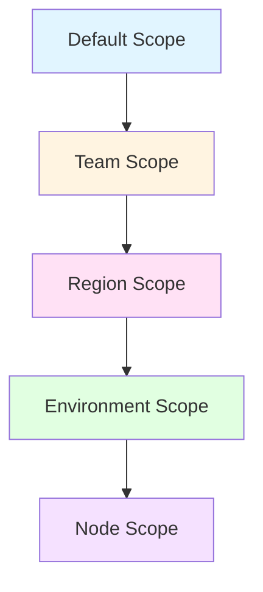

# Example: Multi-Team Web Server Configuration

This example demonstrates how different teams can manage their own
configuration parameters using the Pull Server's scope system while
sharing the same base configuration. This scenario showcases:

- Multiple teams managing different aspects of the same server
  (IIS team, Security team)
- Custom scope types for team ownership and deployment context
- Parameter merging across scope layers
- Real-world separation of concerns

## Scenario Overview

**Infrastructure Setup:**

- Web servers running IIS in multiple regions and environments
- IIS configuration team owns application settings and server tuning
- Security team owns firewall rules and SSL certificates
- Operations team manages region and environment-specific networking

**Teams and Responsibilities:**

- **IIS Team**: Manages application pool settings, site bindings,
  default documents
- **Security Team**: Manages firewall rules, SSL/TLS settings,
  security headers
- **Operations Team**: Manages region-specific compliance and
  environment-specific resource limits

## Scope Type Design

Create scope types that reflect team ownership and deployment context:



**Scope Type Configuration:**

| Scope Type | Precedence | Purpose | Owner |
| ---------- | ---------- | ------- | ----- |
| Default | 0 | Global defaults for all servers | Platform Team |
| Team | 1 | Team-specific application settings | IIS/Security Teams |
| Region | 2 | Regional compliance requirements | Operations Team |
| Environment | 3 | Environment-specific limits | Operations Team |
| Node | 4 | Server-specific overrides | Individual server owner |

## Configuration Structure

**Main Configuration** (`webserver-config`):

```yaml
# webserver-baseline.dsc.yaml
$schema: https://raw.githubusercontent.com/PowerShell/DSC/main/schemas/2024/04/config/document.json
metadata:
  name: webserver-baseline
  version: 1.0.0
  description: IIS web server baseline configuration

parameters:
  # IIS Settings (managed by IIS Team)
  applicationPoolSettings:
    type: object
    defaultValue:
      enable32BitAppOnWin64: false
      managedRuntimeVersion: v4.0
      idleTimeout: '00:20:00'

  siteBindings:
    type: array
    defaultValue:
      - protocol: http
        port: 80
      - protocol: https
        port: 443

  defaultDocuments:
    type: array
    defaultValue:
      - Default.aspx
      - index.html

  # Security Settings (managed by Security Team)
  firewallRules:
    type: array
    defaultValue: []

  tlsSettings:
    type: object
    defaultValue:
      minimumTlsVersion: '1.2'
      cipherSuites:
        - TLS_ECDHE_RSA_WITH_AES_256_GCM_SHA384
        - TLS_ECDHE_RSA_WITH_AES_128_GCM_SHA256

  securityHeaders:
    type: object
    defaultValue: {}

  # Operations Settings
  resourceLimits:
    type: object
    defaultValue:
      maxConnections: 1000
      requestTimeout: 30

resources:
  # IIS Application Pool
  - name: MainAppPool
    type: Microsoft.Windows/WindowsFeatures
    properties:
      name: '[parameters(''applicationPoolSettings'').name]'
      ensure: Present
      enable32BitAppOnWin64: '[parameters(''applicationPoolSettings'').enable32BitAppOnWin64]'
      managedRuntimeVersion: '[parameters(''applicationPoolSettings'').managedRuntimeVersion]'
      idleTimeout: '[parameters(''applicationPoolSettings'').idleTimeout]'

  # Firewall rules from Security team
  - name: WebServerFirewall
    type: Microsoft.Windows/Firewall
    properties:
      rules: '[parameters(''firewallRules'')]'

  # TLS configuration
  - name: TlsSettings
    type: Microsoft.Windows/Registry
    properties:
      key: HKLM:\System\CurrentControlSet\Control\SecurityProviders\SCHANNEL\Protocols\TLS 1.2\Server
      values:
        - name: Enabled
          value: 1
          type: DWord
```

## Parameter Files by Scope

### Default Scope Parameters

**File:** `data/parameters/webserver-config/Default/parameters.yaml`

Platform team sets conservative global defaults:

```yaml
# Global defaults - applies to ALL web servers
applicationPoolSettings:
  name: DefaultAppPool
  enable32BitAppOnWin64: false
  managedRuntimeVersion: v4.0
  idleTimeout: '00:20:00'
  maxProcesses: 1
  recycling:
    periodicRestart: '1.05:00:00'  # 29 hours
    requestLimit: 0

defaultDocuments:
  - Default.aspx
  - Default.htm
  - index.html

tlsSettings:
  minimumTlsVersion: '1.2'
  cipherSuites:
    - TLS_ECDHE_RSA_WITH_AES_256_GCM_SHA384
    - TLS_ECDHE_RSA_WITH_AES_128_GCM_SHA256

resourceLimits:
  maxConnections: 1000
  requestTimeout: 30
  maxBandwidth: 10485760  # 10 MB/s
```

### Team Scope - IIS Team

**Scope Value:** `IIS-Team`

**File:** `data/parameters/webserver-config/Team/
IIS-Team/parameters.yaml`

IIS team customizes application pool and site settings:

```yaml
# IIS Team parameters - overrides defaults for IIS configuration
applicationPoolSettings:
  name: WebAppPool
  idleTimeout: '00:30:00'  # Override: 30 minutes
  maxProcesses: 4           # Override: enable web garden
  recycling:
    periodicRestart: '2.00:00:00'  # Override: 48 hours
    requestLimit: 50000
    privateMemoryLimit: 2097152     # 2 GB

siteBindings:
  - protocol: http
    port: 80
    hostName: www.example.com
  - protocol: https
    port: 443
    hostName: www.example.com
    certificateHash: 'ABC123...'

defaultDocuments:
  - Default.aspx
  - app.html
  - index.html
  - default.html

# IIS-specific logging
loggingSettings:
  logFormat: W3C
  logDirectory: D:\Logs\IIS
  logFields:
    - Date
    - Time
    - ClientIP
    - Method
    - UriStem
    - HttpStatus
```

### Team Scope - Security Team

**Scope Value:** `Security-Team`

**File:** `data/parameters/webserver-config/Team/
Security-Team/parameters.yaml`

Security team manages firewall and hardening:

```yaml
# Security Team parameters - firewall and security hardening
firewallRules:
  - name: Allow HTTP
    direction: Inbound
    action: Allow
    protocol: TCP
    localPort: 80
    enabled: true

  - name: Allow HTTPS
    direction: Inbound
    action: Allow
    protocol: TCP
    localPort: 443
    enabled: true

  - name: Block Insecure Protocols
    direction: Inbound
    action: Block
    protocol: TCP
    localPort: 21,23,25
    enabled: true

tlsSettings:
  minimumTlsVersion: '1.2'
  cipherSuites:
    # Security team enforces strict cipher suite order
    - TLS_ECDHE_ECDSA_WITH_AES_256_GCM_SHA384
    - TLS_ECDHE_ECDSA_WITH_AES_128_GCM_SHA256
    - TLS_ECDHE_RSA_WITH_AES_256_GCM_SHA384
    - TLS_ECDHE_RSA_WITH_AES_128_GCM_SHA256
  disableWeakProtocols: true

securityHeaders:
  X-Frame-Options: DENY
  X-Content-Type-Options: nosniff
  Strict-Transport-Security: max-age=31536000; includeSubDomains
  Content-Security-Policy: "default-src 'self'"
  X-XSS-Protection: '1; mode=block'
```

### Region Scope - US-West

**Scope Value:** `US-West`

**File:** `data/parameters/webserver-config/Region/
US-West/parameters.yaml`

US-West region has specific compliance requirements:

```yaml
# US-West region parameters - regional compliance
resourceLimits:
  maxConnections: 2000      # Higher limits for US-West capacity
  requestTimeout: 45
  maxBandwidth: 20971520    # 20 MB/s

# CCPA compliance logging
loggingSettings:
  logDirectory: D:\Logs\IIS-CCPA
  retentionDays: 365
  logPersonalData: false    # CCPA requirement

# Regional firewall additions
firewallRules:
  - name: Allow Azure Monitor
    direction: Outbound
    action: Allow
    protocol: TCP
    remoteAddress: 13.88.0.0/16
    remotePort: 443
    enabled: true

# US-specific cipher suites (FIPS compliance)
tlsSettings:
  fipsMode: true
  minimumTlsVersion: '1.2'
```

### Region Scope - EU-Central

**Scope Value:** `EU-Central`

**File:** `data/parameters/webserver-config/Region/
EU-Central/parameters.yaml`

EU-Central region has GDPR requirements:

```yaml
# EU-Central region parameters - GDPR compliance
resourceLimits:
  maxConnections: 1500
  requestTimeout: 30
  maxBandwidth: 15728640    # 15 MB/s

# GDPR compliance logging
loggingSettings:
  logDirectory: D:\Logs\IIS-GDPR
  retentionDays: 90         # GDPR data retention
  anonymizeIpAddresses: true
  logPersonalData: false

# EU data residency
dataResidency:
  region: EU
  allowDataTransfer: false
  encryptionRequired: true

# Regional firewall for EU monitoring
firewallRules:
  - name: Allow Azure Monitor EU
    direction: Outbound
    action: Allow
    protocol: TCP
    remoteAddress: 52.174.0.0/16
    remotePort: 443
    enabled: true
```

### Environment Scope - Production

**Scope Value:** `Production`

**File:** `data/parameters/webserver-config/Environment/
Production/parameters.yaml`

Production environment has strict resource limits:

```yaml
# Production environment parameters
applicationPoolSettings:
  maxProcesses: 8           # Override: higher concurrency for production
  recycling:
    periodicRestart: '7.00:00:00'  # 7 days for stability
    requestLimit: 100000
    privateMemoryLimit: 4194304    # 4 GB

resourceLimits:
  maxConnections: 5000      # Production capacity
  requestTimeout: 60
  connectionTimeout: 120

# Production monitoring
monitoring:
  enabled: true
  healthCheckInterval: 30
  alertThresholds:
    cpuPercent: 80
    memoryPercent: 85
    requestQueueLength: 1000
```

### Environment Scope - Staging

**Scope Value:** `Staging`

**File:** `data/parameters/webserver-config/Environment/
Staging/parameters.yaml`

Staging environment matches production but with lower limits:

```yaml
# Staging environment parameters
applicationPoolSettings:
  maxProcesses: 4
  recycling:
    periodicRestart: '1.00:00:00'  # Daily recycle for testing
    requestLimit: 10000

resourceLimits:
  maxConnections: 1000      # Lower capacity for staging
  requestTimeout: 60
  connectionTimeout: 120

# Staging allows more verbose logging
loggingSettings:
  logLevel: Verbose
  includeRequestBody: true
  includeResponseBody: true
```

### Node Scope - Specific Server Override

**Scope Value:** `webserver01.example.com` (auto-generated GUID for this FQDN)

**File:** `data/parameters/webserver-config/Node/{node-guid}/parameters.yaml`

Individual server override for troubleshooting:

```yaml
# Node-specific override for webserver01.example.com
loggingSettings:
  logLevel: Debug           # Temporary debug logging
  includeRequestBody: true

# Temporary resource limit increase for load testing
resourceLimits:
  maxConnections: 10000
  requestTimeout: 120
```

## Parameter Merge Result

For a node `webserver01.example.com` in **US-West** region,
**Production** environment, with tags for **IIS-Team** and **Security-Team**:

**Merge Order:**

1. Default scope (precedence 0)
2. Team scope - IIS-Team (precedence 1)
3. Team scope - Security-Team (precedence 1)
4. Region scope - US-West (precedence 2)
5. Environment scope - Production (precedence 3)
6. Node scope - webserver01.example.com (precedence 4)

**Final Merged Parameters:**

```yaml
# Final merged result for webserver01.example.com
applicationPoolSettings:
  name: WebAppPool                    # From IIS-Team
  enable32BitAppOnWin64: false        # From Default
  managedRuntimeVersion: v4.0         # From Default
  idleTimeout: '00:30:00'             # From IIS-Team
  maxProcesses: 8                     # From Production (overrides IIS-Team's 4)
  recycling:
    periodicRestart: '7.00:00:00'     # From Production (overrides IIS-Team's 2 days)
    requestLimit: 100000              # From Production (overrides IIS-Team's 50000)
    privateMemoryLimit: 4194304       # From Production (overrides IIS-Team's 2GB)

siteBindings:                         # From IIS-Team (array replace)
  - protocol: http
    port: 80
    hostName: www.example.com
  - protocol: https
    port: 443
    hostName: www.example.com
    certificateHash: 'ABC123...'

defaultDocuments:                     # From IIS-Team (array replace)
  - Default.aspx
  - app.html
  - index.html
  - default.html

firewallRules:                        # Merged from Security-Team + US-West
  - name: Allow HTTP
    direction: Inbound
    action: Allow
    protocol: TCP
    localPort: 80
    enabled: true

  - name: Allow HTTPS
    direction: Inbound
    action: Allow
    protocol: TCP
    localPort: 443
    enabled: true

  - name: Block Insecure Protocols
    direction: Inbound
    action: Block
    protocol: TCP
    localPort: 21,23,25
    enabled: true

  - name: Allow Azure Monitor
    direction: Outbound
    action: Allow
    protocol: TCP
    remoteAddress: 13.88.0.0/16
    remotePort: 443
    enabled: true

tlsSettings:                          # Deep merged from Default -> Security-Team -> US-West
  minimumTlsVersion: '1.2'            # From Default (preserved through all scopes)
  cipherSuites:                       # From Security-Team (array replace)
    - TLS_ECDHE_ECDSA_WITH_AES_256_GCM_SHA384
    - TLS_ECDHE_ECDSA_WITH_AES_128_GCM_SHA256
    - TLS_ECDHE_RSA_WITH_AES_256_GCM_SHA384
    - TLS_ECDHE_RSA_WITH_AES_128_GCM_SHA256
  disableWeakProtocols: true          # From Security-Team
  fipsMode: true                      # From US-West

securityHeaders:                      # From Security-Team (object deep merge)
  X-Frame-Options: DENY
  X-Content-Type-Options: nosniff
  Strict-Transport-Security: max-age=31536000; includeSubDomains
  Content-Security-Policy: "default-src 'self'"
  X-XSS-Protection: '1; mode=block'

resourceLimits:                       # Deep merged Default -> US-West -> Production
  maxConnections: 5000                # From Production (overrides US-West's 2000)
  requestTimeout: 60                  # From Production (overrides US-West's 45)
  maxBandwidth: 20971520              # From US-West (20 MB/s)
  connectionTimeout: 120              # From Production

loggingSettings:                      # Deep merged IIS-Team -> US-West -> Node
  logFormat: W3C                      # From IIS-Team
  logDirectory: D:\Logs\IIS-CCPA      # From US-West (CCPA compliance)
  logFields:                          # From IIS-Team (array replace)
    - Date
    - Time
    - ClientIP
    - Method
    - UriStem
    - HttpStatus
  retentionDays: 365                  # From US-West
  logPersonalData: false              # From US-West
  logLevel: Debug                     # From Node override
  includeRequestBody: true            # From Node override

monitoring:                           # From Production
  enabled: true
  healthCheckInterval: 30
  alertThresholds:
    cpuPercent: 80
    memoryPercent: 85
    requestQueueLength: 1000

dataResidency: null                   # Not set for US-West (EU-only)
```

## Node Tagging for Multi-Team Assignment

Each web server needs to be tagged with appropriate scope values:

**webserver01.example.com** (Production, US-West):

- **Team** scope: `IIS-Team`
- **Team** scope: `Security-Team`
- **Region** scope: `US-West`
- **Environment** scope: `Production`

**webserver02.example.com** (Staging, EU-Central):

- **Team** scope: `IIS-Team`
- **Team** scope: `Security-Team`
- **Region** scope: `EU-Central`
- **Environment** scope: `Staging`

## Team Workflow

### IIS Team Workflow

1. **Update Application Settings** (no coordination with Security team needed):

   ```text
   Update: data/parameters/webserver-config/Team/IIS-Team/parameters.yaml
   Changes: applicationPoolSettings, siteBindings, defaultDocuments, loggingSettings
   ```

2. **Publish New Version**:
   - Changes apply to ALL servers tagged with IIS-Team
   - Security team's firewall rules remain unchanged
   - Regional compliance settings remain unchanged

### Security Team Workflow

1. **Update Firewall Rules** (no coordination with IIS team needed):

   ```text
   Update: data/parameters/webserver-config/Team/Security-Team/parameters.yaml
   Changes: firewallRules, tlsSettings, securityHeaders
   ```

2. **Publish New Version**:
   - Security changes apply to ALL servers tagged with Security-Team
   - IIS application settings remain unchanged
   - Teams work independently

### Operations Team Workflow

1. **Regional Compliance Update** (affects only US-West servers):

   ```text
   Update: data/parameters/webserver-config/Region/US-West/parameters.yaml
   Changes: CCPA logging requirements
   ```

2. **Environment Resource Tuning** (affects only Production):

   ```text
   Update: data/parameters/webserver-config/Environment/Production/parameters.yaml
   Changes: resourceLimits, monitoring thresholds
   ```

## Benefits of This Approach

**Team Autonomy:**

- Each team manages their own parameter scope
- No merge conflicts or coordination overhead
- Changes are atomic within team boundaries

**Separation of Concerns:**

- IIS team focuses on application configuration
- Security team focuses on hardening and compliance
- Operations team manages regional/environment differences

**Flexibility:**

- Same configuration works across all environments
- Regional compliance handled via scope parameters
- Environment-specific tuning without configuration forks

**Auditability:**

- Parameter provenance shows which team set each value
- Version history tracks all changes
- Clear ownership of each setting

**Testing:**

- Staging environment can test parameter changes before production
- Node-specific overrides for troubleshooting
- Easy rollback via parameter version management

## Related Documentation

- [Scope System Overview](../scope-system.md) - Understanding scope types,
  values, and tagging
- [Parameter Merging](../parameter-merging.md) - Deep dive into merge algorithm
  and precedence
- [Configuration Management](../configuration-management.md) - Version lifecycle
  and bundle generation
