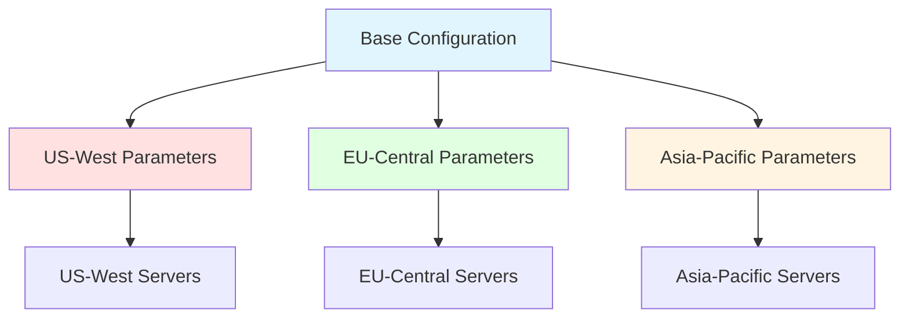

# Example: Multi-Region Deployment with Regional Customization

This example demonstrates deploying the same configuration across multiple
geographic regions with region-specific parameter customization. This scenario
showcases:

- Single configuration deployed to multiple regions
- Region-specific compliance requirements (GDPR, CCPA, LGPD)
- Regional networking and performance tuning
- Centralized configuration with regional flexibility

## Scenario Overview

**Deployment Context:**

- Global application deployed to US-West, EU-Central, and Asia-Pacific regions
- Each region has specific compliance, networking, and performance requirements
- Same core application configuration with regional parameter overlays
- Simplified management with single source of truth

**Regional Requirements:**

| Region | Compliance | Data Residency | Performance Tier |
| -------- | ----------- | ---------------- | ------------------ |
| US-West | CCPA | US-only | High capacity |
| EU-Central | GDPR | EU-only | Standard capacity |
| Asia-Pacific | APAC regulations | Regional | Standard capacity |

## Architecture



## Scope Type Design

Simple two-tier scope structure for regional deployments:

| Scope Type | Precedence | Purpose |
| ----------- | ---------- | ------- |
| Default | 0 | Global application baseline |
| Region | 10 | Region-specific customization |
| Node | 20 | Server-specific overrides |

## Base Configuration

**Configuration Name:** `global-app-config`

```yaml
# global-app.dsc.yaml
$schema: https://raw.githubusercontent.com/PowerShell/DSC/main/schemas/2024/04/config/document.json
metadata:
  name: global-app-config
  version: 2.1.0
  description: Global application configuration with regional customization

parameters:
  # Application settings
  appSettings:
    type: object
    defaultValue:
      maxConcurrentRequests: 1000
      requestTimeout: 30
      cacheEnabled: true

  # Database connection
  databaseSettings:
    type: object
    defaultValue:
      provider: SqlServer
      connectionTimeout: 15
      commandTimeout: 30

  # Compliance settings
  complianceSettings:
    type: object
    defaultValue:
      dataRetentionDays: 90
      encryptionRequired: true
      auditLogging: true

  # Network configuration
  networkSettings:
    type: object
    defaultValue:
      allowedOrigins: []
      corsEnabled: true
      rateLimiting:
        enabled: true
        requestsPerMinute: 100

resources:
  - name: ApplicationConfiguration
    type: Microsoft.Windows/Registry
    properties:
      key: HKLM:\SOFTWARE\GlobalApp
      values:
        - name: MaxConcurrentRequests
          value: '[parameters(''appSettings'').maxConcurrentRequests]'
          type: DWord

        - name: RequestTimeout
          value: '[parameters(''appSettings'').requestTimeout]'
          type: DWord

  - name: DatabaseConfiguration
    type: OpenDsc.Json/Value
    properties:
      path: C:\ProgramData\GlobalApp\config.json
      jsonPath: $.database
      value: '[parameters(''databaseSettings'')]'
```

## Default Scope Parameters

**File:** `data/parameters/global-app-config/Default/
00000000-0000-0000-0000-000000000001/parameters.yaml`

Global defaults for all regions:

```yaml
# Global application defaults
appSettings:
  maxConcurrentRequests: 1000
  requestTimeout: 30
  cacheEnabled: true
  cacheExpirationMinutes: 60
  compressionEnabled: true
  compressionLevel: optimal

databaseSettings:
  provider: SqlServer
  connectionTimeout: 15
  commandTimeout: 30
  maxPoolSize: 100
  minPoolSize: 5
  enableRetry: true
  maxRetryCount: 3

complianceSettings:
  dataRetentionDays: 90
  encryptionRequired: true
  auditLogging: true
  logLevel: Information

networkSettings:
  allowedOrigins:
    - https://app.example.com
    - https://admin.example.com
  corsEnabled: true
  rateLimiting:
    enabled: true
    requestsPerMinute: 100
    burstSize: 150
```

## Regional Parameter Customization

### US-West Region

**Scope Value:** `US-West`

**File:** `data/parameters/global-app-config/Region/
US-West/parameters.yaml`

US-West has higher capacity and CCPA compliance:

```yaml
# US-West regional parameters
appSettings:
  maxConcurrentRequests: 2000  # Higher capacity for US-West
  requestTimeout: 45
  cacheExpirationMinutes: 120  # Longer cache for performance

databaseSettings:
  connectionString: Server=uswest-sql.example.com;Database=GlobalApp;
  maxPoolSize: 200             # Higher pool size
  enableConnectionLogging: true

complianceSettings:
  dataRetentionDays: 365       # CCPA requires longer retention
  encryptionRequired: true
  auditLogging: true
  logLevel: Warning
  complianceFramework: CCPA
  dataResidency:
    allowTransfer: false
    region: US
    storageLocation: US-West-1
  privacyNotice:
    enabled: true
    url: https://example.com/privacy-ccpa

networkSettings:
  allowedOrigins:
    - https://app.example.com
    - https://admin.example.com
    - https://us.example.com   # US-specific domain
  corsEnabled: true
  rateLimiting:
    requestsPerMinute: 200     # Higher limits
    burstSize: 300
  cdn:
    enabled: true
    provider: CloudFlare
    edgeLocations:
      - us-west-1
      - us-west-2

# Regional monitoring
monitoring:
  enabled: true
  endpoint: https://uswest-monitor.example.com
  metricsInterval: 60
  alerting:
    enabled: true
    emailRecipients:
      - uswest-ops@example.com
    thresholds:
      cpuPercent: 75
      memoryPercent: 80
      requestLatencyMs: 500

# US-specific networking
networking:
  loadBalancer:
    type: ApplicationGateway
    healthCheckPath: /health
    healthCheckInterval: 30
  publicIpAddress: 13.88.XXX.XXX
  virtualNetwork:
    addressSpace: 10.1.0.0/16
    subnets:
      - name: app-subnet
        addressPrefix: 10.1.1.0/24
      - name: db-subnet
        addressPrefix: 10.1.2.0/24
```

### EU-Central Region

**Scope Value:** `EU-Central`

**File:** `data/parameters/global-app-config/Region/
EU-Central/parameters.yaml`

EU-Central has GDPR compliance and strict data residency:

```yaml
# EU-Central regional parameters
appSettings:
  maxConcurrentRequests: 1500  # Standard capacity
  requestTimeout: 30
  cacheExpirationMinutes: 90

databaseSettings:
  connectionString: Server=eucentral-sql.example.com;Database=GlobalApp;
  maxPoolSize: 150
  enableConnectionLogging: true
  encryptAtRest: true          # GDPR requirement

complianceSettings:
  dataRetentionDays: 90        # GDPR right to be forgotten
  encryptionRequired: true
  auditLogging: true
  logLevel: Information
  complianceFramework: GDPR
  dataResidency:
    allowTransfer: false       # Strict EU-only data
    region: EU
    storageLocation: EU-Central-1
  privacyNotice:
    enabled: true
    url: https://example.com/privacy-gdpr
  rightToBeForgotten:
    enabled: true
    automatedDeletion: true
  consentManagement:
    enabled: true
    requireExplicitConsent: true

networkSettings:
  allowedOrigins:
    - https://app.example.com
    - https://admin.example.com
    - https://eu.example.com    # EU-specific domain
  corsEnabled: true
  rateLimiting:
    requestsPerMinute: 150
    burstSize: 200
  cdn:
    enabled: true
    provider: CloudFlare
    edgeLocations:
      - eu-central-1
      - eu-west-1

# Regional monitoring (EU data centers only)
monitoring:
  enabled: true
  endpoint: https://eucentral-monitor.example.com
  metricsInterval: 60
  dataResidency: EU
  alerting:
    enabled: true
    emailRecipients:
      - eucentral-ops@example.com
    thresholds:
      cpuPercent: 70
      memoryPercent: 75
      requestLatencyMs: 400

# EU-specific networking
networking:
  loadBalancer:
    type: ApplicationGateway
    healthCheckPath: /health
    healthCheckInterval: 30
  publicIpAddress: 52.174.XXX.XXX
  virtualNetwork:
    addressSpace: 10.2.0.0/16
    subnets:
      - name: app-subnet
        addressPrefix: 10.2.1.0/24
      - name: db-subnet
        addressPrefix: 10.2.2.0/24

  # GDPR-specific network security
  networkSecurity:
    dpiEnabled: false           # DPI not allowed under GDPR
    logIpAddresses: false       # IP anonymization required
    enableGeoBlocking: true
    allowedRegions:
      - EU
      - EEA
```

### Asia-Pacific Region

**Scope Value:** `Asia-Pacific`

**File:** `data/parameters/global-app-config/Region/
Asia-Pacific/parameters.yaml`

Asia-Pacific has regional data regulations and performance optimization:

```yaml
# Asia-Pacific regional parameters
appSettings:
  maxConcurrentRequests: 1200  # Standard capacity
  requestTimeout: 40           # Higher timeout for latency
  cacheExpirationMinutes: 180  # Longer cache due to distance

databaseSettings:
  connectionString: Server=apac-sql.example.com;Database=GlobalApp;
  maxPoolSize: 120
  enableConnectionLogging: true
  readReplica:
    enabled: true              # Read replicas for performance
    endpoints:
      - apac-sql-read01.example.com
      - apac-sql-read02.example.com

complianceSettings:
  dataRetentionDays: 180       # APAC regulations
  encryptionRequired: true
  auditLogging: true
  logLevel: Information
  complianceFramework: APAC
  dataResidency:
    allowTransfer: true        # Allow intra-APAC transfer
    region: APAC
    storageLocation: Asia-Pacific-1
    allowedTransferRegions:
      - Singapore
      - Australia
      - Japan
  localizedPrivacy:
    languages:
      - en
      - zh
      - ja

networkSettings:
  allowedOrigins:
    - https://app.example.com
    - https://admin.example.com
    - https://apac.example.com  # APAC-specific domain
  corsEnabled: true
  rateLimiting:
    requestsPerMinute: 120
    burstSize: 180
  cdn:
    enabled: true
    provider: CloudFlare
    edgeLocations:
      - asia-southeast-1
      - asia-northeast-1
      - australia-southeast-1

# Regional monitoring
monitoring:
  enabled: true
  endpoint: https://apac-monitor.example.com
  metricsInterval: 90          # Less frequent for cost
  alerting:
    enabled: true
    emailRecipients:
      - apac-ops@example.com
    thresholds:
      cpuPercent: 80
      memoryPercent: 85
      requestLatencyMs: 800    # Higher tolerance for latency

# APAC-specific networking
networking:
  loadBalancer:
    type: ApplicationGateway
    healthCheckPath: /health
    healthCheckInterval: 45    # Less frequent
  publicIpAddress: 52.220.XXX.XXX
  virtualNetwork:
    addressSpace: 10.3.0.0/16
    subnets:
      - name: app-subnet
        addressPrefix: 10.3.1.0/24
      - name: db-subnet
        addressPrefix: 10.3.2.0/24

  # APAC regional routing
  routing:
    preferLocalTraffic: true
    crossRegionLatencyMs: 200
    failoverRegion: Australia

# Localization settings
localization:
  defaultLanguage: en
  supportedLanguages:
    - en
    - zh-CN
    - zh-TW
    - ja
    - ko
  timeZone: Asia/Singapore
  dateFormat: DD/MM/YYYY
```

## Parameter Merge Results by Region

### US-West Server

**Server:** `app01.uswest.example.com`

**Tags:**

- Region: `US-West`

**Final Merged Parameters:**

```yaml
appSettings:
  maxConcurrentRequests: 2000           # From US-West (overrides Default 1000)
  requestTimeout: 45                    # From US-West (overrides Default 30)
  cacheEnabled: true                    # From Default
  cacheExpirationMinutes: 120           # From US-West (overrides Default 60)
  compressionEnabled: true              # From Default
  compressionLevel: optimal             # From Default

databaseSettings:
  connectionString: Server=uswest-sql.example.com;Database=GlobalApp;  # From US-West
  provider: SqlServer                   # From Default
  connectionTimeout: 15                 # From Default
  commandTimeout: 30                    # From Default
  maxPoolSize: 200                      # From US-West (overrides Default 100)
  minPoolSize: 5                        # From Default
  enableRetry: true                     # From Default
  maxRetryCount: 3                      # From Default
  enableConnectionLogging: true         # From US-West

complianceSettings:
  dataRetentionDays: 365                # From US-West (CCPA - overrides Default 90)
  encryptionRequired: true              # From Default
  auditLogging: true                    # From Default
  logLevel: Warning                     # From US-West (overrides Default Information)
  complianceFramework: CCPA             # From US-West
  dataResidency:                        # From US-West
    allowTransfer: false
    region: US
    storageLocation: US-West-1
  privacyNotice:                        # From US-West
    enabled: true
    url: https://example.com/privacy-ccpa

networkSettings:
  allowedOrigins:                       # From US-West (array replace)
    - https://app.example.com
    - https://admin.example.com
    - https://us.example.com
  corsEnabled: true                     # From Default
  rateLimiting:                         # Deep merged Default + US-West
    enabled: true                       # From Default
    requestsPerMinute: 200              # From US-West (overrides Default 100)
    burstSize: 300                      # From US-West (overrides Default 150)
  cdn:                                  # From US-West
    enabled: true
    provider: CloudFlare
    edgeLocations:
      - us-west-1
      - us-west-2

monitoring:                             # From US-West
  enabled: true
  endpoint: https://uswest-monitor.example.com
  metricsInterval: 60
  alerting:
    enabled: true
    emailRecipients:
      - uswest-ops@example.com
    thresholds:
      cpuPercent: 75
      memoryPercent: 80
      requestLatencyMs: 500

networking:                             # From US-West
  loadBalancer:
    type: ApplicationGateway
    healthCheckPath: /health
    healthCheckInterval: 30
  publicIpAddress: 13.88.XXX.XXX
  virtualNetwork:
    addressSpace: 10.1.0.0/16
    subnets:
      - name: app-subnet
        addressPrefix: 10.1.1.0/24
      - name: db-subnet
        addressPrefix: 10.1.2.0/24
```

### EU-Central Server

**Server:** `app01.eucentral.example.com`

**Tags:**

- Region: `EU-Central`

**Key Differences from US-West:**

```yaml
appSettings:
  maxConcurrentRequests: 1500           # Lower than US-West (1500 vs 2000)

databaseSettings:
  connectionString: Server=eucentral-sql.example.com;Database=GlobalApp;
  maxPoolSize: 150                      # Lower than US-West (150 vs 200)
  encryptAtRest: true                   # GDPR requirement (not in US-West)

complianceSettings:
  dataRetentionDays: 90                 # Shorter than US-West (90 vs 365)
  complianceFramework: GDPR             # Different framework
  rightToBeForgotten:                   # GDPR-specific (not in US-West)
    enabled: true
    automatedDeletion: true
  consentManagement:                    # GDPR-specific
    enabled: true
    requireExplicitConsent: true

networkSettings:
  cdn:
    edgeLocations:                      # EU edge locations
      - eu-central-1
      - eu-west-1

networking:
  networkSecurity:                      # GDPR-specific security
    dpiEnabled: false
    logIpAddresses: false
    enableGeoBlocking: true
    allowedRegions:
      - EU
      - EEA
```

### Asia-Pacific Server

**Server:** `app01.apac.example.com`

**Tags:**

- Region: `Asia-Pacific`

**Key Differences:**

```yaml
appSettings:
  requestTimeout: 40                    # Higher timeout for latency
  cacheExpirationMinutes: 180           # Longest cache duration

databaseSettings:
  readReplica:                          # APAC-specific performance
    enabled: true
    endpoints:
      - apac-sql-read01.example.com
      - apac-sql-read02.example.com

complianceSettings:
  dataRetentionDays: 180                # Medium retention
  dataResidency:
    allowTransfer: true                 # Allows intra-APAC transfer
    allowedTransferRegions:
      - Singapore
      - Australia
      - Japan

localization:                           # APAC-specific localization
  defaultLanguage: en
  supportedLanguages:
    - en
    - zh-CN
    - zh-TW
    - ja
    - ko
  timeZone: Asia/Singapore
```

## Deployment Workflow

### Step 1: Create Regional Scope Type

Use the Scalar API documentation at `/scalar/v1` to:

- Create scope type "Region" with precedence 1
- Create scope values: `US-West`, `EU-Central`, `Asia-Pacific`

### Step 2: Upload Regional Parameters

For each region, upload customized parameters:

- **US-West**: CCPA compliance, high capacity settings
- **EU-Central**: GDPR compliance, EU data residency
- **Asia-Pacific**: Regional regulations, performance optimization

### Step 3: Tag Servers

Tag each server with its region:

- `app01.uswest.example.com` → Region: US-West
- `app01.eucentral.example.com` → Region: EU-Central
- `app01.apac.example.com` → Region: Asia-Pacific

### Step 4: Deploy Configuration

Publish configuration version:

- Single configuration applies to all regions
- Regional parameters automatically merged at download time
- Each server receives region-customized configuration bundle

## Benefits

**Centralized Management:**

- Single configuration source for global deployment
- Regional customization through parameters
- No configuration forking or duplication

**Compliance:**

- CCPA, GDPR, and APAC regulations handled via regional parameters
- Data residency enforced through region-specific settings
- Audit trail of regional compliance changes

**Performance:**

- Region-specific capacity tuning
- CDN and networking optimization per region
- Read replicas in APAC for performance

**Flexibility:**

- Easy to add new regions
- Regional teams can customize without affecting other regions
- Global updates automatically apply with regional overrides

## Comparison Matrix

| Setting | US-West | EU-Central | Asia-Pacific | Source |
| ------- | ------- | ---------- | ------------ | ------ |
| maxConcurrentRequests | 2000 | 1500 | 1200 | Regional |
| dataRetentionDays | 365 | 90 | 180 | Regional |
| Compliance Framework | CCPA | GDPR | APAC | Regional |
| Data Transfer | Blocked | Blocked | Intra-APAC | Regional |
| CDN Provider | CloudFlare | CloudFlare | CloudFlare | Regional |
| Database Pool Size | 200 | 150 | 120 | Regional |
| Rate Limit (RPM) | 200 | 150 | 120 | Regional |

## Related Documentation

- [Scope System Overview](../scope-system.md)
- [Parameter Merging](../parameter-merging.md)
- [Configuration Management](../configuration-management.md)
- [Web Server Baseline Example](01-web-server-baseline.md)
