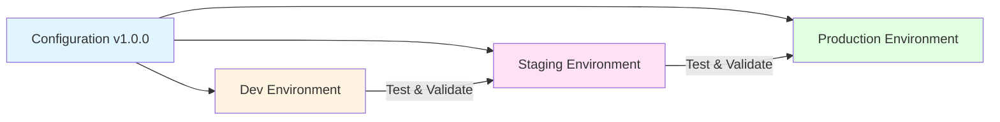
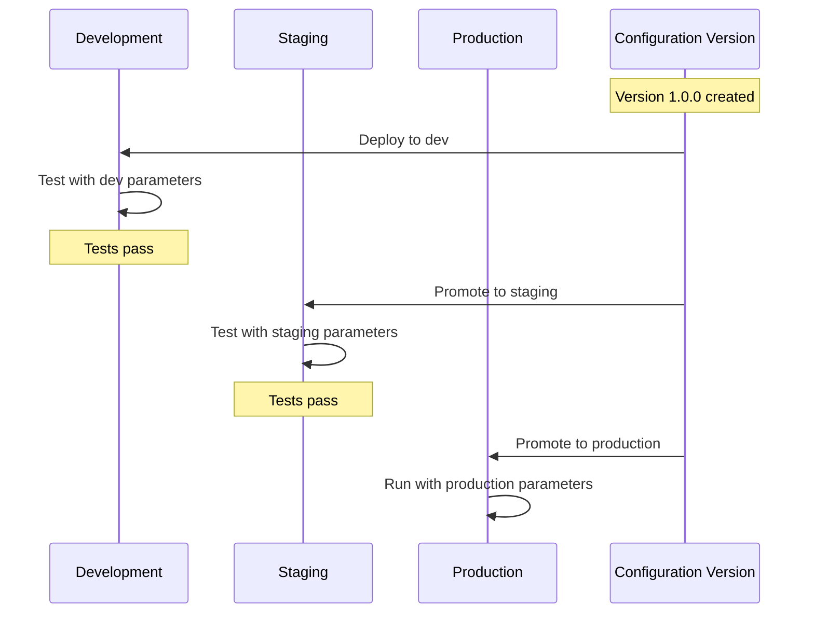

# Example: Environment Promotion Workflow

This example demonstrates how to manage configuration across development,
staging, and production environments using scope-based parameter management.
This scenario showcases:

- Single configuration version promoted across environments
- Environment-specific parameter customization
- Progressive rollout with confidence through lower environments
- Separation of configuration logic from environment-specific values

## Scenario Overview

**Environment Strategy:**

- Same configuration version progresses through dev → staging → production
- Each environment has different resource limits, monitoring, and integrations
- Configuration changes tested in dev before production deployment
- Environment-specific secrets and endpoints managed through parameters

**Environments:**

| Environment | Purpose | Capacity | Monitoring Level | Change Frequency |
| ----------- | ------- | -------- | ---------------- | ---------------- |
| Development | Feature development | Low | Verbose | High |
| Staging | Pre-production testing | Medium | Standard | Medium |
| Production | Live customer traffic | High | Critical-only | Low |

## Architecture



## Promotion Flow



## Scope Type Design

Environment-focused scope hierarchy:

| Scope Type | Precedence | Purpose |
| ---------- | ---------- | ------- |
| Default | 0 | Base configuration defaults |
| Environment | 1 | Environment-specific settings |
| Node | 2 | Server-specific overrides |

## Base Configuration

**Configuration Name:** `app-service-config`

```yaml
# app-service.dsc.yaml
$schema: https://raw.githubusercontent.com/PowerShell/DSC/main/schemas/2024/04/config/document.json
metadata:
  name: app-service-config
  version: 1.0.0
  description: Application service configuration with environment promotion

parameters:
  # Service settings
  serviceSettings:
    type: object
    defaultValue:
      name: AppService
      startupType: Automatic
      maxWorkerThreads: 50

  # Resource limits
  resourceLimits:
    type: object
    defaultValue:
      maxMemoryMb: 2048
      maxCpuPercent: 80
      maxConnections: 100

  # Logging configuration
  loggingSettings:
    type: object
    defaultValue:
      level: Information
      destination: File
      retentionDays: 30

  # External integrations
  integrations:
    type: object
    defaultValue:
      apiEndpoint: https://api.example.com
      authEnabled: true
      timeout: 30

  # Feature flags
  features:
    type: object
    defaultValue:
      enableNewUI: false
      enableAnalytics: true
      enableCaching: true

resources:
  - name: ApplicationService
    type: Microsoft.Windows/Service
    properties:
      name: '[parameters(''serviceSettings'').name]'
      ensure: Present
      startupType: '[parameters(''serviceSettings'').startupType]'

  - name: ServiceConfiguration
    type: OpenDsc.Json/Value
    properties:
      path: C:\ProgramData\AppService\config.json
      jsonPath: $.
      value:
        service: '[parameters(''serviceSettings'')]'
        resources: '[parameters(''resourceLimits'')]'
        logging: '[parameters(''loggingSettings'')]'
        integrations: '[parameters(''integrations'')]'
        features: '[parameters(''features'')]'
```

## Default Scope Parameters

**File:** `data/parameters/app-service-config/Default/parameters.yaml`

Conservative defaults for all environments:

```yaml
# Global defaults
serviceSettings:
  name: AppService
  startupType: Automatic
  displayName: Application Service
  description: Main application service
  maxWorkerThreads: 50
  gracefulShutdownTimeout: 30

resourceLimits:
  maxMemoryMb: 2048
  maxCpuPercent: 80
  maxConnections: 100
  requestQueueSize: 50
  threadPoolSize: 20

loggingSettings:
  level: Information
  destination: File
  path: C:\ProgramData\AppService\Logs
  retentionDays: 30
  maxFileSizeMb: 100
  includeTimestamp: true
  includeThreadId: false

integrations:
  apiEndpoint: https://api.example.com
  authEnabled: true
  timeout: 30
  retryCount: 3
  retryDelay: 1000

features:
  enableNewUI: false
  enableAnalytics: true
  enableCaching: true
  enableCompression: true
  enableHealthChecks: true
```

## Environment-Specific Parameters

### Development Environment

**Scope Value:** `Development`

**File:** `data/parameters/app-service-config/Environment/
Development/parameters.yaml`

Development has verbose logging and feature flags enabled:

```yaml
# Development environment parameters
serviceSettings:
  maxWorkerThreads: 20              # Lower resource usage for dev
  gracefulShutdownTimeout: 10       # Faster restart cycles

resourceLimits:
  maxMemoryMb: 1024                 # Lower limits for dev
  maxCpuPercent: 50
  maxConnections: 50
  requestQueueSize: 20
  threadPoolSize: 10

loggingSettings:
  level: Debug                      # Verbose logging for dev
  destination: File
  path: D:\Dev\AppService\Logs
  retentionDays: 7                  # Shorter retention
  maxFileSizeMb: 50
  includeTimestamp: true
  includeThreadId: true             # Include debug info
  includeStackTrace: true
  includeRequestBody: true
  includeResponseBody: true

integrations:
  apiEndpoint: https://dev-api.example.com  # Dev API endpoint
  authEnabled: false                # No auth in dev for easier testing
  timeout: 60                       # Longer timeout for debugging
  retryCount: 1                     # Don't retry in dev
  mockMode: true                    # Use mocks in dev
  mockDataPath: D:\Dev\AppService\MockData

features:
  enableNewUI: true                 # Test new features in dev
  enableAnalytics: false            # No analytics in dev
  enableCaching: false              # Disable cache for fresh data
  enableCompression: false          # Easier debugging uncompressed
  enableHealthChecks: true
  enableDebugEndpoints: true        # Dev-only debug endpoints
  enableHotReload: true             # Hot reload for development

# Development-specific debugging
debugging:
  enabled: true
  breakOnError: true
  verboseExceptions: true
  includeSourceMaps: true

# Development database
database:
  connectionString: Server=dev-sql.example.com;Database=AppService_Dev;
  commandTimeout: 60
  enableQueryLogging: true
  seedTestData: true
```

### Staging Environment

**Scope Value:** `Staging`

**File:** `data/parameters/app-service-config/Environment/
Staging/parameters.yaml`

Staging mirrors production settings but with additional testing features:

```yaml
# Staging environment parameters
serviceSettings:
  maxWorkerThreads: 40              # Medium capacity
  gracefulShutdownTimeout: 20

resourceLimits:
  maxMemoryMb: 4096                 # Production-like capacity
  maxCpuPercent: 70
  maxConnections: 200               # Lower than prod
  requestQueueSize: 100
  threadPoolSize: 30

loggingSettings:
  level: Information                # Standard logging
  destination: File
  path: D:\Staging\AppService\Logs
  retentionDays: 30
  maxFileSizeMb: 100
  includeTimestamp: true
  includeThreadId: false
  includeRequestBody: false         # No sensitive data
  includeResponseBody: false

integrations:
  apiEndpoint: https://staging-api.example.com  # Staging API
  authEnabled: true                 # Auth enabled like prod
  timeout: 30
  retryCount: 3
  retryDelay: 1000
  mockMode: false                   # Real integrations

features:
  enableNewUI: true                 # Test new UI before prod
  enableAnalytics: true             # Test analytics pipeline
  enableCaching: true
  enableCompression: true
  enableHealthChecks: true
  enableLoadTesting: true           # Staging-specific load testing
  enableSyntheticMonitoring: true   # Test monitoring setup

# Staging-specific testing
testing:
  enableSmokeTests: true
  enableIntegrationTests: true
  testDataRefreshInterval: 24       # Hours
  allowTestAccounts: true

# Staging database (production-like data)
database:
  connectionString: Server=staging-sql.example.com;Database=AppService_Staging;
  commandTimeout: 30
  enableQueryLogging: false
  readOnly: false                   # Allow writes in staging

# Staging monitoring (like production)
monitoring:
  enabled: true
  endpoint: https://staging-monitor.example.com
  metricsInterval: 60
  alerting:
    enabled: true
    emailRecipients:
      - staging-ops@example.com
    thresholds:
      cpuPercent: 70
      memoryPercent: 75
      errorRate: 5
```

### Production Environment

**Scope Value:** `Production`

**File:** `data/parameters/app-service-config/Environment/
Production/parameters.yaml`

Production has maximum performance and minimal logging:

```yaml
# Production environment parameters
serviceSettings:
  maxWorkerThreads: 100             # Maximum capacity
  gracefulShutdownTimeout: 30       # Allow clean shutdown

resourceLimits:
  maxMemoryMb: 8192                 # High limits for production
  maxCpuPercent: 80
  maxConnections: 1000              # Production capacity
  requestQueueSize: 500
  threadPoolSize: 50

loggingSettings:
  level: Warning                    # Minimal logging (only warnings/errors)
  destination: File
  path: D:\Production\AppService\Logs
  retentionDays: 90                 # Longer retention for compliance
  maxFileSizeMb: 200
  includeTimestamp: true
  includeThreadId: false
  includeRequestBody: false         # Never log sensitive data
  includeResponseBody: false
  sanitizeLogs: true                # Sanitize any sensitive data

integrations:
  apiEndpoint: https://api.example.com  # Production API
  authEnabled: true
  timeout: 30
  retryCount: 3
  retryDelay: 1000
  mockMode: false
  useCertificateAuth: true          # Production security
  certificateThumbprint: ABC123...

features:
  enableNewUI: false                # Stable UI only in prod
  enableAnalytics: true
  enableCaching: true
  enableCompression: true
  enableHealthChecks: true
  enablePerformanceMonitoring: true # Production-only APM

# Production database (with read replicas)
database:
  connectionString: Server=prod-sql.example.com;Database=AppService_Prod;
  commandTimeout: 30
  enableQueryLogging: false
  readOnly: false
  connectionPooling:
    enabled: true
    minPoolSize: 10
    maxPoolSize: 100
  readReplicas:
    enabled: true
    endpoints:
      - prod-sql-read01.example.com
      - prod-sql-read02.example.com
      - prod-sql-read03.example.com

# Production monitoring (critical alerts only)
monitoring:
  enabled: true
  endpoint: https://monitor.example.com
  metricsInterval: 30               # More frequent in prod
  alerting:
    enabled: true
    emailRecipients:
      - prod-ops@example.com
      - oncall@example.com
    smsRecipients:
      - +1-555-ON-CALL
    thresholds:
      cpuPercent: 80
      memoryPercent: 85
      errorRate: 1                  # Stricter threshold
      responseTimeMs: 500
    escalationPolicy:
      level1: 5                     # Minutes before escalation
      level2: 15
      pageOncall: true

# Production high availability
highAvailability:
  enabled: true
  healthCheckInterval: 15
  failoverTimeout: 30
  minimumHealthyInstances: 2

# Production security
security:
  enableAuditLogging: true
  enableThreatDetection: true
  enableRateLimiting: true
  rateLimitPerIp: 1000              # Per minute
  enableWaf: true
  wafRuleSet: OWASP-3.2
```

## Parameter Merge Results by Environment

### Development Server

**Server:** `app-dev01.example.com`

**Tags:**

- Environment: `Development`

**Key Merged Settings:**

```yaml
serviceSettings:
  maxWorkerThreads: 20              # From Development
  gracefulShutdownTimeout: 10       # From Development

resourceLimits:
  maxMemoryMb: 1024                 # From Development
  maxConnections: 50                # From Development

loggingSettings:
  level: Debug                      # From Development (verbose)
  includeStackTrace: true           # From Development (debugging)
  retentionDays: 7                  # From Development (short retention)

integrations:
  apiEndpoint: https://dev-api.example.com  # From Development
  authEnabled: false                # From Development (easier testing)
  mockMode: true                    # From Development

features:
  enableNewUI: true                 # From Development (test new features)
  enableCaching: false              # From Development (fresh data)
  enableDebugEndpoints: true        # From Development

debugging:
  enabled: true                     # From Development
```

### Staging Server

**Server:** `app-staging01.example.com`

**Tags:**

- Environment: `Staging`

**Key Merged Settings:**

```yaml
serviceSettings:
  maxWorkerThreads: 40              # From Staging (medium capacity)
  gracefulShutdownTimeout: 20       # From Staging

resourceLimits:
  maxMemoryMb: 4096                 # From Staging (production-like)
  maxConnections: 200               # From Staging

loggingSettings:
  level: Information                # From Staging (standard logging)
  includeStackTrace: false          # From Default (no debug info)
  retentionDays: 30                 # From Staging

integrations:
  apiEndpoint: https://staging-api.example.com  # From Staging
  authEnabled: true                 # From Staging (like production)
  mockMode: false                   # From Staging (real integrations)

features:
  enableNewUI: true                 # From Staging (pre-prod testing)
  enableCaching: true               # From Staging
  enableLoadTesting: true           # From Staging

testing:
  enableSmokeTests: true            # From Staging
  enableIntegrationTests: true      # From Staging

monitoring:
  enabled: true                     # From Staging
  alerting:
    thresholds:
      cpuPercent: 70                # From Staging (less strict)
```

### Production Server

**Server:** `app-prod01.example.com`

**Tags:**

- Environment: `Production`

**Key Merged Settings:**

```yaml
serviceSettings:
  maxWorkerThreads: 100             # From Production (max capacity)
  gracefulShutdownTimeout: 30       # From Production

resourceLimits:
  maxMemoryMb: 8192                 # From Production (high limits)
  maxConnections: 1000              # From Production (max capacity)

loggingSettings:
  level: Warning                    # From Production (minimal logging)
  retentionDays: 90                 # From Production (compliance)
  sanitizeLogs: true                # From Production (security)

integrations:
  apiEndpoint: https://api.example.com  # From Production
  authEnabled: true                 # From Production
  useCertificateAuth: true          # From Production (enhanced security)

features:
  enableNewUI: false                # From Production (stable only)
  enableCaching: true               # From Production
  enablePerformanceMonitoring: true # From Production

database:
  readReplicas:
    enabled: true                   # From Production
    endpoints:                      # From Production
      - prod-sql-read01.example.com
      - prod-sql-read02.example.com

monitoring:
  enabled: true                     # From Production
  metricsInterval: 30               # From Production (more frequent)
  alerting:
    thresholds:
      cpuPercent: 80                # From Production (strict)
      errorRate: 1                  # From Production (very strict)
    escalationPolicy:
      pageOncall: true              # From Production

highAvailability:
  enabled: true                     # From Production
  minimumHealthyInstances: 2        # From Production

security:
  enableThreatDetection: true       # From Production
  enableWaf: true                   # From Production
```

## Promotion Workflow

### Phase 1: Development Testing

1. **Deploy Configuration v1.0.0 to Development**
   - Configuration version created and published
   - Development servers tagged with `Development` environment
   - Servers download configuration with dev parameters

2. **Development Validation**
   - Test new features with `enableNewUI: true`
   - Verify functionality with debug logging
   - Use mock integrations for isolated testing
   - Run automated tests against dev environment

### Phase 2: Staging Validation

1. **Promote to Staging**
   - SAME configuration version (1.0.0)
   - Staging servers tagged with `Staging` environment
   - Servers download configuration with staging parameters

2. **Staging Testing**
   - Integration tests with real API endpoints
   - Load testing with staging capacity limits
   - Synthetic monitoring validation
   - Performance benchmarks

3. **Sign-Off Required**
   - QA team approval
   - Product owner approval
   - Security review (if needed)

### Phase 3: Production Deployment

1. **Promote to Production**
   - SAME configuration version (1.0.0)
   - Production servers tagged with `Production` environment
   - Servers download configuration with production parameters

2. **Production Rollout**
   - Canary deployment (1-2 servers first)
   - Monitor for errors/performance degradation
   - Gradual rollout to remaining servers
   - Full production deployment

3. **Post-Deployment**
   - Monitor alerting thresholds
   - Review error logs
   - Validate high availability
   - Performance monitoring

## Progressive Feature Rollout

### Scenario: Deploying New UI Feature

**Configuration Version 2.0.0** with new UI code deployed:

**Development (Day 1):**

```yaml
features:
  enableNewUI: true    # Test immediately in dev
```

**Staging (Day 3)** - After dev validation:

```yaml
features:
  enableNewUI: true    # Test in staging with production-like load
```

**Production (Week 2)** - After staging validation:

```yaml
features:
  enableNewUI: false   # Feature flag off in production initially
```

**Production (Week 3)** - Gradual rollout:

1. Update Production environment parameters to enable feature
2. No configuration redeployment needed
3. Servers receive updated parameters on next refresh
4. Monitor metrics and gradually enable for all users

## Rollback Strategy

If issues occur in production:

**Option 1: Parameter Rollback** (fast, no redeploy)

```text
Revert production environment parameters to previous version
Servers pick up old parameters on next refresh cycle
```

**Option 2: Configuration Version Rollback** (full rollback)

```text
Assign previous configuration version (e.g., 1.9.0) to production nodes
Servers download old configuration bundle
```

**Option 3: Feature Flag Disable** (targeted fix)

```text
Update production parameters to disable problematic feature
Keep current configuration version
```

## Benefits of Environment Promotion

**Confidence Through Testing:**

- Same configuration tested in dev before production
- Catch issues early in lower environments
- Validate capacity planning in staging

**Consistency:**

- No configuration drift between environments
- Environment differences are explicit in parameters
- Same deployment process for all environments

**Flexibility:**

- Feature flags controlled per environment
- Resource limits tuned per environment
- Easy rollback via parameters or version

**Auditability:**

- Clear promotion history
- Parameter changes tracked per environment
- Compliance through version history

## Environment Comparison Matrix

| Setting | Development | Staging | Production | Rationale |
| ------- | ----------- | ------- | ---------- | --------- |
| Log Level | Debug | Information | Warning | Dev needs verbosity, prod needs performance |
| Max Memory | 1 GB | 4 GB | 8 GB | Resource scaling matches usage |
| Max Connections | 50 | 200 | 1000 | Capacity matches expected load |
| Auth Enabled | false | true | true | Dev convenience vs prod security |
| Mock Mode | true | false | false | Dev isolation vs real integration |
| New UI | true | true | false | Progressive feature rollout |
| Cache Enabled | false | true | true | Dev fresh data vs prod performance |
| Retention Days | 7 | 30 | 90 | Cost vs compliance requirements |
| Alert Threshold | N/A | Relaxed | Strict | Different tolerance for issues |

## Related Documentation

- [Scope System Overview](../scope-system.md)
- [Parameter Merging](../parameter-merging.md)
- [Configuration Management](../configuration-management.md)
- [Web Server Baseline Example](01-web-server-baseline.md)
- [Multi-Region Deployment Example](02-multi-region-deployment.md)
