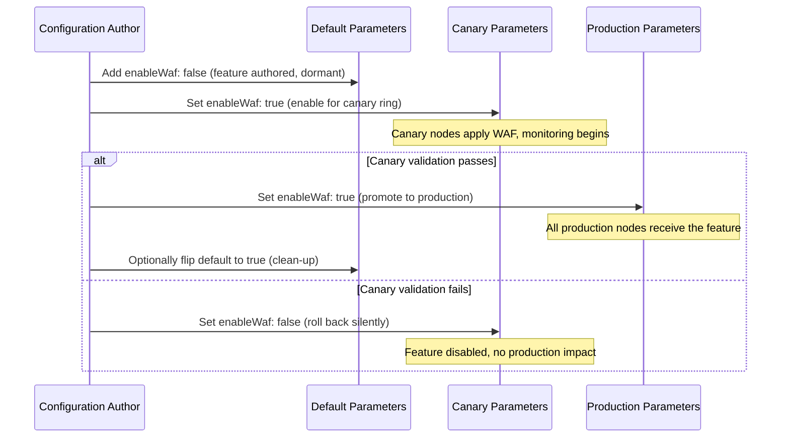

# Feature Flags with Parameters

Boolean parameters can act as feature flags in a DSC configuration, letting you
author opt-in capabilities once and activate them progressively through the
scope system. This document explains the pattern and walks through two common
canary strategies.

## Overview

The idea is straightforward:

1. **Author the feature in the configuration** - wrap the resource block in a
   conditional controlled by a boolean parameter.
2. **Default the flag to `false`** - the feature is off everywhere unless
   explicitly enabled.
3. **Enable the flag at a specific scope** - use the scope hierarchy to turn the
   feature on for a canary ring (an environment, a region, a dedicated canary
   scope value, or individual nodes) before promoting it globally.

This decouples configuration authoring from feature rollout. A new capability
can ship in the configuration at any time, remain dormant in production, and be
evaluated against a subset of nodes without requiring a separate configuration
version.

## Declaring Feature Flag Parameters

Define every feature flag in the configuration's `parameters` block with
`type: boolean` and `defaultValue: false`.

```yaml
# main.dsc.yaml
$schema: https://raw.githubusercontent.com/PowerShell/DSC/main/schemas/2024/04/config/document.json
metadata:
  name: web-server
  version: 2.0.0

parameters:
  # --- Feature flags (opt-in, off by default) ---
  enableHttps:
    type: boolean
    defaultValue: false
    description: Enable HTTPS binding and obtain a TLS certificate.

  enableWaf:
    type: boolean
    defaultValue: false
    description: Install and configure the Web Application Firewall module.

  enableDiagnosticsExtension:
    type: boolean
    defaultValue: false
    description: Install the diagnostics agent for extended telemetry.

  # --- Stable settings always applied ---
  siteName:
    type: string
    defaultValue: DefaultSite

  appPoolName:
    type: string
    defaultValue: DefaultPool

resources:
  # Always-on: core IIS site
  - name: IIS Site
    type: OpenDsc.Windows/Service
    properties:
      name: W3SVC
      state: Running

  # Feature-gated: HTTPS binding
  - name: HTTPS Binding
    type: OpenDsc.Windows/Environment
    condition: "[parameters('enableHttps')]"
    properties:
      name: WEBSITE_HTTPS_ENABLED
      value: "1"
      scope: Machine

  # Feature-gated: WAF module
  - name: WAF Module
    type: OpenDsc.Windows/OptionalFeature
    condition: "[parameters('enableWaf')]"
    properties:
      name: IIS-RequestFiltering
      state: Enabled

  # Feature-gated: diagnostics agent
  - name: Diagnostics Agent
    type: OpenDsc.Windows/Service
    condition: "[parameters('enableDiagnosticsExtension')]"
    properties:
      name: DiagnosticsAgent
      state: Running
```

> [!TIP] All feature flag parameters share a consistent naming convention
> (`enable<Feature>`) and are grouped together at the top of the `parameters`
> block. This makes it easy to scan which capabilities the configuration
> supports.

## Scope Hierarchy for Progressive Rollout

The Pull Server merges parameters from broad to narrow scope, with narrower
scopes winning. This merge order makes it natural to leave feature flags
disabled at the **Default** scope and enable them at a narrower scope for canary
evaluation.

```text
Default (flags: false) → Canary/Environment → Node
```

### Strategy 1 — Environment Scope Type

Use your existing **Environment** scope type when your canary boundary aligns
with an environment (e.g., `Staging` before `Production`).

**Scope setup:**

| Scope Type | Precedence | Scope Values |
| ---------- | ---------- | ------------ |
| Default | 0 | *(no values)* |
| Environment | 1 | Development, Staging, Production |
| Node | 2 | *(per-node overrides)* |

**Default parameters** — flags are `false` everywhere:

```yaml
# Default/parameters.yaml
enableHttps: false
enableWaf: false
enableDiagnosticsExtension: false

siteName: DefaultSite
appPoolName: DefaultPool
```

**Staging parameters** — enable the canary feature:

```yaml
# Environment/Staging/parameters.yaml
enableHttps: true       # validate HTTPS end-to-end in staging
enableWaf: false        # not yet ready for WAF
```

**Production parameters** — only promote once staging validation passes:

```yaml
# Environment/Production/parameters.yaml
enableHttps: true       # promoted after staging sign-off
enableWaf: false        # still gated
```

All nodes tagged with the `Staging` environment scope value receive
`enableHttps: true`; production nodes remain unaffected until the production
parameter file is updated.

### Strategy 2 — Dedicated Canary Scope Type

Create a custom **Canary** scope type when you want a canary ring that cuts
across environments or regions. This is useful for soak-testing a feature on a
hand-picked set of nodes regardless of where they live.

**Scope setup:**

| Scope Type | Precedence | Scope Values |
| ---------- | ---------- | ------------ |
| Default | 0 | *(no values)* |
| Environment | 1 | Development, Staging, Production |
| Canary | 2 | early-access, soak |
| Node | 3 | *(per-node overrides)* |

Because **Canary** has higher precedence than **Environment**, a node tagged
with both `Production` and `early-access` will have its canary parameters win
over the environment parameters.

**Canary/early-access parameters:**

```yaml
# Canary/early-access/parameters.yaml
enableWaf: true
enableDiagnosticsExtension: true
```

**Tagging a node into the canary ring** (via the API or web UI):

```text
POST /api/v1/node-tags
{
  "nodeId": "<node-guid>",
  "scopeTypeId": "<canary-scope-type-guid>",
  "scopeValueId": "<early-access-scope-value-guid>"
}
```

The merge result for a node tagged `Production` + `early-access` is:

| Parameter | Default | Environment/Production | Canary/early-access | **Merged** |
| --------- | ------- | ---------------------- | ------------------- | ---------- |
| `enableHttps` | false | true | *(not set)* | **true** |
| `enableWaf` | false | false | true | **true** |
| `enableDiagnosticsExtension` | false | false | true | **true** |

All other production nodes receive `enableWaf: false` and
`enableDiagnosticsExtension: false`.

## Rollout Workflow



### Step-by-Step

1. **Author the feature** - Add the conditional resource block and the
   `false`-defaulted parameter to the configuration. Publish a new configuration
   version.

2. **Enable in canary** - Set the flag to `true` in the appropriate scope
   parameters file (Canary scope value or a lower environment). No configuration
   version change required.

3. **Monitor** - Observe compliance reports from canary nodes in the Pull Server
   dashboard (Reports → filter by scope value or node tag).

4. **Promote or revert**:
   - **Promote**: Set the flag to `true` in the production (or Default)
     parameters. Canary nodes are unaffected (already `true`).
   - **Revert**: Set the flag back to `false` in the canary parameters.
     Production is never touched.

5. **Clean up** - Once a feature is fully promoted and stable, you can remove
   the `condition` from the resource block and delete the flag parameter in a
   subsequent configuration version.

## Best Practices

### Naming and Organization

- Prefix all feature flag parameters with `enable` for discoverability.
- Group feature flags together in the `parameters` block, separated from
  operational settings by a comment.
- Keep flag names stable across configuration versions so existing parameter
  files remain valid.

### Default to Off

Always set `defaultValue: false`. A flag that defaults to `true` is no longer a
controlled rollout — it is a default-on feature that must be actively disabled
everywhere you don't want it, which inverts the safety model.

### One Flag Per Feature

Avoid coupling multiple features under a single flag. Independent flags let you
promote and revert each capability separately without unintentionally affecting
others.

### Parameter Schema Validation

Define your feature flag parameters in the configuration's parameter schema so
the Pull Server can validate parameter files before activation. This prevents
typos (`enableWaf: true`) from silently failing to enable features.

```yaml
# parameter-schema.yaml (reference schema for the configuration)
$schema: https://json-schema.org/draft/2020-12/schema
type: object
properties:
  enableHttps:
    type: boolean
    default: false
  enableWaf:
    type: boolean
    default: false
  enableDiagnosticsExtension:
    type: boolean
    default: false
additionalProperties: false
```

### Canary Ring Size

Start small. Tag 1–5 nodes in the canary scope value for the initial soak
period. Widen the ring by tagging additional nodes or promoting to a
higher-traffic scope value before full production rollout.

### Compliance Reporting

Use the Pull Server's compliance reports to confirm canary nodes have applied
the new feature before promoting. A healthy canary shows `_inDesiredState: true`
for the feature-gated resource blocks.

## Example: Single Configuration, Three Rollout Stages

```text
web-server (v2.0.0)
├── Default/parameters.yaml         enableWaf: false   ← baseline
├── Canary/soak/parameters.yaml     enableWaf: true    ← soak ring
├── Environment/Staging/parameters.yaml                ← inherits Default (false)
└── Environment/Production/parameters.yaml             ← inherits Default (false)
```

**Week 1** — 3 soak-ring nodes in production receive WAF. All other production
and staging nodes are unaffected.

**Week 2** — Monitoring shows no regressions. Promote:

```text
Environment/Production/parameters.yaml  →  enableWaf: true
```

**All** production nodes now receive WAF. The `Canary/soak` entry can be left
as-is or removed (it would resolve to `true` from both scopes).

## Related Topics

- [Scope System Guide](scope-system.md) — how to create scope types and scope
  values
- [Parameter Merging Deep Dive](parameter-merging.md) — merge precedence and
  provenance tracking -
  [Example: Environment Promotion Workflow](examples/03-environment-promotion.md)
  — promoting a full configuration version across environments
- [Parameter Validation](parameter-validation.md) — schema-based validation of
  parameter files
