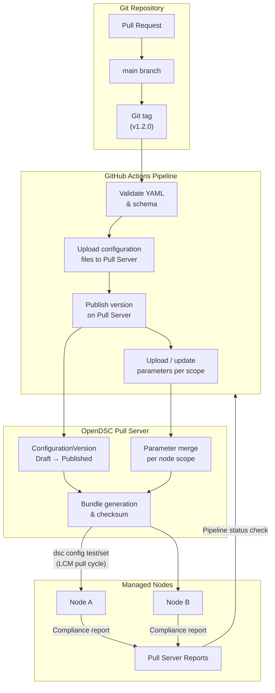
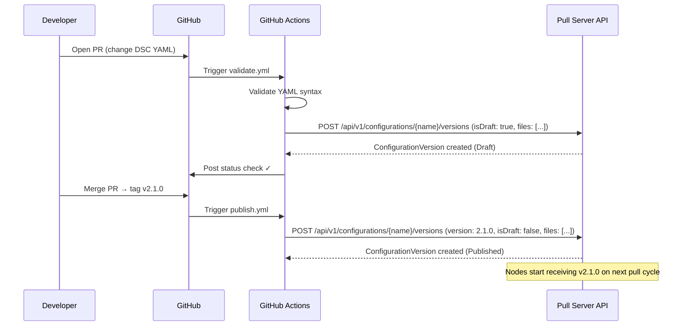
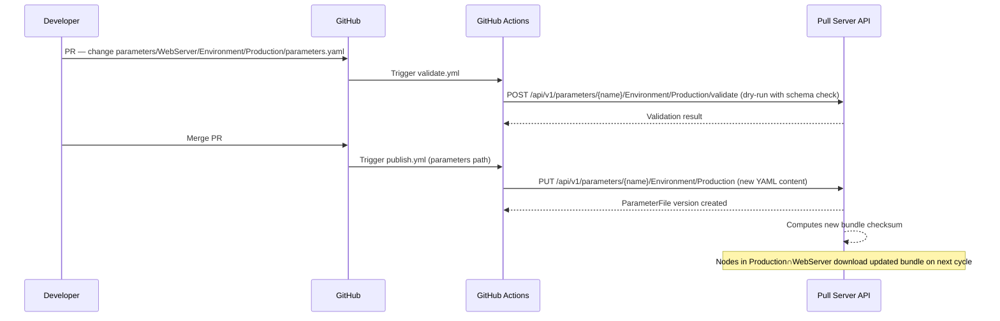
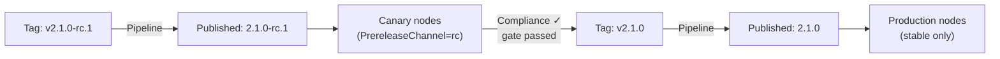
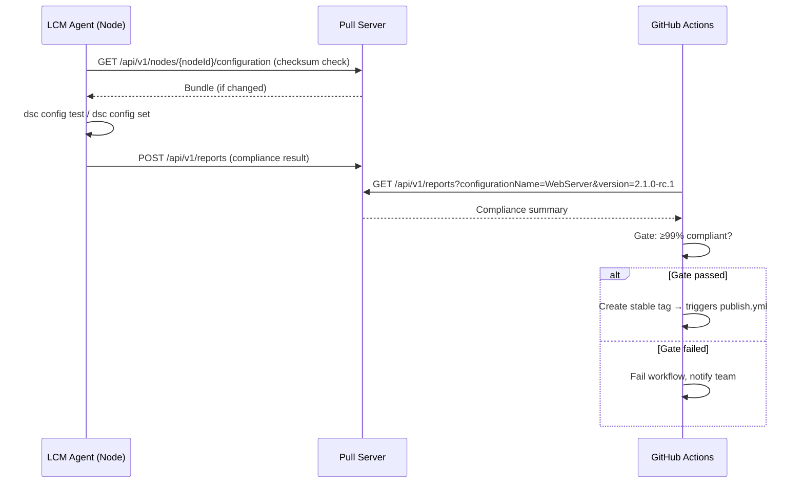

# GitOps Integration Guide

This guide explains how to apply GitOps principles to manage DSC configurations
through the OpenDSC Pull Server. All configuration changes flow through pull
requests, automated pipelines upload and publish new versions, and the Pull
Server distributes approved state to nodes — Git becomes the single source of
truth for desired-state configuration.

## Table of Contents

- [Overview](#overview)
- [Architecture](#architecture)
- [Repository Structure](#repository-structure)
- [Core Workflows](#core-workflows)
  - [Publishing a Configuration Version](#publishing-a-configuration-version)
  - [Updating Parameters](#updating-parameters)
  - [Promoting Across Environments](#promoting-across-environments)
- [GitHub Actions Reference](#github-actions-reference)
- [Secret Management](#secret-management)
- [Compliance Feedback Loop](#compliance-feedback-loop)
- [Best Practices](#best-practices)

## Overview

GitOps shifts infrastructure management from imperative commands to declarative
files stored in a version-controlled repository. With OpenDSC, the Pull Server
acts as the distribution plane that the Git repository drives:

| Concern | Owner |
| --- | --- |
| Desired state authoring | Git repository (DSC YAML files) |
| Parameter management | Git repository (YAML parameter files) |
| Version lifecycle gating | Pull request reviews + pipeline checks |
| Distribution to nodes | OpenDSC Pull Server |
| Drift remediation | OpenDSC LCM agents |

Each change follows this invariant: **no configuration reaches a node without
first being committed to Git, reviewed as a pull request, and uploaded to the
Pull Server by a pipeline.**

## Architecture



### Key Integration Points

1. **Tag-triggered pipeline** — A Git tag on `main` (e.g., `v1.2.0`) is the
   signal to create and publish a new configuration version. Draft versions can
   be created from feature branches for validation.
2. **Pull Server REST API** — The pipeline uses the `/api/v1/configurations` and
   `/api/v1/parameters` endpoints to upload files and manage version lifecycle.
3. **Prerelease channels** — Tags like `v1.2.0-beta.1` publish to a prerelease
   channel so canary nodes can receive the change before production.
4. **Compliance reports** — LCM agents submit reports to `/api/v1/reports` after
   each cycle; the pipeline can query these to gate further promotion.

## Repository Structure

A single Git repository can manage multiple configurations and their
scope-layered parameters. A recommended layout:

```text
dsc-configs/
├── .github/
│   └── workflows/
│       ├── validate.yml          # On PR: validate YAML
│       ├── publish.yml           # On tag: upload & publish version
│       └── promote.yml           # On manual dispatch: promote to next env
│
├── configurations/
│   ├── WebServer/                # One directory per configuration name
│   │   ├── main.dsc.yaml
│   │   └── modules/
│   │       ├── iis.dsc.yaml
│   │       └── firewall.dsc.yaml
│   └── DatabaseServer/
│       ├── main.dsc.yaml
│       └── modules/
│           └── sqlserver.dsc.yaml
│
├── parameters/
│   ├── WebServer/
│   │   ├── Default/
│   │   │   └── parameters.yaml   # Global baseline
│   │   ├── Region/
│   │   │   ├── US-West/
│   │   │   │   └── parameters.yaml
│   │   │   └── EU-Central/
│   │   │       └── parameters.yaml
│   │   └── Environment/
│   │       ├── Development/
│   │       │   └── parameters.yaml
│   │       └── Production/
│   │           └── parameters.yaml
│   └── DatabaseServer/
│       └── Default/
│           └── parameters.yaml
│
└── schemas/
    └── WebServer/
        └── parameters.schema.json  # DSC parameter schema
```

### Naming Conventions

- **Configuration directories** match the `name` field used when creating the
  configuration on the Pull Server.
- **Parameter directories** mirror the scope hierarchy on the server
  (`Default/`, `Region/<value>/`, `Environment/<value>/`, `Node/<fqdn>/`).
- **Git tags** use the format `<ConfigurationName>/v<semver>` when the
  repository manages multiple configurations (e.g., `WebServer/v2.0.0`). For a
  single-configuration repository, plain `v<semver>` tags work well.

## Core Workflows

### Publishing a Configuration Version

This is the primary workflow: a DSC YAML file change flows from a PR to a
published configuration version on the Pull Server.



**Key API calls:**

| Step | Method | Endpoint | Notes |
| --- | --- | --- | --- |
| Create draft (PR validation) | `POST` | `/api/v1/configurations/{name}/versions` | `isDraft: true`; upload all files as multipart form |
| Publish version | `POST` | `/api/v1/configurations/{name}/versions` | `isDraft: false`; or publish an existing draft via `PUT /api/v1/configurations/{name}/versions/{version}/publish` |
| Upload parameters | `PUT` | `/api/v1/parameters/{name}/Default` | Repeat for each scope; body is a YAML file |

When creating a configuration for the **first time**, use
`POST /api/v1/configurations` which creates both the configuration entity and
its initial version in a single call.

### Updating Parameters

Parameter files change more frequently than DSC YAML (e.g., a port number or a
feature flag). Because parameters are versioned independently from
configurations, a parameter-only change does not require a new configuration
version.



The pipeline detects which `parameters/` directories changed (using
`git diff --name-only`) and uploads only those files, avoiding unnecessary
version increments.

### Promoting Across Environments

Use SemVer prerelease channels to roll out changes progressively: canary nodes
receive a prerelease tag first; only after passing compliance checks does the
stable version land in production.

!!! note
    Prerelease configuration versions are **not** the same as stable
    versions. A prerelease version (e.g., `2.1.0-rc.1`) is distributed only to
    nodes that explicitly opt in by setting their `PrereleaseChannel` to a
    matching label. Nodes without a matching channel continue receiving the
    current stable version and are completely unaffected. Only when the version
    is promoted to stable (e.g., `2.1.0`) does it become the new release for all
    nodes. See
    [Prerelease vs Feature Flags](../guides/prerelease-vs-feature-flags.md) to
    understand when prerelease
    versions are the right tool versus feature flags.

**Versioning strategy:**

| Stage | Tag | PrereleaseChannel on node |
| --- | --- | --- |
| Canary (5% of nodes) | `v2.1.0-rc.1` | `rc` |
| Staging | `v2.1.0-rc.2` | `rc` |
| Production | `v2.1.0` | *(none — stable only)* |



The `promote.yml` workflow (manual dispatch or scheduled) queries the Pull
Server compliance reports before creating the stable tag:

```text
GET /api/v1/reports?configurationName=WebServer&version=2.1.0-rc.1
```

If the compliance percentage meets the threshold (e.g., ≥ 99%), the pipeline
creates the `v2.1.0` tag on `main`, triggering `publish.yml` for the stable
release.

## GitHub Actions Reference

### `validate.yml` — PR validation

Runs on every pull request. Validates YAML syntax and optionally creates a draft
version on the Pull Server for schema and parameter checks.

```yaml
name: Validate

on:
  pull_request:
    paths:
      - 'configurations/**'
      - 'parameters/**'

jobs:
  validate:
    runs-on: ubuntu-latest
    steps:
      - uses: actions/checkout@v4

      - name: Detect changed configurations
        id: changes
        run: |
          CONFIGS=$(git diff --name-only origin/${{ github.base_ref }}...HEAD \
            | grep '^configurations/' \
            | cut -d/ -f2 | sort -u | tr '\n' ' ')
          echo "configs=$CONFIGS" >> $GITHUB_OUTPUT

      - name: Upload draft versions
        if: steps.changes.outputs.configs != ''
        env:
          PULL_SERVER_URL: ${{ vars.PULL_SERVER_URL }}
          PULL_SERVER_TOKEN: ${{ secrets.PULL_SERVER_TOKEN }}
          PR_NUMBER: ${{ github.event.pull_request.number }}
        run: |
          for CONFIG in ${{ steps.changes.outputs.configs }}; do
            DRAFT_VERSION="0.0.0-pr${PR_NUMBER}"
            curl -sf -X POST "$PULL_SERVER_URL/api/v1/configurations/$CONFIG/versions" \
              -H "Authorization: Bearer $PULL_SERVER_TOKEN" \
              -F "version=$DRAFT_VERSION" \
              -F "isDraft=true" \
              $(find configurations/$CONFIG -name '*.yaml' | xargs -I{} echo -F "files=@{}")
          done

      - name: Validate parameters
        env:
          PULL_SERVER_URL: ${{ vars.PULL_SERVER_URL }}
          PULL_SERVER_TOKEN: ${{ secrets.PULL_SERVER_TOKEN }}
        run: |
          git diff --name-only origin/${{ github.base_ref }}...HEAD \
            | grep '^parameters/' \
            | while IFS='/' read -r _ CONFIG SCOPE_TYPE SCOPE_VALUE _; do
                curl -sf -X POST \
                  "$PULL_SERVER_URL/api/v1/parameters/$CONFIG/$SCOPE_TYPE/$SCOPE_VALUE/validate" \
                  -H "Authorization: Bearer $PULL_SERVER_TOKEN" \
                  --data-binary @parameters/$CONFIG/$SCOPE_TYPE/$SCOPE_VALUE/parameters.yaml \
                  -H "Content-Type: application/yaml"
              done
```

### `publish.yml` — Tag-triggered publish

Runs when a version tag is pushed. Creates and publishes the configuration
version and uploads updated parameter files.

```yaml
name: Publish

on:
  push:
    tags:
      - '*/v[0-9]*'      # e.g., WebServer/v2.1.0
      - 'v[0-9]*'        # single-config repos

jobs:
  publish:
    runs-on: ubuntu-latest
    steps:
      - uses: actions/checkout@v4

      - name: Parse tag
        id: tag
        run: |
          TAG="${{ github.ref_name }}"
          if [[ "$TAG" == *"/"* ]]; then
            echo "config=${TAG%/v*}" >> $GITHUB_OUTPUT
            echo "version=${TAG#*/v}" >> $GITHUB_OUTPUT
          else
            # Single-config repo — infer config name from directory
            CONFIG=$(ls configurations/ | head -1)
            echo "config=$CONFIG" >> $GITHUB_OUTPUT
            echo "version=${TAG#v}" >> $GITHUB_OUTPUT
          fi

      - name: Upload & publish configuration version
        env:
          PULL_SERVER_URL: ${{ vars.PULL_SERVER_URL }}
          PULL_SERVER_TOKEN: ${{ secrets.PULL_SERVER_TOKEN }}
          CONFIG: ${{ steps.tag.outputs.config }}
          VERSION: ${{ steps.tag.outputs.version }}
        run: |
          curl -sf -X POST "$PULL_SERVER_URL/api/v1/configurations/$CONFIG/versions" \
            -H "Authorization: Bearer $PULL_SERVER_TOKEN" \
            -F "version=$VERSION" \
            -F "isDraft=false" \
            $(find configurations/$CONFIG -name '*.yaml' | xargs -I{} echo -F "files=@{}")

      - name: Upload parameters for all scopes
        env:
          PULL_SERVER_URL: ${{ vars.PULL_SERVER_URL }}
          PULL_SERVER_TOKEN: ${{ secrets.PULL_SERVER_TOKEN }}
          CONFIG: ${{ steps.tag.outputs.config }}
        run: |
          find parameters/$CONFIG -name 'parameters.yaml' | while read FILE; do
            # Derive scope path from file location
            SCOPE_PATH=$(dirname "$FILE" | sed "s|parameters/$CONFIG/||")
            curl -sf -X PUT \
              "$PULL_SERVER_URL/api/v1/parameters/$CONFIG/$SCOPE_PATH" \
              -H "Authorization: Bearer $PULL_SERVER_TOKEN" \
              --data-binary @"$FILE" \
              -H "Content-Type: application/yaml"
          done
```

### `promote.yml` — Compliance-gated stable promotion

Manually dispatched (or on a schedule) after a prerelease has been deployed to
canary nodes. Queries compliance reports and creates the stable tag if the
threshold is met.

```yaml
name: Promote to Stable

on:
  workflow_dispatch:
    inputs:
      configuration:
        description: 'Configuration name (e.g., WebServer)'
        required: true
      prerelease_version:
        description: 'Prerelease version to promote (e.g., 2.1.0-rc.1)'
        required: true
      stable_version:
        description: 'Stable version to create (e.g., 2.1.0)'
        required: true
      compliance_threshold:
        description: 'Minimum compliance % required (0–100)'
        default: '99'

jobs:
  promote:
    runs-on: ubuntu-latest
    steps:
      - uses: actions/checkout@v4
        with:
          token: ${{ secrets.GH_TOKEN }}

      - name: Check compliance reports
        id: compliance
        env:
          PULL_SERVER_URL: ${{ vars.PULL_SERVER_URL }}
          PULL_SERVER_TOKEN: ${{ secrets.PULL_SERVER_TOKEN }}
        run: |
          RESULT=$(curl -sf \
            "$PULL_SERVER_URL/api/v1/reports?configurationName=${{ inputs.configuration }}&version=${{ inputs.prerelease_version }}&latestOnly=true" \
            -H "Authorization: Bearer $PULL_SERVER_TOKEN")

          TOTAL=$(echo "$RESULT" | jq '.totalCount')
          COMPLIANT=$(echo "$RESULT" | jq '.compliantCount')
          PCT=$(( COMPLIANT * 100 / TOTAL ))
          echo "compliance_pct=$PCT" >> $GITHUB_OUTPUT
          echo "Compliance: $COMPLIANT/$TOTAL ($PCT%)"

      - name: Gate on compliance threshold
        run: |
          if [ "${{ steps.compliance.outputs.compliance_pct }}" -lt "${{ inputs.compliance_threshold }}" ]; then
            echo "Compliance ${{ steps.compliance.outputs.compliance_pct }}% is below threshold ${{ inputs.compliance_threshold }}%"
            exit 1
          fi

      - name: Create stable tag
        run: |
          CONFIG="${{ inputs.configuration }}"
          VERSION="${{ inputs.stable_version }}"
          git tag "$CONFIG/v$VERSION"
          git push origin "$CONFIG/v$VERSION"
```

## Secret Management

Secrets must never appear in configuration files, parameter files, or the Git
repository — not even as placeholders that are later substituted by the
pipeline. Instead, use the DSC `[secret]` configuration document function so
that each node retrieves the secret value directly from a vault **at apply
time**.

### Recommended Approach: Vault-backed `[secret]` References

Reference secrets in DSC configuration documents using the `[secret]` function:

```yaml
# configurations/WebServer/main.dsc.yaml
resources:
  - name: Connection string
    type: OpenDsc.Json/Value
    properties:
      path: C:\App\appsettings.json
      jsonPath: $.ConnectionStrings.Default
      value: "[secret('prod-vault', 'web-connection-string')]"
```

The `[secret]` function is resolved on the node at runtime. The vault address
and any authentication details are configured locally on the node (for example,
via workload identity or a pre-provisioned credential) — they are never stored
in the Pull Server or Git.

**Benefits of this approach:**

- Secrets never transit through the pipeline, the Pull Server, or Git.
- Vault access is audited at the node level by the vault provider.
- Rotating a secret in the vault takes effect on the next LCM cycle without any
  configuration version change.
- The same configuration document works across environments; only the vault
  contents differ.

### Anti-Pattern: Do Not Inject Secrets at Publish Time

Avoid substituting secrets into parameter or configuration files before
uploading them to the Pull Server:

```yaml
# ❌ Do not do this — secret value is stored on the Pull Server
- name: Upload parameters (unsafe)
  run: |
    envsubst < parameters.yaml > /tmp/params.yaml
    curl -X PUT "$PULL_SERVER_URL/api/v1/parameters/WebServer/Default" \
      --data-binary @/tmp/params.yaml
```

Even though the resolved value never enters the Git repository, it is now stored
in the Pull Server database and transmitted to every node that downloads the
bundle.

### Pull Server Token Permissions

Create a dedicated Personal Access Token (PAT) per workflow with minimum
required permissions:

| Workflow | Required permissions |
| --- | --- |
| `validate.yml` | `configurations.write` (draft), `parameters.read` |
| `publish.yml` | `configurations.write`, `parameters.write` |
| `promote.yml` | `reports.read`, repository `contents: write` |

## Compliance Feedback Loop

The LCM agent submits compliance reports to the Pull Server after every test or
remediation cycle. These reports close the GitOps loop by confirming that a
committed desired state is actually applied.



### Querying Reports in the Pipeline

```sh
# Compliance summary for a version
curl -sf "$PULL_SERVER_URL/api/v1/reports" \
  -H "Authorization: Bearer $PULL_SERVER_TOKEN" \
  -G \
  --data-urlencode "configurationName=WebServer" \
  --data-urlencode "version=2.1.0-rc.1" \
  --data-urlencode "latestOnly=true"
```

The response includes `totalCount`, `compliantCount`, and `nonCompliantCount`
for automated gating. Individual report entries contain resource-level details
useful for debugging failures.

## Prerelease vs Feature Flags

The comparison between prerelease versions and feature flags has moved to its
own dedicated guide:
[Prerelease vs Feature Flags](../guides/prerelease-vs-feature-flags.md)

## Best Practices

### Branching Strategy

- Maintain a single `main` branch as the source of truth.
- Use short-lived feature branches for all changes; require PR reviews before
  merge.
- Never push directly to `main`; enforce branch protection rules.

### Versioning Discipline

- Follow SemVer semantics strictly:
  - **PATCH** (`1.0.1`) — fix a misconfiguration without changing the schema
  - **MINOR** (`1.1.0`) — add resources or parameters with backward-compatible
    defaults
  - **MAJOR** (`2.0.0`) — breaking changes to the configuration structure or
    parameter schema
- Use prerelease channels (`-rc`, `-beta`) for progressive rollout; do not skip
  canary validation for major versions.

### Parameter Layering

- Keep `Default/parameters.yaml` minimal — only values that are truly global
  (e.g., organization name, log format).
- Prefer environment or node scope for values that differ between deployments.
- Avoid per-node parameter files for anything that can be expressed at a
  scope-value level; per-node files are expensive to maintain.

### Audit Trail

Every configuration and parameter version on the Pull Server stores `createdBy`
from the PAT used to upload it. Combined with Git commit history, this provides
a complete audit trail: who authored the change (Git commit), which pipeline
identity uploaded it (PAT), and which nodes applied it (compliance reports).
