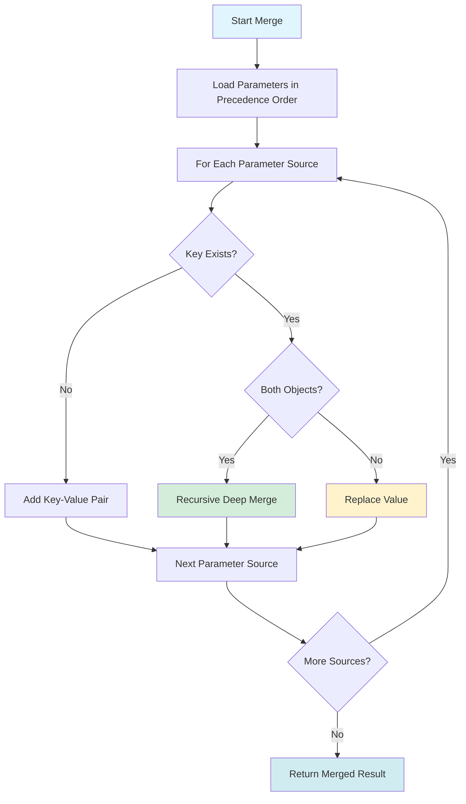
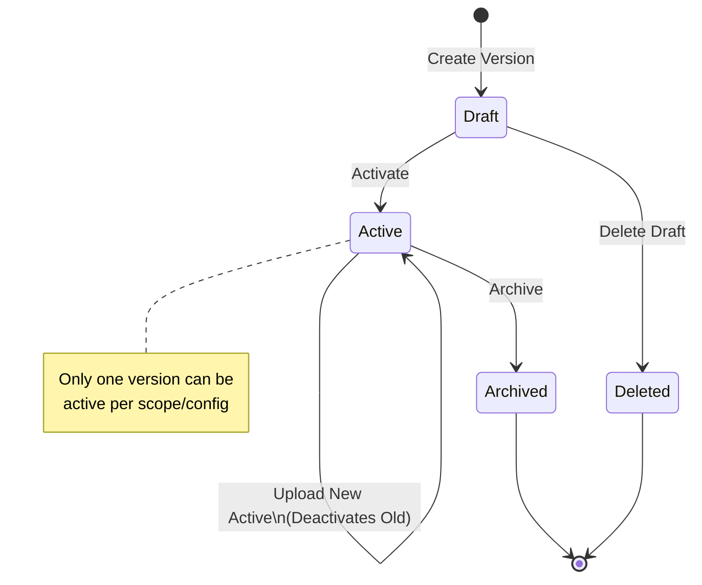
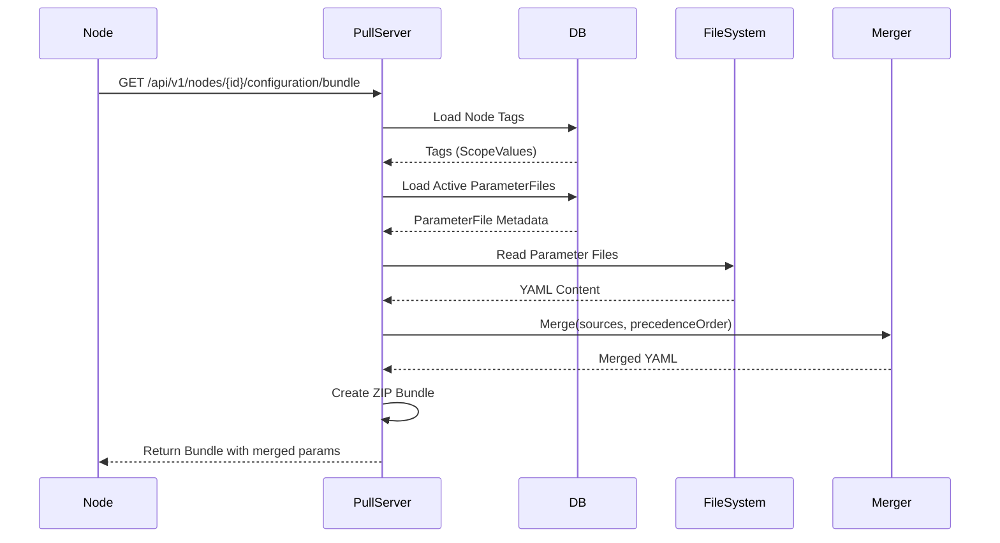
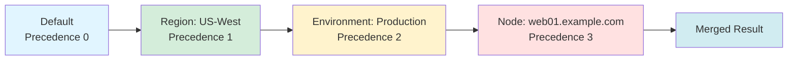

# Parameter Merging Deep Dive

The OpenDSC Pull Server's parameter merging system enables hierarchical
configuration management with provenance tracking, versioning, and
automatic deep-merge capabilities. This guide explains how parameters
are stored, merged, and versioned.

## Overview

Parameters are YAML files (JSON also supported) that contain
configuration values for DSC resources. The Pull Server merges
parameters from multiple scopes based on precedence rules, allowing you
to:

- Define global defaults once
- Override settings per region, environment, or team
- Customize specific nodes without duplicating common settings
- Track where each parameter value originated (provenance)
- Version parameters independently from configurations

## File Storage Structure

### Directory Layout

Parameters are stored on disk following this structure:

```text
data/
└── parameters/
    └── {ConfigurationName}/
        ├── Default/
        │   └── parameters.yaml
        ├── {ScopeTypeName}/
        │   └── {ScopeValue}/
        │       └── parameters.yaml
        └── Node/
            └── {NodeFQDN}/
                └── parameters.yaml
```

**Example:**

```text
data/parameters/WebServer/
├── Default/
│   └── parameters.yaml               # Global baseline
├── Region/
│   ├── US-West/
│   │   └── parameters.yaml           # Region-specific
│   └── EU-Central/
│       └── parameters.yaml
├── Environment/
│   ├── Development/
│   │   └── parameters.yaml           # Environment-specific
│   └── Production/
│       └── parameters.yaml
└── Node/
    ├── web01.example.com/
    │   └── parameters.yaml           # Node-specific
    └── web02.example.com/
        └── parameters.yaml
```

### File Naming

- **Filename**: Always `parameters.yaml` (or `parameters.json` for JSON
  format)
- **Default scope**: No scope value subdirectory (`Default/parameters.yaml`)
- **Other scopes**: Nested under scope type and scope value
  (`Region/US-West/parameters.yaml`)

### File Format

**YAML (recommended):**

```yaml
# parameters.yaml
logLevel: Warning
server:
  host: example.com
  port: 8080
  ssl: true
features:
  - authentication
  - logging
  - monitoring
```

**JSON (also supported):**

```json
{
  "logLevel": "Warning",
  "server": {
    "host": "example.com",
    "port": 8080,
    "ssl": true
  },
  "features": ["authentication", "logging", "monitoring"]
}
```

**Note:** While both formats are supported, YAML is recommended for
readability and is used in all examples throughout this documentation.

## Database Metadata

Each parameter file has corresponding metadata stored in the database
via the `ParameterFile` entity:

```yaml
ParameterFile:
  Id: <GUID>
  ConfigurationId: <GUID>      # Which configuration
  ScopeTypeId: <GUID>          # Which scope type
  ScopeValue: "Production"     # Which value (null for Default)
  Version: "1.0.0"             # Version string
  ContentType: "application/x-yaml"
  Checksum: "sha256:abc123..." # SHA-256 hash of file content
  IsDraft: false               # Draft status
  IsActive: true               # Active status
  IsArchived: false            # Archived status
  CreatedAt: 2026-02-03T10:30:00Z
  CreatedBy: "admin@example.com"
```

### Key Fields

- **ConfigurationId + ScopeTypeId + ScopeValue + Version** - Must be
  unique (composite unique constraint)
- **IsActive** - Only one version per configuration/scope/value can be
  active
- **IsDraft** - Draft versions are not included in parameter merging
- **IsArchived** - Archived versions are excluded from normal queries

## Merge Algorithm

### Deep Merge Rules

The parameter merger uses **deep merge** for objects and **replace** for
arrays:



### Merge Behavior Examples

h4. Example 1: Object Deep Merge

```yaml
# Precedence 0 (Default)
server:
  host: localhost
  port: 8080
  timeout: 30
  ssl: false

# Precedence 1 (Region: US-West)
server:
  host: us-west.example.com
  ssl: true

# Merged Result
server:
  host: us-west.example.com    # Overridden by Region
  port: 8080                   # From Default
  timeout: 30                  # From Default
  ssl: true                    # Overridden by Region
```

h4. Example 2: Array Replace

```yaml
# Precedence 0 (Default)
features:
  - logging
  - monitoring

# Precedence 1 (Environment: Production)
features:
  - logging
  - monitoring
  - authentication
  - encryption

# Merged Result (arrays are replaced, not merged)
features:
  - logging
  - monitoring
  - authentication
  - encryption
```

h4. Example 3: Scalar Replace

```yaml
# Precedence 0 (Default)
logLevel: Info

# Precedence 1 (Environment: Production)
logLevel: Warning

# Merged Result
logLevel: Warning    # Scalar values are replaced
```

## Parameter Versioning

### Version Lifecycle



### Creating Parameter Versions

**Draft Version (default):**

```http
PUT /api/v1/parameters/{scopeTypeId}/{configurationId}
Content-Type: application/json

{
  "version": "1.1.0",
  "content": "logLevel: Debug\nserver:\n  host: test.example.com\n",
  "contentType": "application/x-yaml",
  "isDraft": true
}
```

**Active Version (immediately active):**

```http
PUT /api/v1/parameters/{scopeTypeId}/{configurationId}
Content-Type: application/json

{
  "version": "1.0.0",
  "content": "logLevel: Warning\nserver:\n  host: prod.example.com\n",
  "contentType": "application/x-yaml",
  "isDraft": false
}
```

**With Scope Value (for non-Default scopes):**

```http
PUT /api/v1/parameters/{scopeTypeId}/{configurationId}?scopeValue=Production
Content-Type: application/json

{
  "version": "2.0.0",
  "content": "logLevel: Error\n",
  "contentType": "application/x-yaml",
  "isDraft": false
}
```

### Activating Draft Versions

To activate a draft version (making it the active version for merging):

```http
PUT /api/v1/parameters/{scopeTypeId}/{configurationId}/versions/1.1.0/activate?scopeValue=Production
```

**Behavior:**

- Previous active version (if any) is deactivated (`IsActive = false`)
- Specified version becomes active (`IsActive = true`, `IsDraft = false`)
- Only one version can be active at a time per
  configuration/scope/value

### Version String Format

Version strings can use any format, but **semantic versioning** is
recommended:

- ✅ `1.0.0`
- ✅ `2.1.3`
- ✅ `1.0.0-beta`
- ✅ `2024-02-03` (date-based)
- ✅ `v1-production` (custom format)

**Best Practice:** Use semantic versioning (`MAJOR.MINOR.PATCH`) for
clarity and tooling compatibility.

## Parameter Merge Flow

### Request Flow



### Merge Process

1. **Load Node Configuration** - Determine which configuration is
   assigned
2. **Query Node Tags** - Get all scope values assigned to the node,
   ordered by scope type precedence
3. **Load Default Scope** - Load Default scope parameters (precedence 0)
4. **Load Tagged Scopes** - For each tag, load the active parameter file
5. **Load Node Scope** - Load Node scope parameters matching node FQDN
6. **Merge Parameters** - Call ParameterMerger with all sources in
   precedence order
7. **Bundle Configuration** - Include merged `parameters.yaml` in
   configuration ZIP

### Merge Order Example

**Node:** `web01.example.com`

**Tags:**

- Region: US-West
- Environment: Production

**Scope Precedence:**

- Default (0)
- Region (1)
- Environment (2)
- Node (3)

**Merge Sequence:**



## Provenance Tracking

### What is Provenance?

**Provenance** tracks where each parameter value originated and what
values were overridden. This is critical for:

- Debugging unexpected parameter values
- Understanding configuration inheritance
- Auditing parameter changes
- Compliance and security reviews

### Provenance API

```http
GET /api/v1/nodes/{nodeId}/parameters/provenance?configurationId={guid}
Authorization: Bearer {adminApiKey}
```

**Response:**

```json
{
  "nodeId": "abc-123-def-456",
  "configurationId": "xyz-789-uvw-012",
  "mergedParameters": "logLevel: Warning\nserver:\n  host: us-west.example.com\n  port: 8080\n  ssl: true\n",
  "provenance": {
    "logLevel": {
      "scopeTypeName": "Environment",
      "scopeValue": "Production",
      "precedence": 2,
      "value": "Warning",
      "overriddenBy": [
        {
          "scopeTypeName": "Default",
          "scopeValue": null,
          "precedence": 0,
          "value": "Info"
        }
      ]
    },
    "server.host": {
      "scopeTypeName": "Region",
      "scopeValue": "US-West",
      "precedence": 1,
      "value": "us-west.example.com",
      "overriddenBy": [
        {
          "scopeTypeName": "Default",
          "scopeValue": null,
          "precedence": 0,
          "value": "localhost"
        }
      ]
    },
    "server.port": {
      "scopeTypeName": "Default",
      "scopeValue": null,
      "precedence": 0,
      "value": 8080
    },
    "server.ssl": {
      "scopeTypeName": "Region",
      "scopeValue": "US-West",
      "precedence": 1,
      "value": true,
      "overriddenBy": [
        {
          "scopeTypeName": "Default",
          "scopeValue": null,
          "precedence": 0,
          "value": false
        }
      ]
    }
  }
}
```

### Understanding Provenance Data

For each parameter path (dot-notation for nested objects):

- **scopeTypeName** - Which scope type provided the final value
- **scopeValue** - Which scope value (or null for Default)
- **precedence** - The precedence of the winning scope
- **value** - The actual parameter value
- **overriddenBy** - Array of lower-precedence values that were
  overridden

**Example Interpretation:**

```text
Parameter: server.host
Final Value: us-west.example.com
Winning Scope: Region (US-West) with precedence 1

Override History:
1. Default scope (precedence 0) set it to "localhost"
2. Region scope (precedence 1) overrode it to "us-west.example.com"
```

## Version Retention

### Cleanup Strategy

The Pull Server supports automatic cleanup of old parameter versions to
save disk space. Retention policies keep:

1. **Active versions** - Never deleted (critical for operation)
2. **Recent versions** - Versions created within X days
3. **Latest N versions** - Most recent N versions regardless of age

### Cleanup API

```http
POST /api/v1/retention/parameters/cleanup
Authorization: Bearer {adminApiKey}
Content-Type: application/json

{
  "keepVersions": 5,
  "keepDays": 30,
  "dryRun": false
}
```

**Parameters:**

- `keepVersions` - Number of most recent versions to keep per
  configuration/scope
- `keepDays` - Keep all versions created within this many days
- `dryRun` - If true, return what would be deleted without actually
  deleting

**Response:**

```json
{
  "deletedVersions": 12,
  "freedBytes": 245760,
  "versions": [
    {
      "configurationName": "WebServer",
      "scopeTypeName": "Environment",
      "scopeValue": "Development",
      "version": "1.0.0",
      "createdAt": "2026-01-01T10:00:00Z"
    }
  ]
}
```

**Note:** As of the current version, parameter retention cleanup is not
fully implemented. The endpoint exists but returns empty results.

## Best Practices

### Versioning Strategy

1. **Use semantic versioning** - `MAJOR.MINOR.PATCH` for clarity
2. **Increment major** - When making breaking changes to parameter
   structure
3. **Increment minor** - When adding new parameters
4. **Increment patch** - When changing values without structural changes
5. **Use drafts** - Test changes in draft mode before activating

### Parameter Organization

1. **Group related settings** - Use nested objects for logical grouping
2. **Avoid deep nesting** - Keep nesting to 2-3 levels max for
   readability
3. **Use consistent naming** - camelCase or snake_case, but be
   consistent
4. **Document complex values** - Add YAML comments for non-obvious
   settings

**Good:**

```yaml
# Web Server Configuration
server:
  host: example.com
  port: 8080
  ssl:
    enabled: true
    certPath: /etc/ssl/cert.pem

# Logging Configuration
logging:
  level: Warning
  outputs:
    - console
    - file
```

**Avoid:**

```yaml
# Too flat
serverHost: example.com
serverPort: 8080
serverSslEnabled: true
serverSslCertPath: /etc/ssl/cert.pem
loggingLevel: Warning
loggingOutputConsole: true
loggingOutputFile: true

# Too nested
configuration:
  services:
    web:
      server:
        network:
          host: example.com
```

### Scope-Specific Parameters

1. **Default scope** - Only truly universal settings
2. **Region scope** - Geographic/compliance settings that don't change
   per environment
3. **Environment scope** - Lifecycle settings (dev/staging/prod) that
   apply across regions
4. **Node scope** - Only node-unique values (local paths, node-specific
   licenses)

### Security Considerations

1. **Avoid secrets in parameters** - Use secret management systems
   instead
2. **Limit write access** - Only admins should upload parameters
3. **Audit parameter changes** - Track who uploaded what and when
4. **Use provenance** - Regularly check provenance to ensure correct
   inheritance
5. **Tag carefully** - Wrong environment tags can leak production
   settings to dev

### Performance Optimization

1. **Minimize active scopes** - Only create scope types you actually use
2. **Keep files small** - Large parameter files slow down merging
3. **Use checksums** - Parameters are checksummed to avoid re-reading
   unchanged files
4. **Archive old versions** - Clean up unused versions periodically

## Troubleshooting

### "No active parameter version found"

**Cause**: All versions for a scope/config are either draft or archived.

**Solution**: Activate at least one version:

```http
PUT /api/v1/parameters/{scopeTypeId}/{configurationId}/versions/{version}/activate?scopeValue=xyz
```

### "Parameter file not found on disk"

**Cause**: Database metadata exists but file is missing from filesystem.

**Solution**: Re-upload the parameter version or delete the metadata
entry.

### "Checksum mismatch"

**Cause**: Parameter file on disk doesn't match the stored checksum
(possible corruption or manual edit).

**Solution**: Re-upload the correct parameter version to overwrite the
corrupted file.

### "Cannot activate draft version"

**Cause**: Trying to use a draft version in parameter merging.

**Solution**: Activate the draft version first, then it will be included
in merges.

### Unexpected parameter values

**Cause**: Parameter merging isn't working as expected.

**Solution**: Use the provenance API to trace where the value originated
and identify which scope is overriding it.

## API Reference

For interactive API testing and detailed request/response schemas, visit
the **Scalar API Reference** at `/scalar/v1` when running the server.

## Next Steps

- [Scope System Guide](scope-system.md) - Understand scope types and
  precedence
- [Configuration Management](configuration-management.md) - Learn about
  configuration versioning
- [Quick Start Tutorial](quickstart.md) - Follow a step-by-step example
- [Real-World Examples](examples/) - See parameter merging in action
