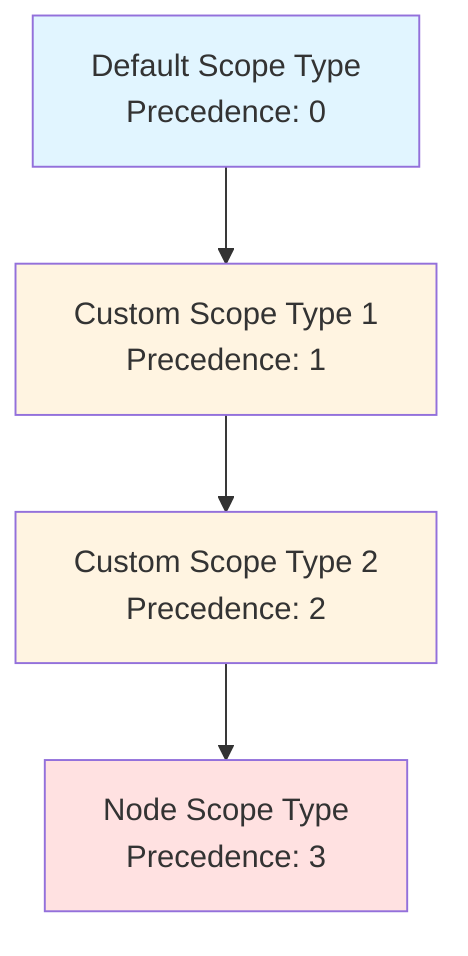
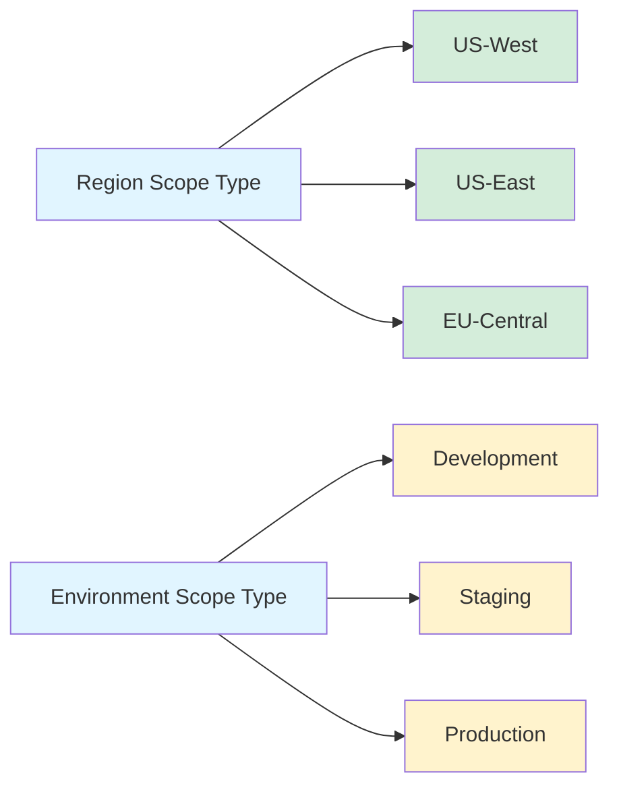
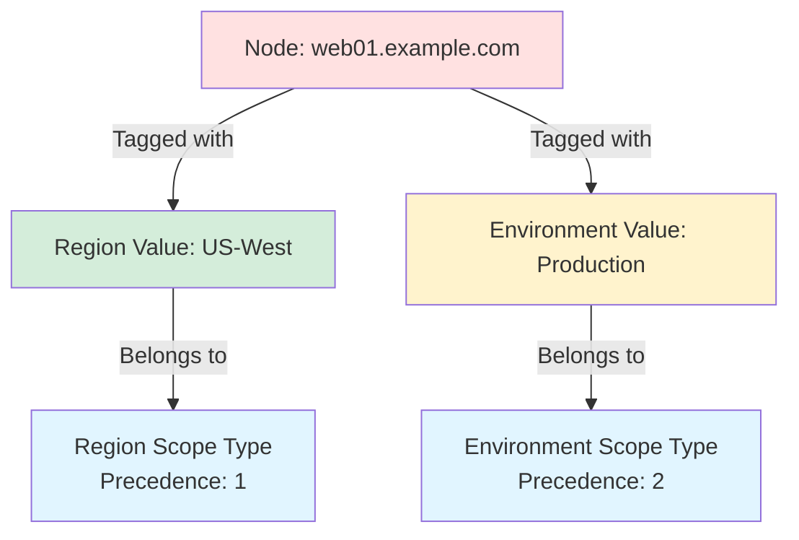
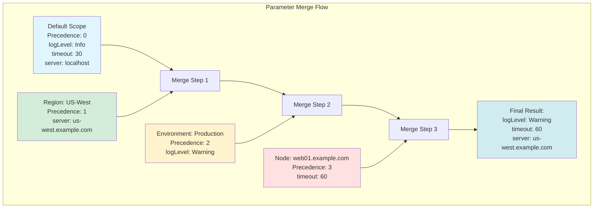

# Scope System Guide

The OpenDSC Pull Server uses a hierarchical scope system to organize and
merge parameters across different levels of your infrastructure. This
guide explains the core concepts of scope types, scope values, and node
tagging.

## Overview

The scope system enables you to define parameters at different levels
(global defaults, regional settings, environment-specific values,
node-specific overrides) and automatically merge them based on
precedence rules. This allows different teams to manage their own
parameter sets while maintaining a single configuration source.

## Core Concepts

### Scope Types

**Scope types** are categories that define how parameters are organized.
Each scope type has a unique precedence value that determines the order
of parameter merging.

Think of scope types as "layers" in your parameter hierarchy:

- **System Scope Types** (pre-configured, cannot be deleted):
  - **Default** - Global baseline parameters (precedence 0)
  - **Node** - Node-specific overrides (precedence 1 by default)
- **Custom Scope Types** - Created by you (e.g., Region, Environment,
  Team)



**Key Properties:**

- `Id` (GUID) - Unique identifier for the scope type
- `Name` (string) - Human-readable name (e.g., "Region", "Environment")
- `Precedence` (integer) - Merge order (lower numbers applied first)
- `AllowsValues` (boolean) - Whether this scope type can have values
- `IsSystem` (boolean) - Whether this is a system scope type (cannot
  modify)

**Important Rules:**

1. **Precedence must be unique** - No two scope types can have the same
   precedence
2. **Default scope type** - Always has precedence 0 and does NOT allow
   values
3. **Node scope type** - Always has the highest precedence by default
   (automatically incremented when custom scopes are added)
4. **Custom scopes** - Inserted between Default and Node scope types

### Scope Values

**Scope values** are specific instances within a scope type. For
example, if you have a "Region" scope type, you might have scope values
like "US-West", "US-East", and "EU-Central".



**Key Properties:**

- `Id` (GUID) - Unique identifier for the scope value
- `ScopeTypeId` (GUID) - The scope type this value belongs to
- `Value` (string) - The actual value (e.g., "Production", "US-West")
- `Description` (string, optional) - Human-readable description

**Special Behaviors:**

- **Default scope type** - Cannot have scope values
- **Node scope type** - Values are implicitly created based on node
  FQDNs (you don't manually create them)
- **Custom scope types** - You create values manually via the API

### Node Tagging

**Node tags** associate a node with specific scope values to determine
which parameters apply to that node.

**Rules:**

- A node can have **one tag per scope type**
- Tags are **admin-only** to prevent nodes from escalating their own
  privileges
- Tags reference scope values by GUID
- Deleting a scope value is blocked if nodes are tagged with it



## Precedence and Merging

Parameters are merged in **precedence order**, with lower precedence
values applied first and higher precedence values overriding them.

### Merge Flow



### Example Scenario

**Setup:**

1. Scope Types:
   - Default (precedence 0, system)
   - Region (precedence 1, custom)
   - Environment (precedence 2, custom)
   - Node (precedence 3, system)

2. Node `web01.example.com` is tagged with:
   - Region: US-West
   - Environment: Production

3. Parameter files:

```yaml
# Default scope (precedence 0)
logLevel: Info
timeout: 30
server: localhost
database:
  host: localhost
  port: 5432
```

```yaml
# Region: US-West (precedence 1)
server: us-west.example.com
database:
  host: db.us-west.example.com
```

```yaml
# Environment: Production (precedence 2)
logLevel: Warning
database:
  ssl: true
```

```yaml
# Node: web01.example.com (precedence 3)
timeout: 60
```

**Merged Result:**

```yaml
logLevel: Warning              # From Environment (precedence 2)
timeout: 60                    # From Node (precedence 3)
server: us-west.example.com    # From Region (precedence 1)
database:
  host: db.us-west.example.com # From Region (precedence 1)
  port: 5432                   # From Default (precedence 0)
  ssl: true                    # From Environment (precedence 2)
```

### Deep Merge Behavior

The parameter merger uses **deep merge** for objects (nested
properties) and **replace** for arrays:

- **Objects**: Properties are merged recursively
- **Arrays**: The higher precedence array completely replaces the lower
  precedence array
- **Scalars**: The higher precedence value replaces the lower precedence
  value

## Working with Scope Types

### Creating a Custom Scope Type

When you create a custom scope type, it's automatically inserted
**before the Node scope type** and the Node scope type's precedence is
incremented.

**Example:**

```text
Before:
- Default (precedence 0)
- Node (precedence 1)

Create "Region" scope type →

After:
- Default (precedence 0)
- Region (precedence 1)
- Node (precedence 2)  ← automatically incremented
```

### Reordering Scope Types

You can atomically reorder scope types by providing a new precedence
mapping for all scope types. This is useful when you need to change the
merge order.

**Important:** System scope types (Default and Node) have constraints:

- Default must always have precedence 0
- Node should typically have the highest precedence

## Working with Scope Values

### Creating Scope Values

Scope values must match the pattern `^[a-zA-Z0-9_.-]+$` (alphanumeric
plus underscore, dot, hyphen).

**Common Patterns:**

- Environments: `Development`, `Staging`, `Production`
- Regions: `US-West`, `US-East`, `EU-Central`, `APAC`
- Teams: `WebTeam`, `DatabaseTeam`, `NetworkTeam`
- Roles: `WebServer`, `DatabaseServer`, `CacheServer`

### Value Uniqueness

Scope values are unique **per scope type**. This means:

- ✅ Valid: Region "Production" + Environment "Production"
- ❌ Invalid: Two "Production" values in the same Environment scope type

## Working with Node Tags

### Tagging a Node

To tag a node with a scope value:

1. Get the scope value's GUID
2. POST to `/api/v1/nodes/{nodeId}/tags` with body:
   `{scopeValueId: "guid"}`

### Tag Constraints

- **One tag per scope type** - You cannot tag a node with multiple
  values from the same scope type
- **Scope value must exist** - The scope value must be created before
  you can tag a node with it
- **Admin-only** - Nodes cannot tag themselves (prevents privilege
  escalation)

### Removing Tags

- Remove a specific tag: DELETE
  `/api/v1/nodes/{nodeId}/tags/{scopeValueId}`
- This removes the node's association with that scope value

## System Scope Types in Detail

### Default Scope Type

**GUID:** `00000000-0000-0000-0000-000000000001`

- **Purpose**: Global baseline parameters that apply to all
  configurations
- **Precedence**: Always 0 (applied first)
- **Allows Values**: No - there's only one "Default" scope, no values
  within it
- **File Storage**: `parameters/{ConfigName}/Default/parameters.yaml`
- **Use Case**: Common settings that all nodes share (company-wide
  defaults, baseline security settings)

**Example Use:**

```yaml
# Default scope parameters
companyName: Acme Corporation
security:
  tlsVersion: 1.2
  timeout: 30
monitoring:
  enabled: true
  endpoint: https://monitor.acme.com
```

### Node Scope Type

**GUID:** `00000000-0000-0000-0000-000000000002`

- **Purpose**: Node-specific parameter overrides matched by FQDN
- **Precedence**: Highest (applied last, overrides all other scopes)
- **Allows Values**: Yes - implicitly created based on node FQDNs
- **File Storage**: `parameters/{ConfigName}/Node/{NodeFQDN}/parameters.yaml`
- **Use Case**: Settings unique to a specific machine (local paths,
  node-specific licenses)

**Example Use:**

```yaml
# Node scope parameters for web01.example.com
localStoragePath: D:\AppData
nodeSpecificLicense: ABC-123-DEF-456
```

**Note:** You don't manually create Node scope values. They're
implicitly created when you store a parameter file for a node's FQDN.

## Best Practices

### Designing Your Scope Hierarchy

1. **Start Simple** - Begin with just Region and Environment scope types
2. **Add as Needed** - Only create scope types when you have a clear
   organizational need
3. **Avoid Over-Scoping** - Too many scope types increase complexity
4. **Common Hierarchies**:

   **Option A: Environment-First**

   ```text
   Default → Environment → Region → Team → Node
   ```

   **Option B: Region-First**

   ```text
   Default → Region → Environment → Role → Node
   ```

### Naming Conventions

- **Scope Types**: PascalCase, singular (e.g., `Region`, `Environment`,
  `Team`)
- **Scope Values**: PascalCase or kebab-case (e.g., `Production`,
  `US-West`)
- **Avoid special characters** except underscore, dot, and hyphen in
  scope values

### Security Considerations

1. **Tag carefully** - Tagging a node with the wrong environment could
   leak production secrets to dev
2. **Admin-only tagging** - Never allow nodes to tag themselves
3. **Audit tags** - Regularly review node tags to ensure correct
   assignments
4. **Limit scope values** - Don't create scope values for individual
   users or sensitive data

### Parameter Organization

1. **Use Default for truly global settings** - Things that never change
   across environments
2. **Use Region for geographical settings** - Time zones, compliance
   requirements, regional endpoints
3. **Use Environment for lifecycle settings** - Logging levels,
   resource sizes, feature flags
4. **Use Node sparingly** - Only for truly node-unique settings

## Troubleshooting

### "Scope type already exists with that precedence"

**Cause**: Trying to create or reorder a scope type with a precedence
that's already in use.

**Solution**: Use the atomic reorder endpoint to assign all scope types
new precedence values in a single operation.

### "Cannot delete scope value: nodes are tagged with it"

**Cause**: Trying to delete a scope value that's currently assigned to
nodes.

**Solution**: Remove the tags from all nodes first, then delete the
scope value.

### "Cannot create scope value for system scope type"

**Cause**: Trying to create a value for the Default scope type.

**Solution**: The Default scope type doesn't allow values. You cannot
create values for it.

### "Node already has a tag for this scope type"

**Cause**: Trying to tag a node with a second value from the same scope
type.

**Solution**: Remove the existing tag first, or use the PUT endpoint to
replace it.

## API Reference

For interactive API testing and detailed request/response schemas, visit
the **Scalar API Reference** at `/scalar/v1` when running the server.

## Next Steps

- [Parameter Merging Deep Dive](parameter-merging.md) - Learn how
  parameters are merged and versioned
- [Configuration Management](configuration-management.md) - Understand
  configuration versioning and bundles
- [Quick Start Tutorial](quickstart.md) - Follow a step-by-step example
- [Real-World Examples](examples/) - See scope systems in action
