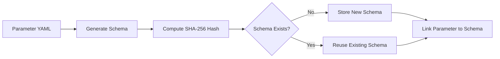

# Semantic Versioning and Parameter Schemas Deep Dive

This guide provides an in-depth look at the OpenDSC Pull Server's semantic
versioning system and parameter schema architecture, explaining how these
features work together to provide efficient configuration management with
intelligent parameter reuse.

## Table of Contents

- [Overview](#overview)
- [Semantic Versioning](#semantic-versioning)
- [Parameter Schema Architecture](#parameter-schema-architecture)
- [Version-Based Routing](#version-based-routing)
- [Schema Sharing Across PATCH Versions](#schema-sharing-across-patch-versions)
- [API Reference](#api-reference)
- [Best Practices](#best-practices)

## Overview

The OpenDSC Pull Server uses **semantic versioning** (SemVer) for all
configuration and composite configuration versions. This provides:

- **Human-readable versions** - "1.2.3"
- **Clear version semantics** - MAJOR.MINOR.PATCH conveys compatibility
- **Efficient parameter storage** - Hash-based schema reuse
- **Smart schema sharing** - PATCH versions automatically share schemas

### Key Concepts

**Semantic Version Format:** `MAJOR.MINOR.PATCH[-PRERELEASE][+BUILD]`

- **MAJOR** - Breaking changes (incompatible API changes)
- **MINOR** - New features (backward-compatible functionality)
- **PATCH** - Bug fixes (backward-compatible fixes)
- **PRERELEASE** - Optional pre-release identifier (e.g., "alpha.1", "beta.2")
- **BUILD** - Optional build metadata (e.g., "20240115.1")

**Examples:**

- `1.0.0` - Initial release
- `1.1.0` - New feature added
- `1.1.1` - Bug fix
- `2.0.0` - Breaking change
- `1.2.0-beta.1` - Pre-release version
- `1.0.0+build.123` - Build metadata

## Semantic Versioning

### Version Requirements

All configuration and composite configuration versions must:

1. **Follow SemVer format** - MAJOR.MINOR.PATCH (core) is required
2. **Be unique per configuration** - Each configuration has unique versions
3. **Be immutable** - Published versions cannot be modified (only archived)
4. **Progress forward** - New versions should increment appropriately

### Creating Versions

**Regular Configuration:**

```http
POST /api/v1/configurations/{configurationName}/versions
Content-Type: multipart/form-data

Form Data:
- version: 1.2.0
- isDraft: true
- files: [main.dsc.yaml, modules/module1.dsc.yaml]
```

**Composite Configuration:**

```http
POST /api/v1/composite-configurations/{compositeName}/versions
Content-Type: application/json

{
  "version": "1.0.0",
  "isDraft": true
}
```

### Version Comparison Rules

The server uses standard SemVer comparison rules:

1. **MAJOR.MINOR.PATCH** compared numerically
2. **Pre-release versions** have lower precedence than normal versions
3. **Pre-release identifiers** compared alphanumerically left-to-right
4. **Build metadata** is ignored in comparisons

**Examples:**

```text
1.0.0 < 1.0.1 < 1.1.0 < 2.0.0
1.0.0-alpha < 1.0.0-alpha.1 < 1.0.0-beta < 1.0.0
1.0.0+build.1 == 1.0.0+build.2  (build metadata ignored)
```

### Latest Version Selection

When `activeVersion: null` is used (auto-tracking):

1. Filter to **published** (non-draft, non-archived) versions
2. Exclude pre-release versions (unless explicitly requested)
3. Select highest version using SemVer comparison

**Example:**

Given published versions: `1.0.0`, `1.1.0`, `1.2.0-beta.1`, `2.0.0`

- `activeVersion: null` → selects `2.0.0` (latest stable)
- With pre-release filter disabled → selects `2.0.0` (still latest)

## Parameter Schema Architecture

### Problem Statement

In traditional DSC configuration management, parameters are stored as raw
YAML/JSON files. When you have hundreds of nodes across multiple scopes, storing
the same parameter schema repeatedly wastes storage and makes validation
inefficient.

**Example Scenario:**

- Configuration: `WebServer`
- Scopes: 5 regions × 3 environments = 15 scope combinations
- Parameters per scope: Average 50 KB YAML
- Total storage: 750 KB just for parameter schemas

When you create a PATCH version (1.0.0 → 1.0.1), the parameter schema typically
doesn't change - you're just fixing a bug in the configuration logic. However,
without schema deduplication, you'd duplicate all 750 KB of parameter schemas
for the new version.

### Solution: Hash-Based Schema Reuse

The Pull Server implements **hash-based parameter schema deduplication**:



### Database Structure

**ParameterSchema Table:**

| Column      | Type        | Description                 |
|-------------|-------------|-----------------------------|
| `Hash`      | string (PK) | SHA-256 hash of schema JSON |
| `SchemaJson`| string      | JSON Schema document        |

**Parameter Table (excerpt):**

| Column               | Type        | Description                    |
|----------------------|-------------|--------------------------------|
| `Id`                 | Guid (PK)   | Parameter unique identifier    |
| `ParameterSchemaHash`| string (FK) | Links to ParameterSchema.Hash  |
| `ConfigurationId`    | Guid        | Which configuration            |
| `ScopeTypeId`        | Guid        | Which scope type               |
| `ScopeValue`         | string      | Which scope value              |
| `Version`            | string      | Version string (e.g., "1.0.0") |

### How Schema Hashing Works

#### Step 1: Generate JSON Schema

When a parameter file is uploaded, the server:

1. Parses the YAML/JSON content
2. Generates a JSON Schema that describes the structure
3. Normalizes the schema (consistent formatting, ordering)

**Example Parameter YAML:**

```yaml
logLevel: Warning
server:
  host: example.com
  port: 8080
  ssl: true
features:
  - authentication
  - logging
```

**Generated JSON Schema:**

```json
{
  "$schema": "https://json-schema.org/draft/2020-12/schema",
  "type": "object",
  "properties": {
    "logLevel": {
      "type": "string"
    },
    "server": {
      "type": "object",
      "properties": {
        "host": {"type": "string"},
        "port": {"type": "number"},
        "ssl": {"type": "boolean"}
      }
    },
    "features": {
      "type": "array",
      "items": {"type": "string"}
    }
  }
}
```

#### Step 2: Compute Hash

```csharp
var schemaJson = GenerateSchema(parameterContent);
var hash = SHA256.HashData(Encoding.UTF8.GetBytes(schemaJson));
var hashString = Convert.ToHexString(hash); // e.g., "A1B2C3D4..."
```

#### Step 3: Deduplicate

```text
-- Check if schema already exists
SELECT Hash FROM ParameterSchema WHERE Hash = 'A1B2C3D4...'

-- If not found, insert new schema
INSERT INTO ParameterSchema (Hash, SchemaJson)
VALUES ('A1B2C3D4...', '{...}')

-- Link parameter to schema
UPDATE Parameter
SET ParameterSchemaHash = 'A1B2C3D4...'
WHERE Id = '...'
```

### Schema Retrieval API

**Get Parameter Schema:**

```http
GET /api/v1/parameters/{parameterId}/schema
Authorization: X-API-Key: admin-key
```

**Response:**

```json
{
  "$schema": "https://json-schema.org/draft/2020-12/schema",
  "type": "object",
  "properties": {
    "logLevel": {"type": "string"},
    "server": {
      "type": "object",
      "properties": {
        "host": {"type": "string"},
        "port": {"type": "number"},
        "ssl": {"type": "boolean"}
      }
    },
    "features": {
      "type": "array",
      "items": {"type": "string"}
    }
  }
}
```

**Use Cases:**

1. **Validation** - Validate node parameters against schema before applying
2. **Tooling** - Generate parameter templates for new nodes
3. **Documentation** - Auto-generate parameter documentation
4. **IDE Support** - Provide autocomplete and validation in editors

## Version-Based Routing

### API Endpoint Structure

All version-specific operations use **string-based routing**:

**Regular Configurations:**

```http
GET    /api/v1/configurations/{name}/versions
GET    /api/v1/configurations/{name}/versions/{version}
POST   /api/v1/configurations/{name}/versions
PUT    /api/v1/configurations/{name}/versions/{version}/publish
DELETE /api/v1/configurations/{name}/versions/{version}
```

**Composite Configurations:**

```http
GET    /api/v1/composite-configurations/{name}/versions
GET    /api/v1/composite-configurations/{name}/versions/{version}
POST   /api/v1/composite-configurations/{name}/versions
PUT    /api/v1/composite-configurations/{name}/versions/{version}/publish
DELETE /api/v1/composite-configurations/{name}/versions/{version}
```

**Child Configuration Management:**

```http
POST   /api/v1/composite-configurations/{name}/versions/{version}/children
PUT    /api/v1/composite-configurations/{name}/versions/{version}/children/{childId}
DELETE /api/v1/composite-configurations/{name}/versions/{version}/children/{childId}
```

### URL Encoding

Version strings in URLs must be **URL-encoded**:

```text
Version: 1.0.0         → URL: /versions/1.0.0
Version: 2.0.0-beta.1  → URL: /versions/2.0.0-beta.1
Version: 1.0.0+build   → URL: /versions/1.0.0%2Bbuild  (+ encoded as %2B)
```

### Version Pinning

**Pin Child Configuration to Specific Version:**

```json
{
  "childConfigurationName": "WebServer",
  "activeVersion": "1.2.0",
  "order": 1
}
```

**Auto-Track Latest Version:**

```json
{
  "childConfigurationName": "WebServer",
  "activeVersion": null,
  "order": 1
}
```

## Schema Sharing Across PATCH Versions

### The PATCH Version Optimization

One of the most powerful features of the schema architecture is **automatic
schema sharing for PATCH versions**.

**Principle:** PATCH versions (bug fixes) typically don't change parameter
schemas - they only fix implementation bugs in the configuration logic.

**Example Workflow:**

1. **Create v1.0.0** - Upload configuration with parameters
   - Server generates schema, hash: `ABC123`
   - Stores schema in ParameterSchema table
   - Links all v1.0.0 parameters to schema `ABC123`

2. **Create v1.0.1** (bug fix) - Upload same parameters
   - Server generates schema from v1.0.1 parameters
   - Computes hash: `ABC123` (same as v1.0.0)
   - **Reuses existing schema** - no duplicate storage
   - Links v1.0.1 parameters to same schema `ABC123`

3. **Create v1.1.0** (new feature) - Add new parameter field
   - Server generates schema with new field
   - Computes hash: `DEF456` (different from v1.0.x)
   - **Stores new schema** - new structure detected
   - Links v1.1.0 parameters to schema `DEF456`

### Storage Benefits

**Before Schema Deduplication:**

```text
Configuration: WebServer
Versions: 1.0.0, 1.0.1, 1.0.2, 1.0.3, 1.0.4
Scopes: 15 (5 regions × 3 environments)
Parameters per scope: 50 KB

Total Storage: 5 versions × 15 scopes × 50 KB = 3,750 KB
```

**After Schema Deduplication:**

```text
Schemas:
- v1.0.0-1.0.4: Share same schema (1 copy)
- Scopes: 15 unique parameter instances

Schema Storage: 1 schema × 5 KB = 5 KB
Parameter Storage: 5 versions × 15 scopes × 1 KB (values only) = 75 KB

Total Storage: 80 KB (98% reduction!)
```

### When Schemas Change

**MINOR Version (New Feature):**

```yaml
# Version 1.0.0
logLevel: Warning
server:
  host: example.com
  port: 8080

# Version 1.1.0 (added new field)
logLevel: Warning
server:
  host: example.com
  port: 8080
  timeout: 30  # NEW FIELD

# Result: New schema hash, new ParameterSchema entry
```

**MAJOR Version (Breaking Change):**

```yaml
# Version 1.0.0
server:
  host: example.com
  port: 8080

# Version 2.0.0 (breaking change - renamed field)
server:
  endpoint: example.com  # RENAMED from 'host'
  port: 8080

# Result: New schema hash, new ParameterSchema entry
```

### Schema Validation Benefits

**Scenario:** You have 1,000 nodes pulling configuration v1.0.3

Without schema validation:

- Each node validates parameters independently
- 1,000 schema generations on nodes
- Inconsistent validation rules

With centralized schema:

1. Server generates schema once for v1.0.0
2. All PATCH versions (1.0.0-1.0.4) share same schema
3. Schema available via API for node-side validation
4. Consistent validation across all nodes
5. Reduced server load (no repeated schema generation)

## API Reference

### Get Parameter Schema

```http
GET /api/v1/parameters/{parameterId}/schema
```

**Parameters:**

- `parameterId` (path, required) - Parameter GUID

**Response:** `200 OK`

```json
{
  "$schema": "https://json-schema.org/draft/2020-12/schema",
  "type": "object",
  "properties": { ... }
}
```

**Error Responses:**

- `404 Not Found` - Parameter not found
- `404 Not Found` - Parameter schema not available

### List Configuration Versions

```http
GET /api/v1/configurations/{configurationName}/versions
```

**Query Parameters:**

- `includeDrafts` (optional, boolean) - Include draft versions
- `includeArchived` (optional, boolean) - Include archived versions

**Response:** `200 OK`

```json
[
  {
    "id": "guid",
    "configurationId": "guid",
    "version": "1.0.0",
    "isDraft": false,
    "isArchived": false,
    "createdAt": "2026-01-15T10:00:00Z"
  },
  {
    "id": "guid",
    "configurationId": "guid",
    "version": "1.1.0",
    "isDraft": true,
    "isArchived": false,
    "createdAt": "2026-02-01T14:30:00Z"
  }
]
```

### Get Specific Version

```http
GET /api/v1/configurations/{configurationName}/versions/{version}
```

**Response:** `200 OK`

```json
{
  "id": "guid",
  "configurationId": "guid",
  "version": "1.2.0",
  "isDraft": false,
  "isArchived": false,
  "files": [
    {
      "id": "guid",
      "path": "main.dsc.yaml",
      "contentType": "application/x-yaml",
      "size": 1024
    }
  ],
  "createdAt": "2026-01-15T10:00:00Z"
}
```

### Publish Version

```http
PUT /api/v1/configurations/{configurationName}/versions/{version}/publish
```

**Response:** `204 No Content`

Sets `isDraft = false`, making the version available for node assignment.

### Add Child to Composite Version

```http
POST /api/v1/composite-configurations/{compositeName}/versions/{version}/children
Content-Type: application/json

{
  "childConfigurationName": "WebServer",
  "activeVersion": "1.2.0",
  "order": 1
}
```

**Response:** `201 Created`

```json
{
  "id": "guid",
  "compositeConfigurationVersionId": "guid",
  "childConfigurationId": "guid",
  "childConfigurationName": "WebServer",
  "activeVersion": "1.2.0",
  "order": 1
}
```

## Best Practices

### Version Numbering Strategy

**PATCH Versions (x.y.Z) - Use for:**

- Bug fixes in configuration logic
- Documentation updates
- Whitespace/formatting changes
- No parameter schema changes

**MINOR Versions (x.Y.0) - Use for:**

- New optional parameters
- New optional resources
- Backward-compatible additions
- New features that don't break existing deployments

**MAJOR Versions (X.0.0) - Use for:**

- Removing parameters
- Renaming parameters (breaking change)
- Changing parameter types
- Incompatible configuration changes

### Example Version Progression

```text
1.0.0   Initial release
1.0.1   Fix: Typo in service name
1.0.2   Fix: Incorrect firewall port
1.1.0   Feature: Add monitoring configuration
1.1.1   Fix: Monitoring config syntax error
1.2.0   Feature: Add backup configuration
2.0.0   Breaking: Rename 'logPath' to 'loggingDirectory'
```

### Leveraging Schema Reuse

**Maximize PATCH Version Benefits:**

1. **Keep parameters stable** - Avoid parameter changes in PATCH versions
2. **Use separate configs** - Split frequently-changing parts into configs
3. **Version wisely** - Batch parameter changes into MINOR versions

**Example - Good Practice:**

```text
WebServer v1.0.0   (Initial)
WebServer v1.0.1   (Bug fix - same parameters)
WebServer v1.0.2   (Bug fix - same parameters)
WebServer v1.1.0   (New feature - new parameter added)
```

**Example - Avoid:**

```text
WebServer v1.0.0   (Initial)
WebServer v1.0.1   (Bug fix + new parameter)  ← Should be v1.1.0
WebServer v1.0.2   (Renamed parameter)        ← Should be v2.0.0
```

### Composite Configuration Strategies

#### Strategy 1: Pin Critical Components

```json
{
  "version": "1.0.0",
  "items": [
    {
      "childConfigurationName": "Database",
      "activeVersion": "2.1.0",  // Pinned - stability critical
      "order": 1
    },
    {
      "childConfigurationName": "WebServer",
      "activeVersion": null,      // Auto-track - can update freely
      "order": 2
    }
  ]
}
```

#### Strategy 2: Environment-Specific Pinning

- **Development/Staging:** `activeVersion: null` (auto-track latest)
- **Production:** `activeVersion: "1.2.0"` (pin to tested version)

#### Strategy 3: Progressive Rollout

1. Create composite v1.0.0 with all children pinned
2. Test thoroughly in dev/staging
3. Update prod nodes to composite v1.0.0
4. Create composite v1.1.0 with one child unpinned
5. Test automatic updates in staging
6. Gradually unpin more children as confidence grows

### Parameter Management

**Organize by Change Frequency:**

```text
data/parameters/WebServer/
├── Default/
│   └── parameters.yaml          # Rarely changes (base settings)
├── Environment/
│   ├── Development/
│   │   └── parameters.yaml      # Occasionally changes
│   └── Production/
│       └── parameters.yaml      # Rarely changes
└── Node/
    └── web01.example.com/
        └── parameters.yaml      # Frequently changes (node-specific)
```

**Version parameter changes appropriately:**

- Base parameters change → MINOR or MAJOR version
- Node-specific parameters change → No version change needed

## Advanced Topics

### Pre-Release Versions

Use pre-release versions for testing:

```http
POST /api/v1/configurations/WebServer/versions

version: 2.0.0-beta.1
isDraft: false
```

**Behavior:**

- `activeVersion: null` → Selects `1.9.0` (latest stable)
- `activeVersion: "2.0.0-beta.1"` → Explicitly selects pre-release

### Build Metadata

Include build information without affecting version comparison:

```text
1.0.0+20260205.1
1.0.0+build.456
1.0.0+sha.a1b2c3d
```

**Note:** Build metadata is stored but **ignored in version comparisons**.

### Schema Evolution Tracking

Track parameter schema evolution:

```text
-- Find all unique schemas for a configuration
SELECT DISTINCT p.ParameterSchemaHash, ps.SchemaJson
FROM Parameter p
JOIN ParameterSchema ps ON p.ParameterSchemaHash = ps.Hash
WHERE p.ConfigurationId = '...'
ORDER BY ps.Hash

-- Count versions sharing each schema
SELECT ParameterSchemaHash, COUNT(DISTINCT Version) as VersionCount
FROM Parameter
WHERE ConfigurationId = '...'
GROUP BY ParameterSchemaHash
ORDER BY VersionCount DESC
```

### Performance Considerations

**Schema Generation:**

- Performed once per unique parameter structure
- Cached in database for reuse
- O(1) lookup by hash

**Version Comparison:**

- Semantic version parsing is efficient
- Database indices on Version column
- Latest version query optimized with proper filtering

**Storage Efficiency:**

- 95%+ reduction for PATCH-heavy configurations
- Linear growth with unique schemas (not versions)
- Minimal overhead for hash storage (64 bytes per schema)

For more information, see:

- [Configuration Management Guide](configuration-management.md)
- [Composite Configuration Guide](composite-configurations.md)
- [Parameter Merging Deep Dive](parameter-merging.md)
